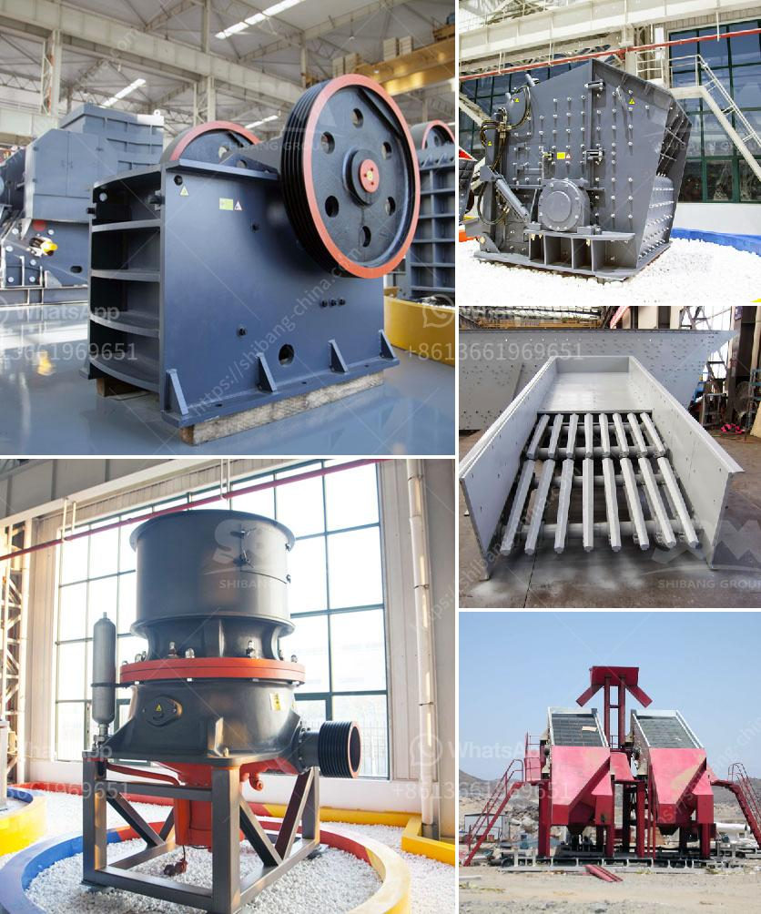

<h3>iron sand processing plant for sale in pakistan</h3>
Iron sand is a natural resource that is found abundantly on the coastline of Pakistan. This sand is rich in iron ore, making it an essential ingredient for the production of steel and iron. With the growing demand for steel and iron in the construction and infrastructure sectors, setting up an iron sand processing plant in Pakistan can help provide a boost to the country's economy.

An iron sand processing plant is used to extract iron ore from sand deposits found along the coastline. The process consists of a series of steps, including crushing, screening, magnetic separation, and washing. In this process, iron particles are separated from the sand, allowing for the extraction of pure iron ore.

One of the main advantages of an iron sand processing plant is the ability to produce high-quality iron ore. The iron ore extracted from sand is known for its high iron content, often exceeding 60%. This makes it suitable for steel and iron production, as it can be used as a raw material without the need for extensive purification or beneficiation processes.

Furthermore, the establishment of an iron sand processing plant in Pakistan can have positive environmental impacts. By extracting iron ore from sand deposits, the plant can help reduce the pressure on traditional iron ore mining, which often involves extensive excavation and can lead to deforestation and habitat destruction. Additionally, the processing plant can help reduce the reliance on imported iron ore, thus reducing the carbon footprint associated with transportation.

The sale of an iron sand processing plant in Pakistan presents a valuable investment opportunity. The abundance of iron sand along the coastline ensures a consistent supply of raw material for the plant's operations. Moreover, with the growing demand for steel and iron in Pakistan's construction and infrastructure sectors, the plant can secure a stable customer base for the processed iron ore.

Investing in an iron sand processing plant requires careful consideration of various factors. These include the location of the plant, as proximity to the coastline is essential for access to raw material. The capacity and efficiency of the plant are also crucial factors to ensure a profitable operation.

In conclusion, the establishment of an iron sand processing plant in Pakistan can provide significant economic and environmental benefits. The extraction of iron ore from sand deposits can contribute to the country's steel and iron production, reducing reliance on imported raw materials. The sale of such a plant offers a lucrative investment opportunity, with the potential for a stable customer base and growing demand. Moreover, the environmental impact of the plant can be minimized by reducing traditional iron ore mining and associated carbon emissions. Overall, an iron sand processing plant offers a promising venture for investors looking to capitalize on Pakistan's natural resources and contribute to sustainable development.
<h3>Contact us</h3><ul><li><strong>Whatsapp:&nbsp;<a href="https://wa.me/8613661969651">+8613661969651</a></strong></li><li><a href="https://swt.shibang-china.com/?git&amp;zhl&amp;iron sand processing plant for sale in pakistan"><strong>Online Service(chat now)</strong></a></li></ul><h3>Related</h3><ul><li><a href='roller mill for gravel.md'>roller mill for gravel</a></li><li><a href='operation and maintenance manuals of cone crusher.md'>operation and maintenance manuals of cone crusher</a></li><li><a href='crusher made in taiwan.md'>crusher made in taiwan</a></li><li><a href='distributors of conveyor belts in malaysia.md'>distributors of conveyor belts in malaysia</a></li><li><a href='mobile crusher plants.md'>mobile crusher plants</a></li></ul>