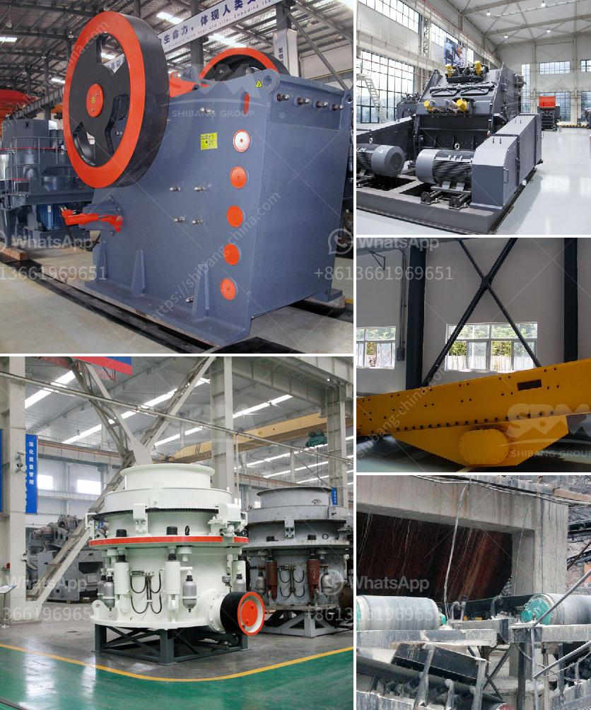

<h3>jaw crusher application</h3>
Jaw crushers are versatile machines that are commonly used in mining, construction, demolition, recycling, and the quarrying industry. These machines have a powerful crushing capacity. They are also designed to be easy to use and maintain, and have a long service life.

Jaw crushers are designed to break down large rocks into smaller, more manageable pieces. They come in different sizes and configurations to match different crushing requirements. The most common type of jaw crusher is the Blake crusher. In this machine, an eccentric drives a pitman arm that moves back and forth against the fixed jaw to crush rocks into smaller pieces.

One of the key applications of a jaw crusher is in the quarrying industry, where it is used to crush hard rocks into smaller sizes for further processing. These rocks may be used for road construction, concrete production, or other construction applications. Jaw crushers can also be used to crush softer, non-abrasive materials such as limestone, gypsum, and clay.

Aside from quarrying and construction, jaw crushers are also widely used in the mining industry where they are used to crush ore into smaller sizes for further processing. This crushing process is essential as it prepares the ore for the extraction of valuable metals such as gold, silver, and copper.

Jaw crushers have several advantages over other crushing machines. They have a simple design, making them easy to operate and maintain. They also have a low cost per tonne ratio, allowing for cost-effective crushing operations. Additionally, jaw crushers can handle a wide range of materials and produce uniform end products.

In conclusion, jaw crushers are versatile machines that are commonly used in various industries. From quarrying and construction to mining, these machines play a crucial role in breaking down rocks and ores into smaller, manageable sizes. With their easy operation, low cost, and versatility, jaw crushers are an essential tool for any crushing operation.
<h3>Contact us</h3><ul><li><strong>Whatsapp:&nbsp;<a href="https://wa.me/8613661969651">+8613661969651</a></strong></li><li><a href="https://swt.shibang-china.com/?git&amp;zhl&amp;jaw crusher application"><strong>Online Service(chat now)</strong></a></li></ul><h3>Related</h3><ul><li><a href='ball mill for sale in china.md'>ball mill for sale in china</a></li><li><a href='functions of a mobile crushing plant.md'>functions of a mobile crushing plant</a></li><li><a href='ultra fine mill price.md'>ultra fine mill price</a></li><li><a href='sale 42 jaw crusher in india.md'>sale 42 jaw crusher in india</a></li><li><a href='chrome crusher for sale south africa.md'>chrome crusher for sale south africa</a></li></ul>