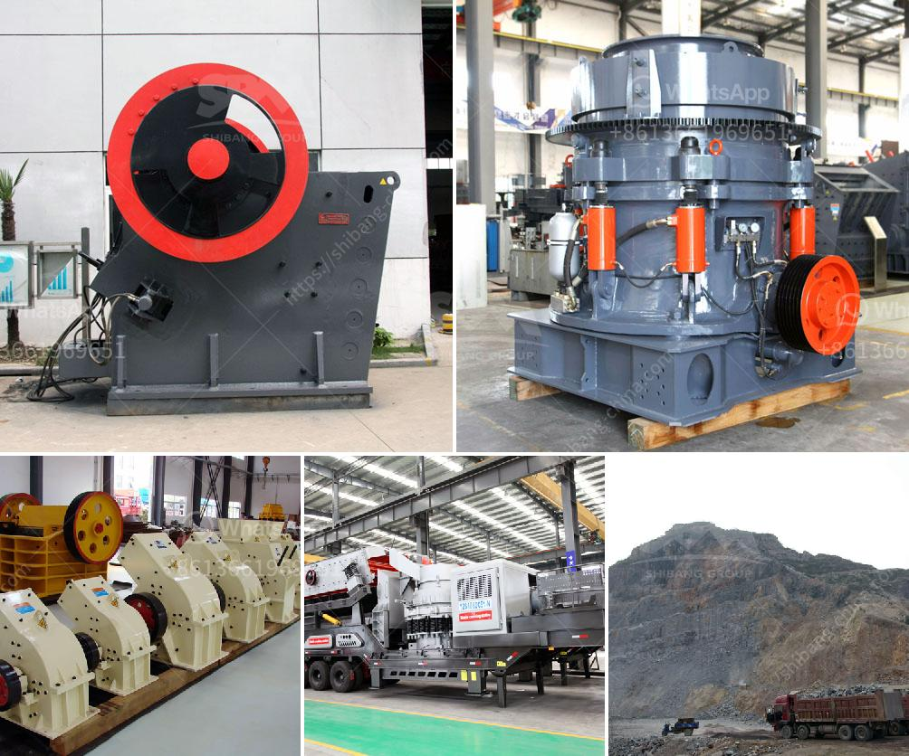

<h3>jaw crusher construction</h3>
Jaw crushers have been around for decades and have seen many significant advancements in their design and functionality. Over this time, they have established themselves as an essential piece of machinery in the construction industry, enabling the processing of hard rock and ore to be carried out quickly and efficiently.

There are different types of jaw crushers available on the market, including fixed jaw crushers, and portable jaw crushers. Even though both the fixed jaw crusher machines and portable jaw crusher machines are different in terms of structure, portable jaw crushers are the ones most commonly preferred by contractors due to their versatility and ability to move from one location to another quickly.

The construction of a jaw crusher is robust and well-designed. It consists of various components such as the vibrating feeder, jaw crusher, cone crusher, vibrating screen, and a conveyor belt. The jaw crusher is the primary crushing equipment responsible for breaking down large rocks into smaller, more manageable pieces.

In recent years, jaw crushers have evolved. They have become safer and more user-friendly, focusing on reducing operator fatigue and increasing overall operational efficiency. Modern jaw crushers are equipped with hydraulic systems, which allow for easy adjustment of the crusher's closed side setting. This feature primarily allows for the control of the size of the final product.

One crucial aspect of jaw crusher construction is the utilization of manganese steel jaws. The jaws are subjected to high levels of stress, which can cause premature wear and tear. However, manganese steel jaws possess exceptional toughness and are resistant to wear and abrasion. This material ensures the longevity of the jaw crusher, reducing the need for frequent replacements.

Another vital element of jaw crusher construction is the toggle plate. Designed to absorb shocks and prevent overloading of the crusher, the toggle plate is crucial for ensuring the jaw crusher's smooth operation. In addition to its protective function, the toggle plate also plays a role in enhancing the crushing capacity, as it allows for a more significant chunk of material to pass through the jaws.

When it comes to safety, modern jaw crushers are equipped with safety features to prevent accidents. For example, they often include a safety toggle plate that stops the jaw crusher's motor in the event of an overload. Additionally, emergency stops and interlocking systems are standard to prevent unauthorized access to the crushing chamber during operation.

In conclusion, jaw crusher construction has made significant advancements over the years. With their robust design, ease of use, and safety features, these machines have become an integral part of the construction industry. Contractors rely on jaw crushers to quickly and efficiently break down materials, enabling the construction of various structures and projects. As technology continues to advance, we can expect even more innovations in jaw crusher construction, providing improved productivity and safety for construction professionals.
<h3>Contact us</h3><ul><li><strong>Whatsapp:&nbsp;<a href="https://wa.me/8613661969651">+8613661969651</a></strong></li><li><a href="https://swt.shibang-china.com/?git&amp;zhl&amp;jaw crusher construction"><strong>Online Service(chat now)</strong></a></li></ul><h3>Related</h3><ul><li><a href='2nd hand old mining process plant.md'>2nd hand old mining process plant</a></li><li><a href='jaw crusher pe 1000 x.md'>jaw crusher pe 1000 x</a></li><li><a href='limestone mining crusher industry in nepal.md'>limestone mining crusher industry in nepal</a></li><li><a href='product of 100 tons mini cement plant.md'>product of 100 tons mini cement plant</a></li><li><a href='coal washing plant supplier south africa.md'>coal washing plant supplier south africa</a></li></ul>