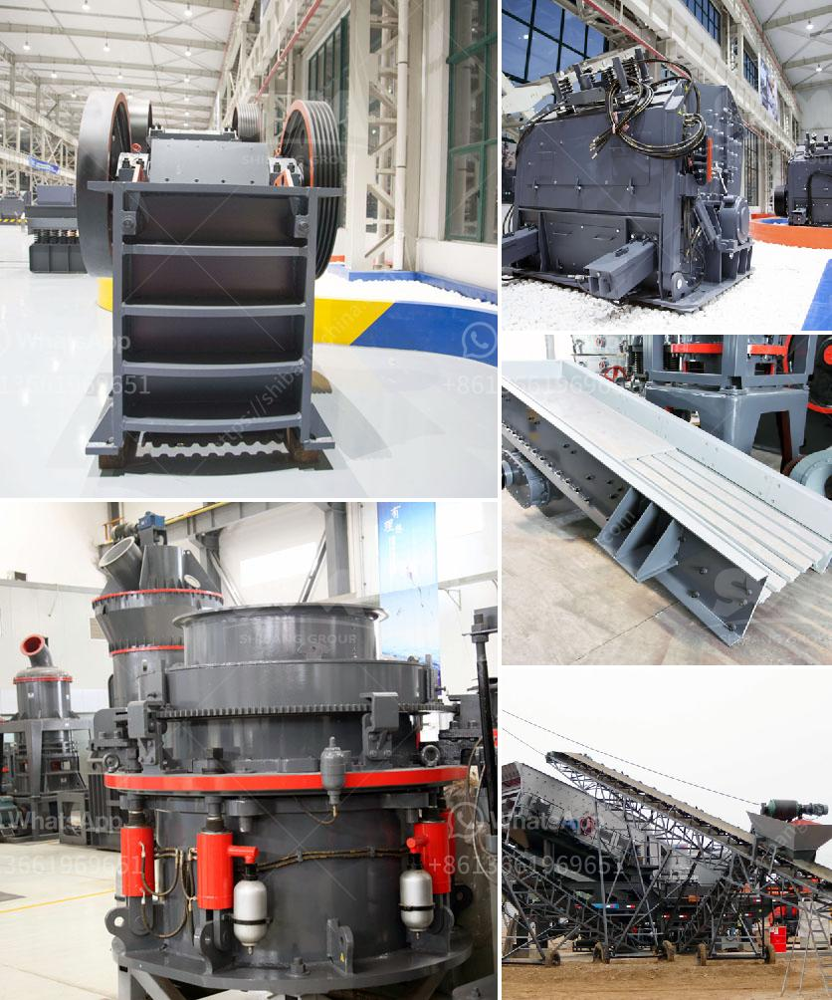

<h3>jaw crusher for graphite</h3>
The jaw crusher is commonly used as the primary crusher in graphite crushing operations. It is popular for its simplicity and efficiency in crushing graphite ore. The jaw crusher is responsible for reducing the size of the graphite ore so that it can be used for further processing.

In general, the jaw crusher is the primary crusher that breaks the graphite ore into smaller particles. The jaw crusher is generally composed of a fixed jaw plate and a movable jaw plate. The movable jaw plate is periodically reciprocated against the fixed jaw plate, sometimes separated, and sometimes approached. When separated, the graphite ore is squeezed and crushed between the two jaw plates.

One of the advantages of using a jaw crusher for graphite ore processing is its relatively simple structure and reliable operation. Unlike other types of crushers, such as impact crushers or cone crushers, the jaw crusher does not have a complex mechanism. This makes it easier to maintain and operate, resulting in lower downtime and increased productivity.

Another advantage of using a jaw crusher for graphite ore processing is its high crushing ratio. The jaw crusher can easily crush large pieces of graphite ore into small particles. This provides a higher surface area for subsequent grinding or processing, ensuring a higher recovery rate of graphite particles.

The jaw crusher is also suitable for crushing graphite ore of different hardness levels. It can handle both soft and hard graphite ores with ease. This versatility is beneficial as it allows operators to crush various types of graphite ore without the need for a separate crusher for each type.

Despite its advantages, the jaw crusher also has some limitations. One limitation is its relatively low processing capacity compared to other types of crushers. However, this limitation can be compensated for by using a larger jaw crusher or multiple jaw crushers in parallel.

Additionally, the jaw crusher is not suitable for crushing extremely hard graphite ores, as it may result in excessive wear and tear on the jaw plates. In such cases, a cone crusher or impact crusher may be more suitable.

In conclusion, the jaw crusher is a reliable and efficient crusher that is widely used in graphite ore processing. Its simplicity and high crushing ratio make it suitable for a variety of applications. However, it is important to consider its limitations and ensure proper maintenance and operation to maximize its performance.
<h3>Contact us</h3><ul><li><strong>Whatsapp:&nbsp;<a href="https://wa.me/8613661969651">+8613661969651</a></strong></li><li><a href="https://swt.shibang-china.com/?git&amp;zhl&amp;jaw crusher for graphite"><strong>Online Service(chat now)</strong></a></li></ul><h3>Related</h3><ul><li><a href='rock crusher machine manufacturer.md'>rock crusher machine manufacturer</a></li><li><a href='granite crushing per tonne.md'>granite crushing per tonne</a></li><li><a href='cost new jaw crusher.md'>cost new jaw crusher</a></li><li><a href='tonne stone crusher price for hire in cardiff.md'>tonne stone crusher price for hire in cardiff</a></li><li><a href='tonne ball mill.md'>tonne ball mill</a></li></ul>