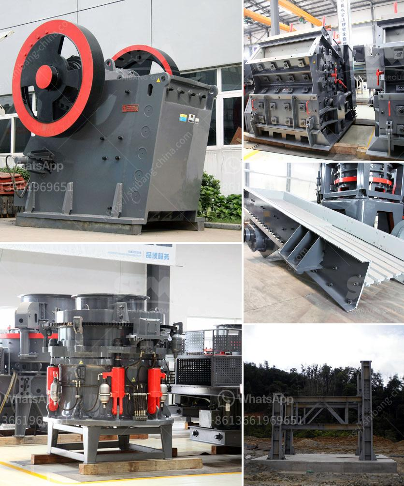

<h3>jaw crusher for sale in harare</h3>
One of the most popular stone-crushing equipment in the world, Jaw Crusher is ideally suitable for primary and secondary crushing. The highest anti-pressure strength of crushed material is 320MPa. 

Based on years' experience and technology development, Zenith jaw crusher series are of different models, which can meet most crushing requirements in primary and secondary crushing. With the same specifications, it has larger processing capacity and higher screening efficiency compared to traditional crushers. 

Jaw crusher for sale in Harare is widely used in mining, metallurgy, construction, highway, railway, irrigation and chemical industries, and our jaw crusher for sale in Harare can reach the crushing ratio of 4-6 and the shape of final product is even. 

The Zenith jaw crusher has been widely used in mining, metallurgical, construction, road and railway building, water conservancy and chemistry, and some other industries. The capacity of our jaw crusher ranges from 5 tons to 1000+ tons per hour. 

The jaw crusher for sale in Harare is suitable for crushing all kinds of materials with compressive strength less than 320 MPa. Compared with other crushers on the market, the jaw crusher has outstanding advantages: high crushing efficiency, large processing capacity, low energy consumption, uniform particle size, simple structure, reliable operation, easy maintenance and economical operation cost. 

The jaw crusher for sale in Harare is widely used in mining, building materials, chemical industry, metallurgy and so on. The jaw crusher is suitable for primary and secondary crushing all kinds of minerals and rocks with compressive strength less than 320 MPa. 

In recent years, with the rapid development of economy and the increasing demand for mining machinery, the market demand for jaw crusher in Harare is also increasing. The jaw crusher for sale in Harare is not only widely applied in mining, quarrying, and construction industry, but also in chemical, metallurgical, and power industries. 

Jaw crusher is used as coarse crushing machine in sand gravel plant, crushing rocks and ores, etc. It is widely used in construction, mining, metallurgy, and chemical industries. The highest compressive strength of materials can reach 320MPa. 

The jaw crusher for sale in Harare is widely used in crusher plants and sand production lines. It can crush a variety of rocks, including granite, quartz, basalt, limestone, river pebbles, etc. 

In conclusion, the jaw crusher for sale in Harare has become a hot sale product due to its superior performance and wide application range. With the increasing demand for mining machinery in Harare, more and more jaw crushers are needed to meet the market demand. Therefore, if you are in need of a jaw crusher for sale in Harare, Zenith is your best choice. We provide high-quality jaw crushers with competitive prices and excellent after-sales service. Contact us now to get the latest price and more information about our jaw crusher for sale in Harare.
<h3>Contact us</h3><ul><li><strong>Whatsapp:&nbsp;<a href="https://wa.me/8613661969651">+8613661969651</a></strong></li><li><a href="https://swt.shibang-china.com/?git&amp;zhl&amp;jaw crusher for sale in harare"><strong>Online Service(chat now)</strong></a></li></ul><h3>Related</h3><ul><li><a href='flow and grate type ball mill difference.md'>flow and grate type ball mill difference</a></li><li><a href='dolomite processing plant cost in india.md'>dolomite processing plant cost in india</a></li><li><a href='salvage value of crusher machine.md'>salvage value of crusher machine</a></li><li><a href='quarry and stone crushing executive business plan.md'>quarry and stone crushing executive business plan</a></li><li><a href='crusher plant in tarlac.md'>crusher plant in tarlac</a></li></ul>