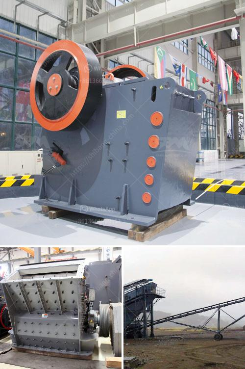

<h3>jaw crusher in china</h3>
China is well-known for its manufacturing prowess, and the jaw crusher is an invaluable piece of equipment that is utilized in all manner of fields. The reduction ratio of this machine is typically 6:1, but varies depending on the specific type of rock being processed. As such, this crusher effectively breaks down large chunks of materials into smaller particle sizes.

With the advent of automation technology, the jaw crusher has made significant improvements in terms of performance, productivity, and safety. The automated features include hydraulic adjustment, automatic lubrication, and overload protection, among others. This has made the jaw crusher easier to operate and maintain, leading to reduced downtime and enhanced productivity.

One key advantage of the jaw crusher over other primary crushing equipment is its enormous crushing force, which is achieved by the high rotational speed of the eccentric wheel. This force is directly transmitted to the crushing zone through the pitman, resulting in outstanding crushing performance.

China boasts a rich variety of jaw crushers, varying from traditional jaw crushers to the most advanced jaw crushers. With the continuous advancements in technology, the jaw crusher market sees more innovative products. For instance, the environmental-friendly small jaw crusher, an innovation by Henan Hongxing Mining Machinery Co., Ltd., incorporates advanced technology to promote energy conservation and emission reduction. This crusher facilitates green production processes, reduces noise pollution, and significantly improves operational efficiency.

Another noteworthy development is the introduction of the hydraulic jaw crusher design principle by Hongxing Machinery. This design, which combines the principles of both the toggle plate and hydraulic systems, has improved the crushing efficiency and overall stability of the jaw crusher. It also effectively avoids the problems of frequent maintenance and expensive parts replacement.

China has always been a major player in the global mining industry, and with increasing demand for minerals and construction materials worldwide, the jaw crusher market is expected to witness significant growth in the coming years. Jaw crushers are extensively used in the mining, quarrying, demolition, and recycling industries, where they excel at providing excellent performance and high reduction ratios.

In conclusion, the jaw crusher remains an indispensable piece of equipment for the mining and construction industries in China. Its performance, productivity, and safety features continue to improve with advancements in technology. As the demand for minerals and construction materials rises, China will continue to play a vital role in the jaw crusher market, ensuring its steady growth and development.
<h3>Contact us</h3><ul><li><strong>Whatsapp:&nbsp;<a href="https://wa.me/8613661969651">+8613661969651</a></strong></li><li><a href="https://swt.shibang-china.com/?git&amp;zhl&amp;jaw crusher in china"><strong>Online Service(chat now)</strong></a></li></ul><h3>Related</h3><ul><li><a href='hammer mill rock crusher.md'>hammer mill rock crusher</a></li><li><a href='iron ore crusher price.md'>iron ore crusher price</a></li><li><a href='granite crushing line.md'>granite crushing line</a></li><li><a href='marble quarry mining crusher in sudan.md'>marble quarry mining crusher in sudan</a></li><li><a href='ball milling price.md'>ball milling price</a></li></ul>