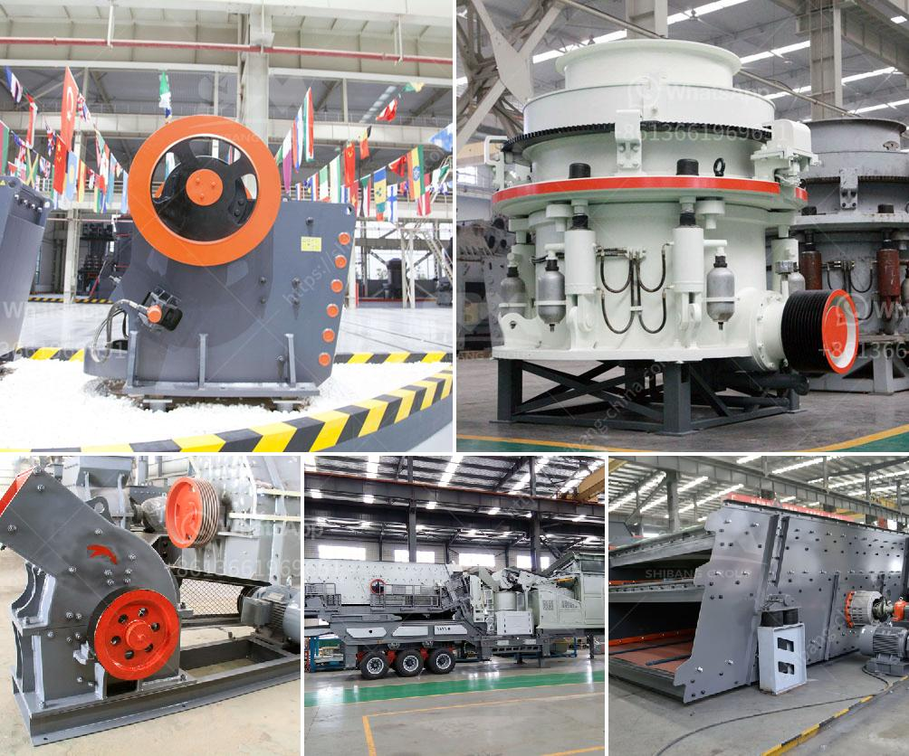

<h3>jaw crusher in kenya</h3>
Jaw crusher plays a crucial role in mining and construction industries. Kenyan economy is rapidly expanding, and so is the demand for various industrial goods and materials, like cement, metals, diamonds, agricultural products, and more. As the country continues to grow, there is an increasing need for building infrastructure, such as roads, bridges, and buildings. All these developments require the use of robust machinery, like jaw crushers, to facilitate the extraction, crushing, and processing of raw materials.

A jaw crusher is a versatile machine that facilitates efficient size reduction of hard rocks, ores, and other materials. The primary function of a jaw crusher is to reduce the size of materials for further processing. It is used in various industries, including mining, construction, metallurgy, highways, railways, water conservancy projects, and chemical industries.

In Kenya, jaw crusher is used for crushing hard rocks and ores for the initial processing. The raw materials are uniformly transported into the jaw crusher machine by the vibrating feeder. Then the jaw crusher machine performs coarse crushing and reduces the size of large-sized rocks and ores into manageable sizes. The crushed materials are further processed by the cone crusher or impact crusher to achieve the desired size and shape.

The jaw crusher in Kenya has become the preferred equipment for crushing and processing all kinds of hard rocks and ores. It is suitable for crushing materials with compressive strength not exceeding 320MPa. The jaw crusher in Kenya has a simple structure, easy operation, reliable performance, and low operating cost. The wear-resistant parts of the jaw crusher are made of high-quality materials, prolonging the service life of the equipment and ensuring economical operation.

In conclusion, Kenya's mining and construction industries rely heavily on jaw crushers for the crushing and processing of raw materials. Whether it is limestone, granite, or other types of ores, the jaw crusher plays an integral role in these industries. With the continuous growth of the Kenyan economy, the demand for jaw crushers will only increase further, driving the development of the industry and contributing to the overall infrastructure growth in the country.
<h3>Contact us</h3><ul><li><strong>Whatsapp:&nbsp;<a href="https://wa.me/8613661969651">+8613661969651</a></strong></li><li><a href="https://swt.shibang-china.com/?git&amp;zhl&amp;jaw crusher in kenya"><strong>Online Service(chat now)</strong></a></li></ul><h3>Related</h3><ul><li><a href='gypsum processing machine suppliers.md'>gypsum processing machine suppliers</a></li><li><a href='gypsum plants in india.md'>gypsum plants in india</a></li><li><a href='coal crusherton per hours.md'>coal crusherton per hours</a></li><li><a href='ball mill projects for slag in india.md'>ball mill projects for slag in india</a></li><li><a href='gypsum crushing machine for sale india.md'>gypsum crushing machine for sale india</a></li></ul>