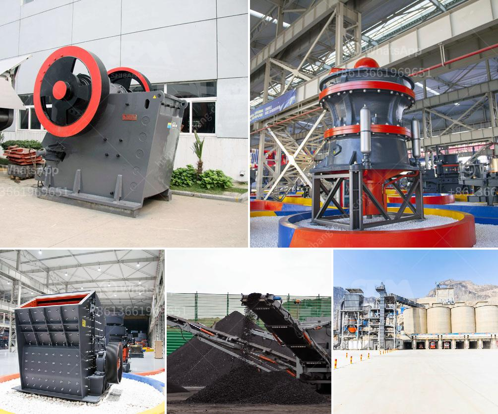

<h3>jaw crusher machine cost</h3>
The jaw crusher machine is widely used in the construction industry and mining industry. Its common usage in many applications including demolition and recycling, quarrying and mining, construction and demolition, landfilling and earthmoving, etc. The machine is designed to process large rocks or ores into smaller pieces or gravel using a primary jaw crusher.

The price of the jaw crusher machine will vary depending on the size, capacity, and manufacturer. One can a find jaw crusher machine ranging from 1tph to 100tph. Markets and companies in various regions would follow different pricing strategies for their jaw crushers. The jaw crusher machine cost is generally considered as the primary investment, especially when investors choose a small-scale crushing plant.

The jaw crusher machine cost includes fixed and variable costs. Fixed costs, such as the machine price and installation fees, are normally accounted for in the purchase price or financing plan. Variable costs, such as the hourly energy consumption, maintenance costs, and wear parts replacement, should also be taken into account when estimating the overall jaw crusher machine cost.

The energy consumption of a jaw crusher machine mainly depends on the specifications of the machine and its operational parameters, such as the material feed size, feed rate, and the working angle. A higher working angle generally requires more energy for crushing rocks or ores. Therefore, it is necessary to thoroughly analyze the operational parameters before investment to select an appropriate machine model that suits specific requirements and reduces energy consumption.

Maintenance costs are another important consideration when calculating the jaw crusher machine cost. Regular maintenance is vital to ensure the machine's performance and prolong its lifespan. Routine inspection, lubrication, and replacement of wear parts such as jaw plates, toggle plates, and eccentric shafts should be budgeted for in the crusher's routine maintenance plan. These costs should be taken into account to assess the long-term affordability of the machine.

In addition to energy consumption and maintenance costs, investors should also pay attention to the wear parts replacement expenses. The jaw crusher machine's wear parts, such as jaw plates and toggle plates, play a crucial role in the crushing process. These parts are subjected to high wear and tear during operation and need to be replaced periodically. The replacement frequency depends on factors such as the material being crushed, its abrasiveness, and the machine's maintenance and operation practices. Therefore, the cost of wear parts should be factored in while estimating the jaw crusher machine cost.

In summary, the jaw crusher machine cost is influenced by various factors, including the machine size, capacity, manufacturer reputation, and operational costs. It is important for investors to carefully consider these factors while making an investment decision. By analyzing the energy consumption, maintenance costs, and wear parts replacement expenses, investors can have a better understanding of the overall cost and affordability of the jaw crusher machine.
<h3>Contact us</h3><ul><li><strong>Whatsapp:&nbsp;<a href="https://wa.me/8613661969651">+8613661969651</a></strong></li><li><a href="https://swt.shibang-china.com/?git&amp;zhl&amp;jaw crusher machine cost"><strong>Online Service(chat now)</strong></a></li></ul><h3>Related</h3><ul><li><a href='cara mengelola debu crucher batu bara.md'>cara mengelola debu crucher batu bara</a></li><li><a href='gold ore refinery portable machinery maker china.md'>gold ore refinery portable machinery maker china</a></li><li><a href='impact crusher machine for sale.md'>impact crusher machine for sale</a></li><li><a href='india vertical grinding machines.md'>india vertical grinding machines</a></li><li><a href='gypsum board manufacturing machine india.md'>gypsum board manufacturing machine india</a></li></ul>