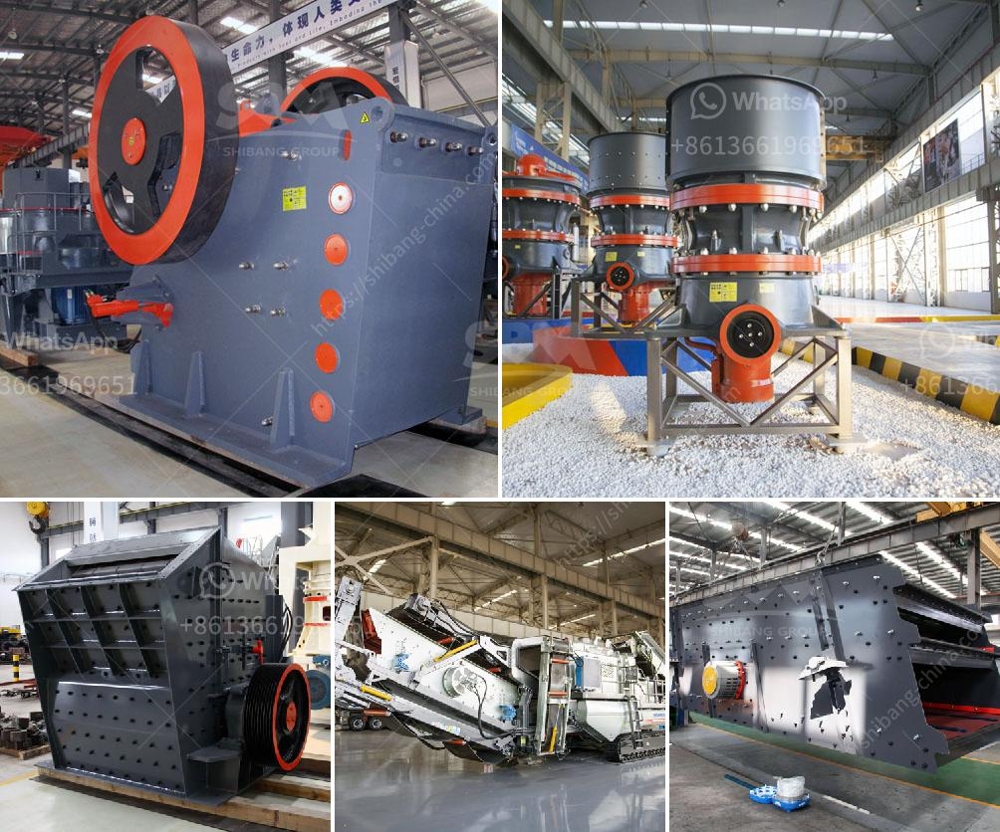

<h3>jaw crusher machine price</h3>
Jaw crusher machine price is a concern for buyers in purchasing jaw crushers. Based on the current market scenario, jaw crusher machine price in India is not very high. Although crushers are sold at an affordable cost, the manufacturers still profit handsomely due to the high demand for these machines. At present, the jaw crusher machine is not only widely used in the construction industry, but also in the mining industry.

The demand of jaw crusher machines is growing day by day. For the construction and infrastructure industries, the jaw crusher machine is indispensable. This device is mainly used to crush various types of ore and bulk materials into medium-sized particles. The jaw crusher machine price is relatively low compared with other types of crushing equipment. It can be said to be the economical and practical crusher machine.

Firstly, jaw crusher machine price is influenced by the manufacturing cost. Different manufacturers have different manufacturing costs. So the price is not fixed and there will be some differences in price. Secondly, the jaw crusher can be divided into large, medium and small sizes. The feed opening width of the large-scale machine is larger than 600mm, and the feed opening width of the medium-scale machine is between 300-600mm. As for the small-scale machine, its feed opening width is less than 300mm. The discharge size adjustment range of the jaw crusher machine is wide. The processing capacity of a single device can reach 1-2200t/h.

Various types of jaw crushers have different jaw crusher machine price. The capacity and operating performance of these different types of jaw crusher machines are different, but they are suitable for different materials. Among the three series, the PE series was first developed, followed by the German version and JC series crushers. Now, it's widely used in mining, construction, water conservancy, metallurgy, and chemical industries.

The jaw crusher machine price is often a concern for buyers. Although its price is relatively low, the machines are of superior quality due to their high manufacturing standards and better performance. Compared to the traditional crushing machines, the jaw crusher machine produced by Shanghai Zenith Construction Machinery Co., Ltd adopts advanced materials and manufacturing techniques ensuring the long lifespan and high performance.

In summary, the price of a jaw crusher machine is determined by its quality and performance. The jaw crusher machine in India is made of the best quality raw materials. It has better performance and longer life compared to other machines. The jaw crusher machine has strict quality control standards. Machines produced by reliable manufacturers have a lower failure rate and long service life, which can save the buyer's maintenance costs.

Ultimately, when purchasing a jaw crusher machine, it is essential to consider its quality, performance, and price. Cheaper is not always better, as lower-quality machines may require further maintenance and replacement parts, resulting in higher costs in the long run. By investing in a high-quality and efficient jaw crusher machine, buyers will see long-term benefits in terms of productivity, performance, and cost-effectiveness.
<h3>Contact us</h3><ul><li><strong>Whatsapp:&nbsp;<a href="https://wa.me/8613661969651">+8613661969651</a></strong></li><li><a href="https://swt.shibang-china.com/?git&amp;zhl&amp;jaw crusher machine price"><strong>Online Service(chat now)</strong></a></li></ul><h3>Related</h3><ul><li><a href='hammer crusher clinker.md'>hammer crusher clinker</a></li><li><a href='china vertical roller mill.md'>china vertical roller mill</a></li><li><a href='stone crusher manufacturers in dhansura.md'>stone crusher manufacturers in dhansura</a></li><li><a href='used lab scale crusher price.md'>used lab scale crusher price</a></li><li><a href='mobile stone crusher from taiwan.md'>mobile stone crusher from taiwan</a></li></ul>