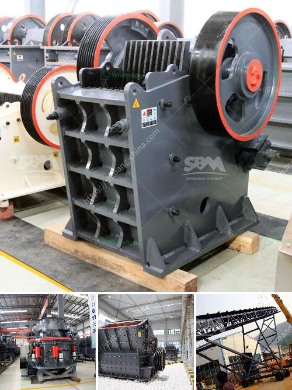

<h3>jaw crusher manganese</h3>
Manganese is a widely used metal for making highly wear-resistant parts of crushers. Although manganese content in these parts has a major influence on crusher's working capability, operators must pay attention to manganese casting quality. Here are three common problems related to manganese casting quality:

1. Uncertain wear life: Due to the unpredictable wear rate of manganese castings, it is difficult to specify an exact wear life. A good quality liner will generally wear evenly, with no spikes in wear rate. The wear rate should be consistent with the life of the liner. However, low-quality manganese castings can wear irregularly, resulting in premature failure and downtime.

2. Brittle failure: Manganese is known for its high strength and toughness. However, poor casting quality can lead to brittleness, making the liner prone to cracks and failure under impact. This can ultimately result in reduced crusher performance and increased maintenance costs.

3. Inconsistent product sizing: Manganese liners play a crucial role in controlling the product size and shape produced by the crusher. Poor quality manganese castings can lead to uneven product sizing, resulting in lower efficiency and increased recirculation of oversized material.

To ensure high-quality manganese castings, manufacturers should follow strict casting guidelines and conduct extensive metallurgical testing. Opting for reputable suppliers known for their expertise in manganese casting can help mitigate the risk of poor quality liners.

In conclusion, manganese is an essential element for the production of durable and efficient crushers. It is crucial for operators to prioritize manganese casting quality to achieve optimal crusher performance. By investing in high-quality manganese castings, operators can improve wear life, reduce maintenance costs, and achieve consistent product sizing.
<h3>Contact us</h3><ul><li><strong>Whatsapp:&nbsp;<a href="https://wa.me/8613661969651">+8613661969651</a></strong></li><li><a href="https://swt.shibang-china.com/?git&amp;zhl&amp;jaw crusher manganese"><strong>Online Service(chat now)</strong></a></li></ul><h3>Related</h3><ul><li><a href='cheapest crusher machines for sale in kenya.md'>cheapest crusher machines for sale in kenya</a></li><li><a href='sale 42 jaw crusher in india.md'>sale 42 jaw crusher in india</a></li><li><a href='iron sand processing plant for sale in pakistan.md'>iron sand processing plant for sale in pakistan</a></li><li><a href='aggregate washing plant for sale.md'>aggregate washing plant for sale</a></li><li><a href='mobile vibrating screens.md'>mobile vibrating screens</a></li></ul>