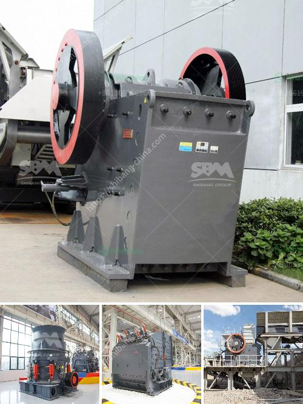

<h3>jaw crusher manufacturer in italy</h3>
Italy has abundant mineral resources, largely distributed throughout the country. Located in the heart of the Mediterranean, Italy is a perfect combination of the Alpine belt, part of the Alps, and the Apennine mountain range. As a rich source of natural stone, Italy ranks among the top seven producers for materials such as marble, granite, and travertine. With a long history and expertise in the quarrying and mining industry, it is no surprise that Italy is home to several renowned jaw crusher manufacturers.

One such company is MB Crusher. For over 20 years, MB Crusher has been providing crushing solutions to customers in various industries, including construction, demolition, quarrying, mining, and recycling. With their innovative products and cutting-edge technology, MB Crusher has established itself as a market leader in the field of crushing equipment.

Known for its versatile and efficient jaw crushers, MB Crusher offers a wide range of models to suit any customer's needs. Their jaw crushers come in different sizes and are designed for both primary and secondary crushing applications. Whether it's hard and abrasive rock or recycled concrete and asphalt, MB Crusher's jaw crushers can process a wide range of materials with ease.

What sets MB Crusher apart from other manufacturers is their patented crushing technology. Their jaw crushers incorporate a unique hydraulic system that allows the jaws to automatically adjust and maintain the desired crushing size. This feature not only ensures consistent and high-quality output but also minimizes downtime and reduces maintenance costs. Additionally, MB Crusher's jaw crushers are equipped with a dust suppression system, helping to keep the work site clean and safe.

Another reputable jaw crusher manufacturer in Italy is Guidetti S.r.l. For over 50 years, Guidetti has been providing innovative solutions for the recycling and aggregates industries. Guidetti's jaw crushers are known for their compact size and excellent performance. Whether you need a small crusher for recycling purposes or a larger one for quarrying applications, Guidetti has a jaw crusher to suit your needs.

Guidetti's jaw crushers are characterized by their simple design and easy operation. With their robust construction and high reliability, Guidetti's crushers can handle even the toughest materials. Their jaw crushers are equipped with hydraulic systems for easy adjustment of the crushing size and overload protection. Additionally, Guidetti's jaw crushers have a low fuel consumption, making them environmentally friendly and cost-effective.

In conclusion, Italy is home to several reputable jaw crusher manufacturers that have been providing reliable and efficient crushing solutions for decades. Companies such as MB Crusher and Guidetti S.r.l. are leaders in their respective industries and offer a wide range of jaw crusher models suited for various applications. With their innovative technologies and commitment to customer satisfaction, these manufacturers continue to drive the industry forward and contribute to Italy's rich mining and quarrying heritage.
<h3>Contact us</h3><ul><li><strong>Whatsapp:&nbsp;<a href="https://wa.me/8613661969651">+8613661969651</a></strong></li><li><a href="https://swt.shibang-china.com/?git&amp;zhl&amp;jaw crusher manufacturer in italy"><strong>Online Service(chat now)</strong></a></li></ul><h3>Related</h3><ul><li><a href='diatomite grinding mill in indonesia.md'>diatomite grinding mill in indonesia</a></li><li><a href='how to start mining business in india.md'>how to start mining business in india</a></li><li><a href='stone crushers in bucaramanga.md'>stone crushers in bucaramanga</a></li><li><a href='small scale aggregate crushing machine.md'>small scale aggregate crushing machine</a></li><li><a href='quartz making process.md'>quartz making process</a></li></ul>