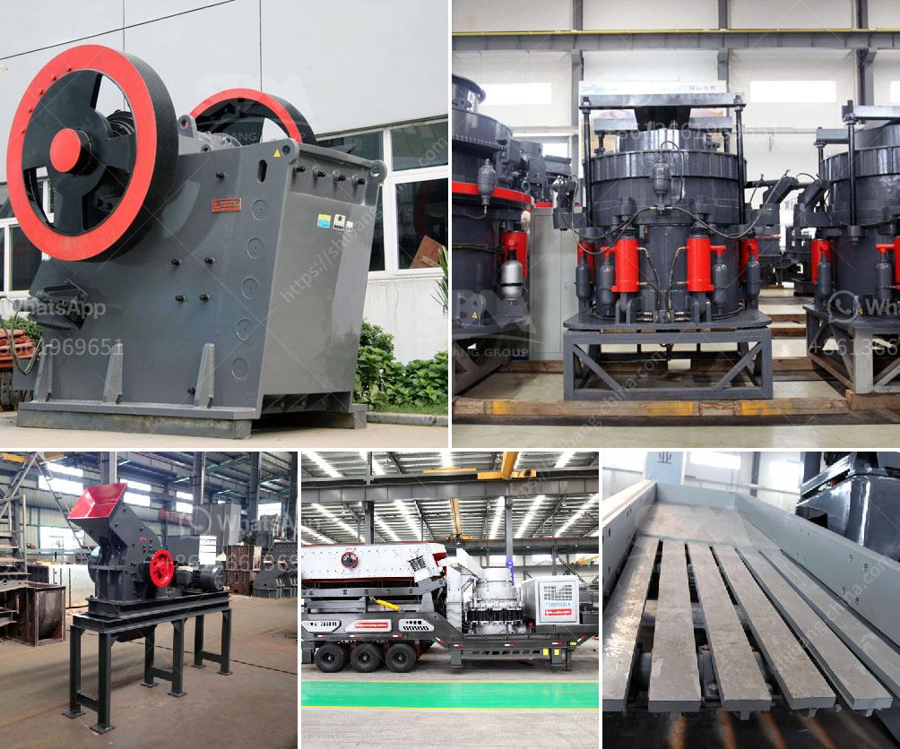

<h3>jaw crusher materials</h3>
Jaw crusher materials are important components in the construction and mining industry. Known for its incredible durability and resistance, jaw crusher materials have become the primary choice in construction and mining applications. These highly versatile materials offer numerous benefits and advantages, making them an ideal choice for various projects.

One of the key advantages of jaw crusher materials is their ability to crush hard and abrasive materials. These materials include rocks, ores, and minerals, which are usually difficult to break down. The robust nature of jaw crusher materials allows them to effectively break down these challenging substances, making them suitable for use in mining operations.

Furthermore, jaw crusher materials are known for their durability and longevity. Crushers are subjected to intense pressure and harsh conditions while in operation, which requires robust materials to withstand the stress. Jaw crusher materials are specifically designed to endure these harsh conditions and perform efficiently for long periods. The durability of these materials reduces maintenance costs and increases the productivity of the crusher.

Another significant advantage of jaw crusher materials is their resistance to wear and tear. Due to their continuous contact with hard substances, crushers are prone to degradation over time. However, jaw crusher materials are specially engineered to resist this wear and tear. The high-resistant properties of these materials prevent abrasion and extend the service life of the crusher, reducing the need for frequent replacements.

Jaw crusher materials also offer exceptional corrosion resistance. In mining operations, crushers are exposed to various chemicals and contaminants that can cause corrosion. However, the unique composition of jaw crusher materials makes them highly resistant to corrosion, ensuring the crusher's longevity and efficiency.

Moreover, jaw crusher materials have remarkable tensile strength, allowing them to withstand high levels of pressure and force. This impressive strength enables jaw crushers to handle heavy loads and efficiently crush large quantities of material. The ability to handle heavy loads makes jaw crusher materials suitable for use in construction projects that require crushing large volumes of material.

In addition to their physical properties, jaw crusher materials also offer excellent thermal stability. Crushers can generate significant amounts of heat during operation, and it is crucial to choose materials that can withstand such high temperatures. The thermal stability of jaw crusher materials ensures that the crusher can operate without any performance deterioration, even under extreme heat conditions.

In conclusion, jaw crusher materials are of immense importance in the construction and mining industry. These materials offer numerous benefits, including the ability to crush hard and abrasive substances, durability, resistance to wear and tear, corrosion resistance, exceptional tensile strength, and thermal stability. Choosing the right jaw crusher materials is crucial for enhancing efficiency, reducing maintenance costs, and maximizing productivity in crushing operations.
<h3>Contact us</h3><ul><li><strong>Whatsapp:&nbsp;<a href="https://wa.me/8613661969651">+8613661969651</a></strong></li><li><a href="https://swt.shibang-china.com/?git&amp;zhl&amp;jaw crusher materials"><strong>Online Service(chat now)</strong></a></li></ul><h3>Related</h3><ul><li><a href='used cone crushers zambia.md'>used cone crushers zambia</a></li><li><a href='iron ore beneficiation process flow chart.md'>iron ore beneficiation process flow chart</a></li><li><a href='stone crusher pe 250x400.md'>stone crusher pe 250x400</a></li><li><a href='copper ore separation machine.md'>copper ore separation machine</a></li><li><a href='hydraulic roll crusher zenith.md'>hydraulic roll crusher zenith</a></li></ul>