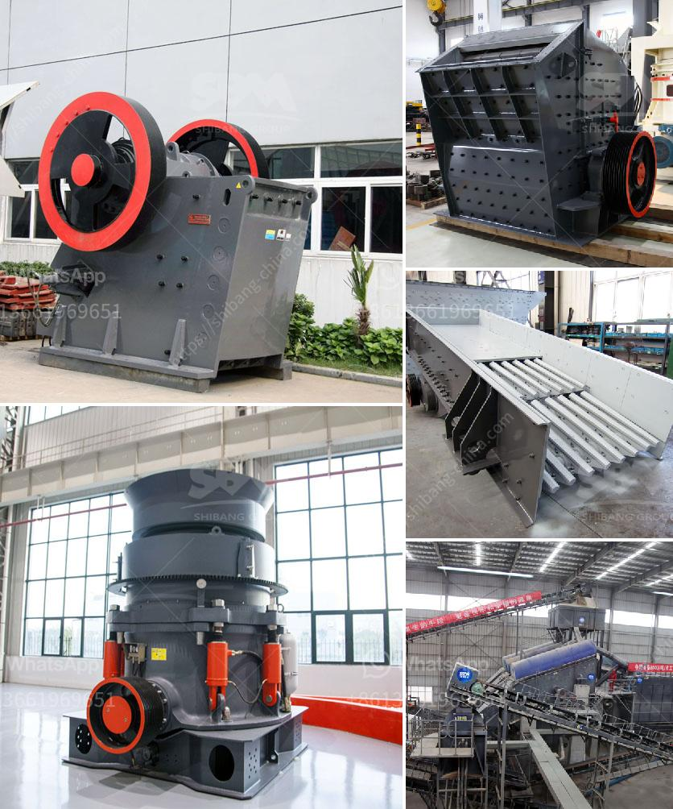

<h3>jaw crusher mem fr</h3>
The jaw crusher is a vital piece of equipment in many industries, and it plays a significant role in the construction, mining, and quarrying sectors. With the increasing demand for crushed stones, it has become essential to invest in high-quality crushing equipment like the jaw crusher mem fr.

Designed and manufactured by reputable brands, the jaw crusher mem fr offers exceptional performance and reliability. It is engineered to break down rocks, stones, and other materials into smaller, more manageable sizes. This crushing machine operates by applying compressive force, enabling efficient and precise crushing of even the toughest materials.

One of the standout features of the jaw crusher mem fr is its robust construction. It is built to withstand heavy-duty applications, making it ideal for quarries and construction sites where there is a constant need for crushing large quantities of rocks and stones. The sturdy frame and components can withstand immense pressure, ensuring long-term durability and minimal maintenance requirements.

Additionally, the jaw crusher mem fr boasts a high reduction ratio, making it perfect for producing high-quality aggregates with uniform sizes. This reduction ratio refers to the ratio of the input size to the output size after crushing. With the jaw crusher mem fr, operators can achieve consistent and well-graded particles, which are crucial for various applications like road construction and concrete production.

Furthermore, the jaw crusher mem fr offers exceptional versatility. It can handle a wide range of materials, from soft to medium-hard rocks, ensuring that it can adapt to different crushing needs. This versatility makes it a valuable investment for companies working in diverse industries.

The operational efficiency of the jaw crusher mem fr is another commendable aspect. With its powerful motor and controlled feed rate, it ensures maximum productivity while minimizing energy consumption. The efficient crushing process helps companies save on operational costs and increase their overall profitability.

In terms of safety and user-friendly features, the jaw crusher mem fr excels as well. It comes with advanced technologies and mechanisms to protect the machine and its operators. For instance, the crusher overload protection system prevents damage caused by excessive loads, ensuring safe and reliable operations. Also, the easy-to-use controls and clear instructions make it effortless for operators to operate the machine with confidence.

Maintenance is an essential aspect of any crushing equipment, and the jaw crusher mem fr simplifies this process. Regular maintenance, such as lubrication and inspection, can be easily carried out, contributing to the longevity of the machine and reducing downtime.

In conclusion, the jaw crusher mem fr stands out as a high-quality and efficient crushing equipment. Its robust construction, high reduction ratio, versatility, and operational efficiency make it an excellent choice for various industries. Whether it is for building construction, mineral extraction, or road infrastructure projects, the jaw crusher mem fr offers reliable and cost-effective solutions. By investing in this top-notch crushing machine, companies can enhance their productivity, produce superior-quality aggregates, and ultimately achieve their business goals.
<h3>Contact us</h3><ul><li><strong>Whatsapp:&nbsp;<a href="https://wa.me/8613661969651">+8613661969651</a></strong></li><li><a href="https://swt.shibang-china.com/?git&amp;zhl&amp;jaw crusher mem fr"><strong>Online Service(chat now)</strong></a></li></ul><h3>Related</h3><ul><li><a href='limestone grinding and crushing.md'>limestone grinding and crushing</a></li><li><a href='gravel crushers manufacturers.md'>gravel crushers manufacturers</a></li><li><a href='steel slag recycling plant.md'>steel slag recycling plant</a></li><li><a href='china pasir harga washing plant.md'>china pasir harga washing plant</a></li><li><a href='micro fine grinding machine.md'>micro fine grinding machine</a></li></ul>