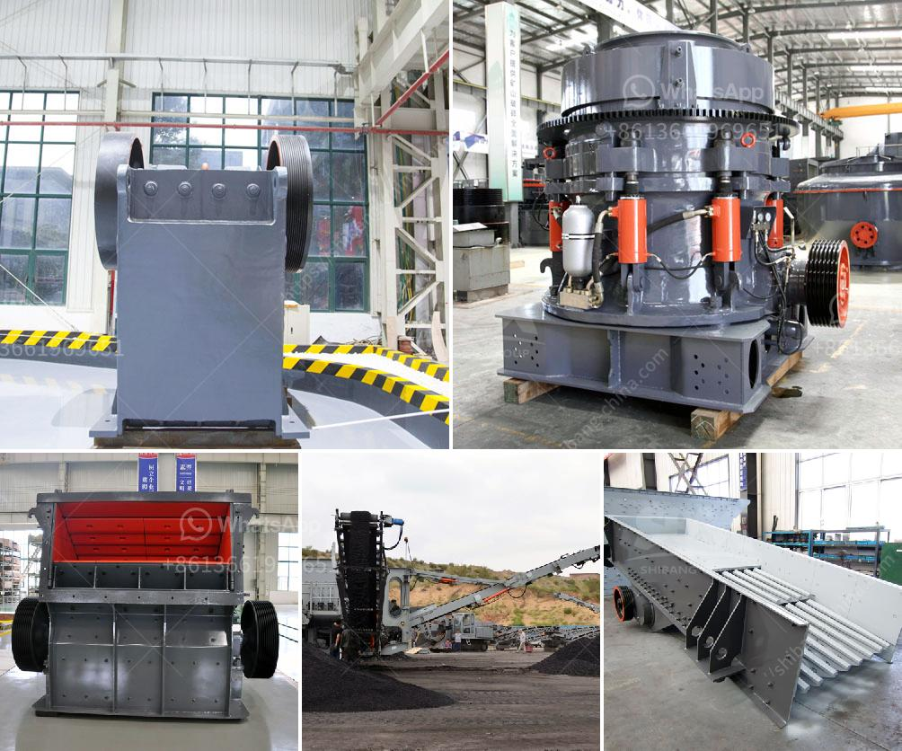

<h3>jaw crusher pe 1000 x</h3>
The jaw crusher PE 1000 x 1200 is commonly used for primary crushing. It has a large inlet size, allowing it to accept a wide range of materials with compressive strength up to 320 MPa. This stone crusher is powered by a highly efficient 200 kW motor.

The jaw plates are made from durable manganese steel, ensuring long-lasting performance. The heavy-duty design of the jaw crusher allows for high production and increased reliability. Its hydraulic system and toggle plate enable smooth and efficient operation.

With a maximum feed size of 850 mm, the PE 1000 x 1200 jaw crusher is capable of crushing large volumes of materials quickly. It is commonly used in the mining industry and construction sites to process ore and aggregates. The adjustable discharge setting provides flexibility in producing different sizes of crushed materials.

The PE 1000 x 1200 jaw crusher also features a safety toggle plate, a reliable and efficient mechanism that prevents unwanted accidents. It reduces the risk of damage to the crusher and ensures operator safety during operation.

Maintenance for this jaw crusher is relatively easy, with access to the jaw plates and other components conveniently located. Regular inspection and lubrication will help prolong the life of the machine and maintain its optimal performance.

Overall, the jaw crusher PE 1000 x 1200 is a reliable and efficient primary crushing equipment. Its high capacity and large inlet size make it suitable for a wide range of applications. Whether used for mining or construction, this jaw crusher delivers consistent performance and high productivity.
<h3>Contact us</h3><ul><li><strong>Whatsapp:&nbsp;<a href="https://wa.me/8613661969651">+8613661969651</a></strong></li><li><a href="https://swt.shibang-china.com/?git&amp;zhl&amp;jaw crusher pe 1000 x"><strong>Online Service(chat now)</strong></a></li></ul><h3>Related</h3><ul><li><a href='roller mill diagram.md'>roller mill diagram</a></li><li><a href='list of machineries for marble processing plants.md'>list of machineries for marble processing plants</a></li><li><a href='mini rock crusher.md'>mini rock crusher</a></li><li><a href='jaw crusher plant saudi.md'>jaw crusher plant saudi</a></li><li><a href='stone crusher sale.md'>stone crusher sale</a></li></ul>