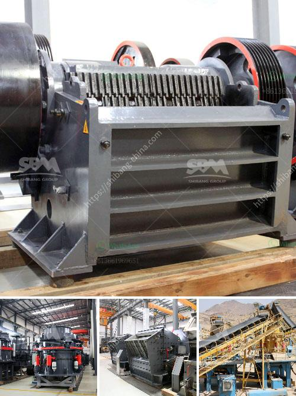

<h3>jaw crusher pe 250 x 400</h3>
The PE 250 x 400 jaw crusher is a popular small stone crusher designed for crushing smaller rocks or similar materials. It is widely used in mining, metallurgy, building materials, road construction, chemical industries, and many other industries. The machine has a compact structure, high crushing ratio, low energy consumption, easy maintenance, and a reliable performance.

One of the key advantages of this jaw crusher is its ability to process stones with a maximum size of 200mm. This allows it to handle a variety of materials, including granite, limestone, basalt, and more. The machine’s adjustable outlet allows for the adjustment of the size of the final product, making it suitable for various applications.

The PE 250 x 400 jaw crusher is equipped with a 15kw motor and a feed hopper that can accommodate materials up to 200mm in size. The machine has a discharge opening range of 20-60mm, which allows it to be widely used in crushing processes, such as producing artificial sand and pulverizing construction waste.

In addition to its high crushing capacity and adjustable outlet size, the PE 250 x 400 jaw crusher also has many other features. It has a simple structure, which makes it easy to operate and maintain. The machine’s crushing chamber is deep and has no dead zone, which helps to improve the feeding capacity and output. The machine is also equipped with a protective device, which ensures the safety of the operator during operation.

Another advantage of the PE 250 x 400 jaw crusher is its low energy consumption. The machine consumes less power during the crushing process, making it an economical choice for users. This jaw crusher also produces less noise and vibration, ensuring a comfortable working environment for the operator.

With its compact structure and reliable performance, the PE 250 x 400 jaw crusher is widely used in small-scale crushing projects. It is ideal for crushing materials with compressive strength less than 320MPa, such as limestone, granite, concrete, and more. This jaw crusher is also popular among contractors and DIY enthusiasts who need a reliable and efficient machine for their projects.

In conclusion, the PE 250 x 400 jaw crusher is a versatile machine that is suitable for small-scale stone crushing projects. It has a compact and robust design, making it ideal for applications where space is limited. The machine’s adjustable outlet size and low energy consumption make it a cost-effective choice for users. Whether you are a contractor, DIY enthusiast, or a small-scale mining company, the PE 250 x 400 jaw crusher is a reliable and efficient machine that can meet your crushing needs.
<h3>Contact us</h3><ul><li><strong>Whatsapp:&nbsp;<a href="https://wa.me/8613661969651">+8613661969651</a></strong></li><li><a href="https://swt.shibang-china.com/?git&amp;zhl&amp;jaw crusher pe 250 x 400"><strong>Online Service(chat now)</strong></a></li></ul><h3>Related</h3><ul><li><a href='gypsum board connection machine.md'>gypsum board connection machine</a></li><li><a href='functions of a mobile crushing plant.md'>functions of a mobile crushing plant</a></li><li><a href='copper crusher exporter in south africa.md'>copper crusher exporter in south africa</a></li><li><a href='ton grinding unit cement plant cost.md'>ton grinding unit cement plant cost</a></li><li><a href='properties of gold mining in south africa.md'>properties of gold mining in south africa</a></li></ul>