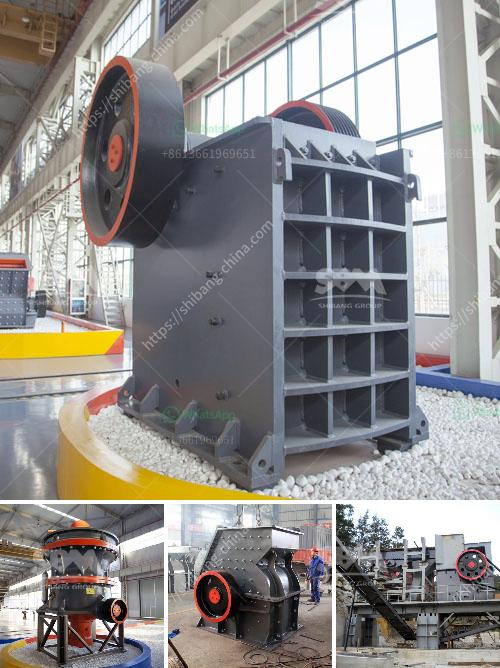

<h3>jaw crusher plant saudi</h3>
Saudi Arabia is rich in oil resources and has one of the largest reserves in the world. With oil prices fluctuating, the Kingdom constantly seeks new ways to diversify its economy. In line with this vision, the Saudi government recently launched its Saudi Vision 2030 program. The program aims to reduce the Kingdom's dependence on oil, develop new sectors, and attract foreign investment.

One of the key sectors targeted for development is the mining industry. Saudi Arabia is blessed with a variety of minerals, such as gold, copper, and phosphate. With vast deposits of these valuable resources, it is no surprise that mining has become a booming sector in the country.

To extract and process these minerals, specialized equipment is required. One such piece of equipment is the jaw crusher plant. This machine is designed to reduce large rocks into smaller rocks or gravel for further processing.

The jaw crusher plant has a powerful crushing capacity, making it an ideal solution for construction and demolition debris, concrete, or asphalt recycling applications. This robust machine has a heavy-duty design and is equipped with premium-quality components to ensure long-lasting performance and high reliability.

Furthermore, the jaw crusher plant is environmentally friendly and can operate quietly, reducing noise pollution. It also has a low fuel consumption, making it cost-effective to operate. With its compact size, the jaw crusher plant can be easily transported to different sites, making it a flexible and versatile tool for any mining operation.

Additionally, the jaw crusher plant is easy to install and requires minimal maintenance. Its user-friendly interface allows operators to easily adjust the crusher settings to achieve the desired product size. It also provides a safe working environment, with features such as a hydraulic release mechanism to prevent any uncrushable material from damaging the machine.

For the mining industry in Saudi Arabia, the jaw crusher plant is an essential piece of equipment. By reducing the size of rocks and minerals, the plant ensures an efficient and economical extraction process. With its low operation costs, environmental sustainability, and high productivity, it becomes the ideal solution for mining operations in the Kingdom.

In conclusion, the jaw crusher plant has been extensively used in the mining industry in Saudi Arabia. It is a game changer in the crushing industry, providing a safe and reliable solution for mines looking to increase their productivity and reduce operational costs. The jaw crusher plant is not only versatile but also environmentally friendly and cost-effective to operate, making it a preferred choice for many mining companies. As Saudi Arabia strives to diversify its economy, the mining sector plays a vital role, and the jaw crusher plant is supporting this growth and development.
<h3>Contact us</h3><ul><li><strong>Whatsapp:&nbsp;<a href="https://wa.me/8613661969651">+8613661969651</a></strong></li><li><a href="https://swt.shibang-china.com/?git&amp;zhl&amp;jaw crusher plant saudi"><strong>Online Service(chat now)</strong></a></li></ul><h3>Related</h3><ul><li><a href='how to start quarry business.md'>how to start quarry business</a></li><li><a href='tanzania processing plant cost.md'>tanzania processing plant cost</a></li><li><a href='companies that sell conveyor belts.md'>companies that sell conveyor belts</a></li><li><a href='stone crushers in bucaramanga.md'>stone crushers in bucaramanga</a></li><li><a href='tempat rental stone crusher.md'>tempat rental stone crusher</a></li></ul>