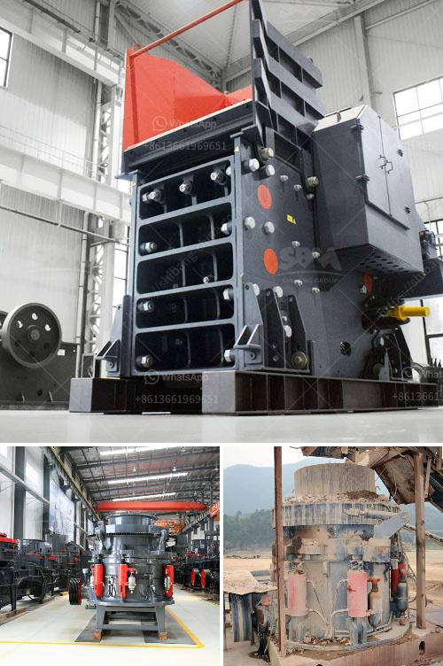

<h3>jaw crusher prices saudi</h3>
When it comes to the need for crushed stone, the jaw crusher is a very important machine. It is highly sought after and widely used for various applications, such as the construction industry, for the production of sand and gravel, as well as for the recycling of concrete and other materials.

In Saudi Arabia, the jaw crusher is categorized based on the type of crushing cavity they have. So, this includes the fine jaw crusher, the medium jaw crusher, and the coarse jaw crusher. These different types of jaw crushers have different price ranges based on their capabilities and specifications.

In Saudi Arabia, the jaw crusher is considered to be among the heavyweight machinery. This is because it is built with a sturdy structure and comes with powerful motors that enable it to efficiently crush the hardest stones and materials. Therefore, it is no surprise that the prices of jaw crushers in Saudi Arabia are relatively high.

The price of the jaw crusher in Saudi Arabia will vary depending on the model and the manufacturer. The price range starts from a few thousand dollars and can go up to tens of thousands of dollars, depending on the specific jaw crusher model you choose. As you can see, jaw crusher prices in Saudi Arabia are different for different manufacturers.

The jaw crusher efficiency is important when it comes to the productivity of the crusher, and the energy consumption of the machine, as well as the wear of the jaw plates. Therefore, it is important to find a jaw crusher that has a high efficiency rating and low energy consumption.

Another important factor to consider when buying a jaw crusher in Saudi Arabia is the spare parts availability. It is important to choose a jaw crusher that comes with readily available spare parts. This will ensure that in case of any breakdowns or malfunctions, you can easily get replacement parts without much downtime.

In conclusion, the jaw crusher prices in Saudi Arabia are highly dependent on the specifications and model of the machine. When choosing a jaw crusher, it is important to consider factors such as the efficiency rating, energy consumption, and availability of spare parts.

With these factors in mind, you can make an informed decision on which jaw crusher to purchase. Remember that the jaw crusher is a long-term investment, so it is crucial to choose a high-quality machine that will serve your needs efficiently for many years to come.
<h3>Contact us</h3><ul><li><strong>Whatsapp:&nbsp;<a href="https://wa.me/8613661969651">+8613661969651</a></strong></li><li><a href="https://swt.shibang-china.com/?git&amp;zhl&amp;jaw crusher prices saudi"><strong>Online Service(chat now)</strong></a></li></ul><h3>Related</h3><ul><li><a href='crusher impact germany.md'>crusher impact germany</a></li><li><a href='concrete batching plant for sale in pakistan.md'>concrete batching plant for sale in pakistan</a></li><li><a href='impact crusher for sale in bulawayo.md'>impact crusher for sale in bulawayo</a></li><li><a href='small scale aggregate crushing machine.md'>small scale aggregate crushing machine</a></li><li><a href='vibrating screens kenya.md'>vibrating screens kenya</a></li></ul>