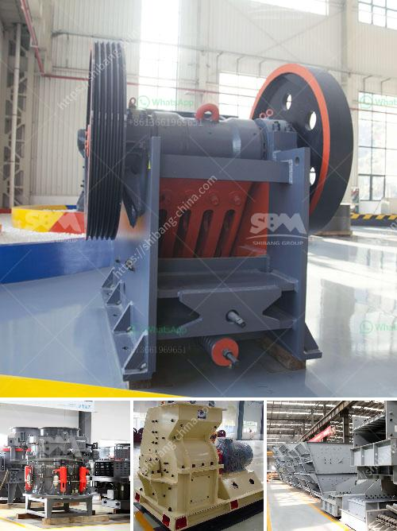

<h3>jaw crusher routine service pdf</h3>
A jaw crusher is a versatile and commonly used crushing equipment that is used during various construction projects. It plays an essential role in the reduction of larger rocks or ore into smaller, more manageable sizes. In order to ensure its optimal performance, regular maintenance is necessary. This article will outline the routine service required for a jaw crusher, focusing on the PDF manual provided by the manufacturer.

The jaw crusher routine service PDF manual covers all aspects of both maintenance and operation of the equipment. It explains the instructions needed to properly operate and maintain the jaw crusher. In addition, it also provides essential information on the replacement of wear parts, inspection procedures, and troubleshooting tips. By following the guidelines outlined in the PDF manual, users can effectively prevent costly breakdowns and extend the service life of the equipment.

One of the primary aspects covered in the routine service PDF is the regular inspection of wear parts. The jaw crusher consists of movable and fixed jaw plates, which are subjected to wear and tear over time. The manual provides guidance on how to inspect these parts and determine if they need to be replaced. By regularly checking the wear parts, users can identify any signs of excessive wear, such as uneven surfaces or cracks, and take timely action to replace them. This helps to maintain the efficiency and productivity of the jaw crusher.

In addition to wear parts, lubrication is another critical aspect covered in the routine service PDF. Lubrication is essential to reduce friction and prevent wear between moving parts. The manual provides information on the type and amount of lubricant required, as well as the recommended intervals for lubrication. By following these guidelines, users can ensure that all moving parts are adequately lubricated, preventing premature wear and damage.

Furthermore, the routine service PDF also highlights the importance of regular inspection of the jaw crusher's electrical components. Proper functioning of electrical components, such as motors and control panels, is crucial for the safe and efficient operation of the equipment. The manual provides instructions on how to inspect these components and detect any signs of malfunction. By addressing electrical issues promptly, users can avoid costly repairs and potential safety hazards.

Troubleshooting tips are another valuable aspect covered in the routine service PDF. Despite regular maintenance, jaw crushers may occasionally encounter technical issues. The manual provides a comprehensive troubleshooting guide, outlining common problems and their solutions. By referring to this guide, users can quickly diagnose and resolve any issues, minimizing downtime and ensuring uninterrupted operation.

In conclusion, the jaw crusher routine service PDF is an indispensable tool for the daily maintenance of this crucial equipment. By following the instructions outlined in the manual, users can effectively inspect and maintain the jaw crusher, ensuring its optimal performance and extending its service life. Regular inspection of wear parts, proper lubrication, and timely troubleshooting are essential to prevent breakdowns and maximize productivity. Ultimately, investing in routine service and maintenance saves time, money, and ensures the smooth operation of jaw crushers on construction sites.
<h3>Contact us</h3><ul><li><strong>Whatsapp:&nbsp;<a href="https://wa.me/8613661969651">+8613661969651</a></strong></li><li><a href="https://swt.shibang-china.com/?git&amp;zhl&amp;jaw crusher routine service pdf"><strong>Online Service(chat now)</strong></a></li></ul><h3>Related</h3><ul><li><a href='stone crusher machine from japan.md'>stone crusher machine from japan</a></li><li><a href='chrome crusher for sale south africa.md'>chrome crusher for sale south africa</a></li><li><a href='gold milling equipment prices.md'>gold milling equipment prices</a></li><li><a href='buy jaw crusher machine.md'>buy jaw crusher machine</a></li><li><a href='tph stationery stone crushing plant.md'>tph stationery stone crushing plant</a></li></ul>