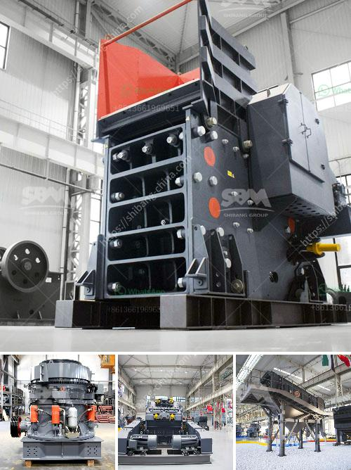

<h3>jaw crusher sale</h3>
Jaw crushers are known for their ability to break the toughest materials, making them a popular choice for primary crushing applications. With the capability to produce a wide range of products, jaw crushers are indispensable for industries such as mining, construction, demolition, and recycling.

One of the key advantages of a jaw crusher is its ability to deliver a continuous flow of 100-300 tons per hour. This reliability and high production capacity translate into savings for businesses that require large quantities of material to be crushed on a daily basis. The jaw crusher's design ensures smooth operation, low maintenance, and long service life, making it an economical choice for businesses of all sizes.

But why choose a jaw crusher over other types of crushers? The answer lies in its versatility. Jaw crushers can handle a variety of materials such as granite, limestone, concrete, asphalt, and more. This makes them suitable for hard and abrasive rocks, as well as softer materials. Additionally, jaw crushers can be adjusted to produce different sizes of products, allowing businesses to meet the specific requirements of their projects.

Another significant advantage of jaw crushers is their energy efficiency. These machines consume less power compared to other crushers, resulting in lower electricity bills for businesses. Additionally, their robust construction ensures minimal wear and tear, reducing the need for frequent repairs and replacement parts.

When considering a jaw crusher sale, it's essential to choose a reputable manufacturer known for their quality and reliability. Their expertise in jaw crusher design and engineering will guarantee a product that meets your exact needs and stands the test of time.

In conclusion, jaw crushers are a valuable investment for any company that requires efficient crushing solutions. Their versatility, high production capacity, and energy efficiency make them an ideal choice for various applications. With a wide range of options available on the market, businesses can find the right jaw crusher for their specific needs. So, start exploring your options and choose a jaw crusher that will transform your operations.
<h3>Contact us</h3><ul><li><strong>Whatsapp:&nbsp;<a href="https://wa.me/8613661969651">+8613661969651</a></strong></li><li><a href="https://swt.shibang-china.com/?git&amp;zhl&amp;jaw crusher sale"><strong>Online Service(chat now)</strong></a></li></ul><h3>Related</h3><ul><li><a href='stone crusher plant.md'>stone crusher plant</a></li><li><a href='suppliers of crusher equipment in south africa.md'>suppliers of crusher equipment in south africa</a></li><li><a href='rent portable concrete crusher in los angeles.md'>rent portable concrete crusher in los angeles</a></li><li><a href='industrial rotary dryers for sale india.md'>industrial rotary dryers for sale india</a></li><li><a href='price of cone crusher.md'>price of cone crusher</a></li></ul>