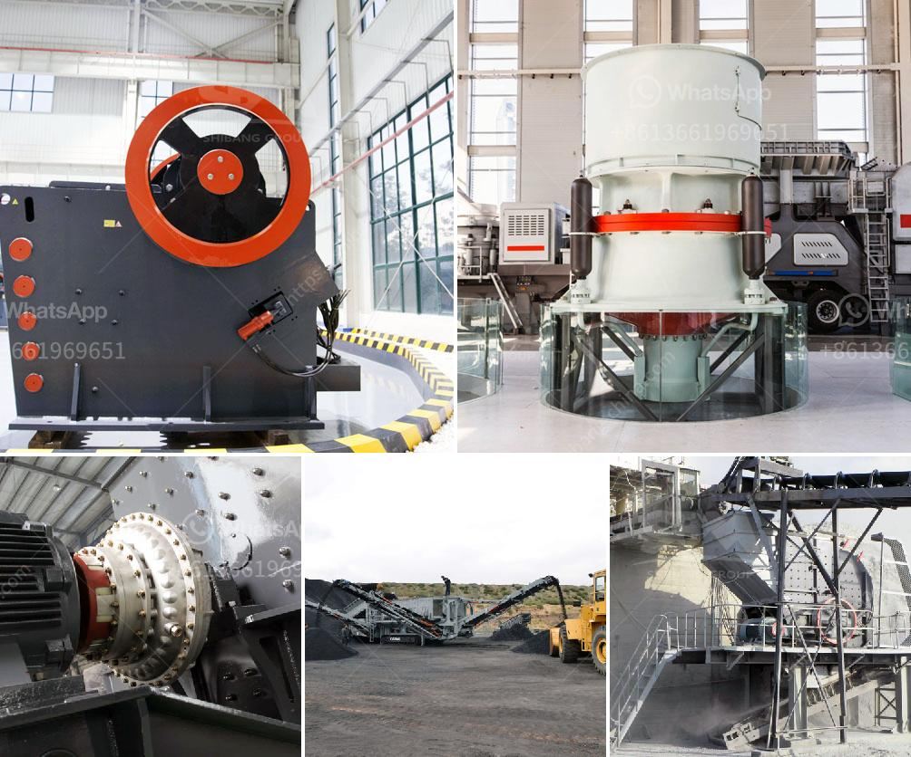

<h3>jaw crusher size and capacity</h3>
The jaw crusher is a versatile machine that can be used for crushing materials of various hardness and sizes. The jaw crusher is used mainly in the first stage of crushing, which can be considered as the primary crusher. The jaw crusher size and capacity can be determined by considering the following factors:

- The application: The jaw crusher is suitable for crushing materials that are classified as medium-hard to hard. It is widely used in quarries, mining, and recycling to break down materials such as rock, sand, and gravel. The jaw crusher can handle different types of materials with a wide range of hardness and size.

- The size of the feed material: The jaw crusher accepts materials up to a size of about 1 meter. The reduction ratio of the crusher is usually expressed as the reduction ratio of the feed size divided by the product size. It indicates the extent of reduction that can be achieved with the crusher. Generally, a higher reduction ratio indicates a higher crushing capacity.

- The capacity: The jaw crusher has a maximum capacity of 1,440 tons per hour. After the material is crushed to the required particle size, the material is discharged from the outlet of the crusher. Jaw crushers are used for crushing rocks and other materials with a compressive strength of less than 320MPa. They are commonly used as primary crushers in the mining, quarrying, and recycling industries.

- The dimensions: The jaw crusher comes in different sizes and dimensions. The size of the crusher should be selected based on the maximum feed size and the desired product size. The size of the crusher can range from 4 feet to 6 feet and is typically determined by the size of the feed opening.

In summary, the jaw crusher size and capacity are determined by multiple factors such as the application, the size of the feed material, the capacity, and the dimensions. It is important to select the appropriate jaw crusher based on these factors to ensure optimal performance and efficiency in crushing operations.
<h3>Contact us</h3><ul><li><strong>Whatsapp:&nbsp;<a href="https://wa.me/8613661969651">+8613661969651</a></strong></li><li><a href="https://swt.shibang-china.com/?git&amp;zhl&amp;jaw crusher size and capacity"><strong>Online Service(chat now)</strong></a></li></ul><h3>Related</h3><ul><li><a href='placer mining wash plant operating costs.md'>placer mining wash plant operating costs</a></li><li><a href='carbon black grinding.md'>carbon black grinding</a></li><li><a href='harga stone crusher mini bekas.md'>harga stone crusher mini bekas</a></li><li><a href='small crusher project.md'>small crusher project</a></li><li><a href='crushers machines for sale in south africa.md'>crushers machines for sale in south africa</a></li></ul>