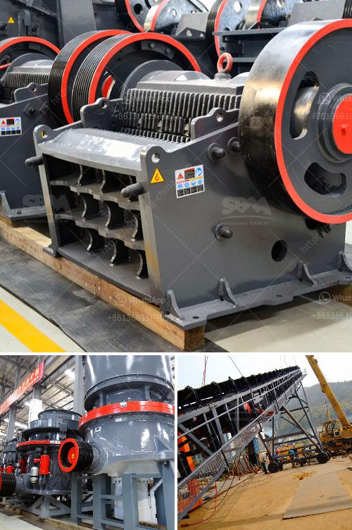

<h3>jaw crusher small size product</h3>
In the construction industry, jaw crushers are used to break down large stones into smaller pieces. These machines are indispensable as they help the industry achieve its objectives by reducing the size of aggregates used in construction projects, such as roads, bridges, and buildings. However, not all projects require large-sized jaw crushers. There are instances when a smaller size jaw crusher is more appropriate in meeting specific project requirements. In this article, we will explore the benefits and applications of jaw crusher small size products.

First and foremost, a jaw crusher small size product offers great versatility. These compact machines are capable of processing a diverse range of materials, including various types of rocks, concrete, and asphalt. Whether it is for residential, commercial, or industrial use, a smaller jaw crusher can easily handle different materials, making it suitable for a wide variety of construction projects.

Another advantage of using a jaw crusher small size product is its efficiency and cost-effectiveness. Smaller jaw crushers typically work at a higher speed compared to larger ones. This high-speed operation allows the machine to quickly and efficiently crush materials, saving time and reducing labor costs. Additionally, the smaller size of the machine requires less power consumption, resulting in lower energy costs. Consequently, jaw crusher small size products contribute to reducing overall project expenses.

Despite their compact size, these machines offer impressive performance capabilities. With advanced technology and high-quality parts, small jaw crushers deliver excellent crushing power. They are equipped with strong and durable jaw plates that can withstand continuous use and resist wear and tear. This ensures that the machine can consistently deliver reliable and efficient results even when processing hard and challenging materials.

The small size of jaw crushers also enhances their portability. These machines can easily be transported to different job sites, allowing construction companies to complete projects in various locations. Compared to larger jaw crushers that require additional equipment for transportation, small-sized options offer a more flexible and convenient solution for the construction industry.

Moreover, small jaw crushers are ideal for areas with limited space and tight working conditions. Whether it is a confined construction site or a congested urban environment, these compact machines can efficiently operate in tight spaces. Their small footprint enables them to maneuver easily, providing easy access to hard-to-reach areas and reducing the need for additional labor or equipment.

In conclusion, jaw crusher small size products have become an essential addition to the construction industry. With their versatility, efficiency, and cost-effectiveness, these compact machines offer a wide range of applications in various construction projects. Their portability and ability to operate in confined spaces make them an ideal choice for projects with limited space or challenging working conditions. Furthermore, their impressive performance capabilities ensure consistent and reliable results, helping the industry achieve its objectives effectively and efficiently.
<h3>Contact us</h3><ul><li><strong>Whatsapp:&nbsp;<a href="https://wa.me/8613661969651">+8613661969651</a></strong></li><li><a href="https://swt.shibang-china.com/?git&amp;zhl&amp;jaw crusher small size product"><strong>Online Service(chat now)</strong></a></li></ul><h3>Related</h3><ul><li><a href='advantech grinding mill india.md'>advantech grinding mill india</a></li><li><a href='how to set up a crushing plant.md'>how to set up a crushing plant</a></li><li><a href='looking for small coal processing equipment.md'>looking for small coal processing equipment</a></li><li><a href='machine to crush stones for gold from germany.md'>machine to crush stones for gold from germany</a></li><li><a href='aggregate crushing processes.md'>aggregate crushing processes</a></li></ul>