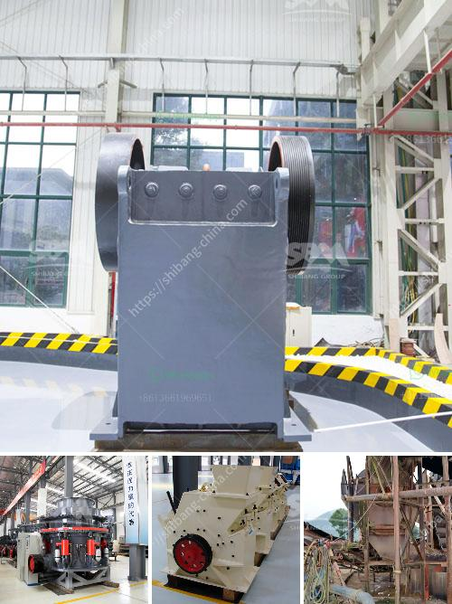

<h3>jaw crusher start up procedure</h3>
A jaw crusher is a device that reduces the size of various solid materials in many applications, including underground mining and mobile crushing applications mainly using the compressive force of the two jaws, one of which is stationary and the other is moving. The jaw crusher's moving jaw undergoes two main types of motion, one resulting from the eccentric shaft movement, and the second from the toggle plate and the tension rod. Using simulation and the discrete element method (DEM), it is possible to model the complex crushing process in order to optimize the operation and design of the machine.

Prior to starting a jaw crusher, operators must fully understand all safety guidelines and instructions outlined in the operation manual. Failure to follow these instructions may result in serious bodily injury or death. Here are some key procedures operators should follow when starting a jaw crusher:

1. Conduct a thorough pre-operation inspection before starting the crusher. This includes checking for any potential material buildup, ensuring the jaw plates, cheek plates, and toggle plate are properly secured, verifying the lubrication system is in good working order, and examining the safety guards.

2. Before starting the jaw crusher, the operator should ensure the crusher chamber is free from any debris or obstructions. This includes pushing any stray material off the base plate and removing any large rocks that may be lodged in the hopper or feeding inlet.

3. Once the crusher chamber is clear and the machine is ready to be started, operators should strictly adhere to the startup sequence outlined in the operation manual. This typically involves starting the lubrication system, followed by the motor, and finally the crusher itself.

4. During the startup process, operators should closely monitor the various components of the jaw crusher for unusual vibrations or noises. If any abnormalities are detected, the machine should be shut down immediately to prevent further damage.

5. Once the jaw crusher is running smoothly, operators can gradually feed the material into the machine. It is important to note that overfeeding may cause mechanical issues, so operators must maintain a consistent and controlled feed rate.

6. After the jaw crusher has been started for a period of time, operators should perform a comprehensive inspection to ensure the machine is in good working order. This includes checking the toggle plate, pitman arm, and any other critical components for signs of wear or damage.

By following these startup procedures, operators can ensure the jaw crusher operates efficiently and safely, ultimately maximizing productivity and reducing downtime. Additionally, proper startup procedures contribute to a longer lifespan for the machine and minimize the risk of costly repairs.
<h3>Contact us</h3><ul><li><strong>Whatsapp:&nbsp;<a href="https://wa.me/8613661969651">+8613661969651</a></strong></li><li><a href="https://swt.shibang-china.com/?git&amp;zhl&amp;jaw crusher start up procedure"><strong>Online Service(chat now)</strong></a></li></ul><h3>Related</h3><ul><li><a href='construction equipment manufacturer in turkey.md'>construction equipment manufacturer in turkey</a></li><li><a href='jual beli stone crusher bekas.md'>jual beli stone crusher bekas</a></li><li><a href='limestone mining crusher industry in nepal.md'>limestone mining crusher industry in nepal</a></li><li><a href='ball mill projects for slag in india.md'>ball mill projects for slag in india</a></li><li><a href='conveyor belts in horizontal position.md'>conveyor belts in horizontal position</a></li></ul>