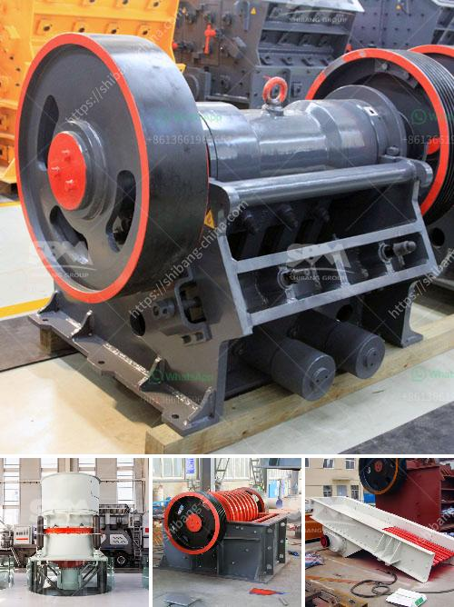

<h3>jaw crusher supplier in jakarta</h3>
Jaw crusher is a machine or tool widely used in the mining industry in general placement outdoors. A one-use equipment at the time of the destruction of the first stage and the second stage. Has the power to destroy the anti-pressure high up the material can reach 320Mpa. In addition, jaw crusher has other functions as a tool to destroy the material with high hardness levels. This machine has the functionality to destroy such material due to the material between its two jaws chambers. Since being created, the machine has undergone various improvements and has been proven to be very effective in facilitating productivity and processing various types of processing when needed.

When you decide to use the product from a jaw crusher supplier in Jakarta, you will get the following benefits:

1. The machine is resistant to excessive pressure and is suitable for your needs during your initial crushing stage.

2. This product can be used efficiently to crush components at the second stage to achieve the desired result size.

3. In general, this process is a traditional method used and requires little maintenance. This tool is also easy to operate so you are expected to avoid accidents during the crushing process.

4. The cost performance quotient is very low, making it one of the most economical tools for crushing purposes.

7. Regardless of whether the material is big or small, this tool can crush it into granules of a desired size quickly and efficiently.

8. The end result of the crushed material is rubble and ballast that can be used in other construction projects.

Jaw crushers that are used in the mining industry differ significantly from those used in construction and processing of asphalt and coal. As a result, the Jakarta crusher supplier offers a wide range of crushers to match the needs of every customer. Different types of crushers are also offered to suit specific applications as required. The primary models offered by the company include the jaw crushers, impact crushers, cone crushers, and mobile crushers.

Jaw crusher suppliers are also responsible for ensuring the quality of the product they supply, along with providing customers with the most competitive price. The price of a jaw crusher is determined by the size of the unit and the different components it consists of. The rise in demand for this type of equipment ultimately depends on the amount of production material that needs to be crushed. Efficiency, reliability, and performance of the jaw crusher are all affected by the shape and texture of the raw input material. So, the supplier must be able to consistently provide high-quality material by using the best possible sourcing techniques.

In conclusion, a jaw crusher supplier in Jakarta has its own advantages in terms of service, life span, and quality. These advantages benefit customers in many ways, resulting in efficiency that can last for long periods. It can also ensure continuous reliability for customers who are willing to replace new equipment as needed. Whether customers want to launch a new stone crushing plant or want to purchase new crushers for their existing infrastructure, a jaw crusher supplier in Jakarta is a great option to consider.
<h3>Contact us</h3><ul><li><strong>Whatsapp:&nbsp;<a href="https://wa.me/8613661969651">+8613661969651</a></strong></li><li><a href="https://swt.shibang-china.com/?git&amp;zhl&amp;jaw crusher supplier in jakarta"><strong>Online Service(chat now)</strong></a></li></ul><h3>Related</h3><ul><li><a href='conveyor belt supplier in riyadh.md'>conveyor belt supplier in riyadh</a></li><li><a href='suppliers of conveyor belts in malaysia.md'>suppliers of conveyor belts in malaysia</a></li><li><a href='stone crushing machines for brick making.md'>stone crushing machines for brick making</a></li><li><a href='types of coal crusher.md'>types of coal crusher</a></li><li><a href='prices of stone crushers in johannesburg.md'>prices of stone crushers in johannesburg</a></li></ul>