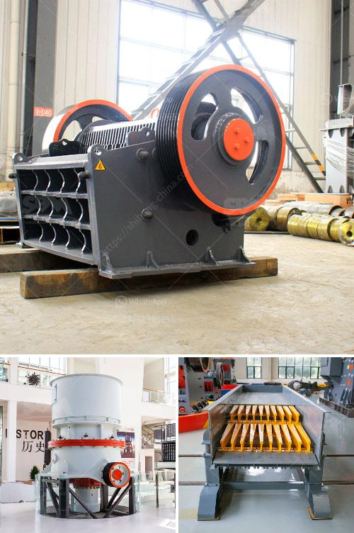

<h3>jaw crusher technical parameter</h3>
One of the most commonly used crushing machines today is the jaw crusher. It is a heavy-duty machine that is generally used for crushing different kinds of raw materials into smaller pieces. The jaw crushers can be seen in the mining and disposal industries where large rocks need to be crushed into smaller pieces for further use.

There are many technical parameters that affect the production and efficiency of the jaw crusher. These parameters include the angle of the vibrating screen, the frequency of the vibrating system, the amplitude of the vibrating system, the number of screens, and the weight of the products. Each of these parameters plays a crucial role in the overall performance of the jaw crusher.

One of the most important parameters is the angle of the vibrating screen. This parameter determines the angle at which the material will be fed into the jaw crusher. A smaller angle will result in a more efficient crushing process, while a larger angle may cause the material to be ejected before it is properly crushed. Therefore, it is essential to select an appropriate angle for optimal performance.

Another important parameter is the frequency of the vibrating system. This parameter determines how often the vibrating screen will vibrate per unit of time. A higher frequency will result in a quicker and more efficient crushing process, whereas a lower frequency may delay the material's crushing process.

The amplitude of the vibrating system is also a crucial parameter. This parameter determines the maximum displacement of the vibrating screen during its cyclic motion. A larger amplitude will result in a greater crushing force, allowing the jaw crusher to break down larger and harder rocks. However, an excessively large amplitude may cause the vibrating screen to malfunction.

The number of screens in the jaw crusher system is also critical. More screens allow for the material to be separated into different sizes or grades, which improves efficiency. Finally, the weight of the products is essential in determining the production capacity of the machine and is directly related to its power consumption.

In conclusion, various technical parameters significantly influence the performance and efficiency of a jaw crusher. The angle, frequency, amplitude, number of screens, and weight of the products all play important roles in determining the optimal performance of the machine. Understanding and optimizing these parameters will result in a more efficient crushing process and higher-quality final products.
<h3>Contact us</h3><ul><li><strong>Whatsapp:&nbsp;<a href="https://wa.me/8613661969651">+8613661969651</a></strong></li><li><a href="https://swt.shibang-china.com/?git&amp;zhl&amp;jaw crusher technical parameter"><strong>Online Service(chat now)</strong></a></li></ul><h3>Related</h3><ul><li><a href='barite mining and quarry equipment spain.md'>barite mining and quarry equipment spain</a></li><li><a href='crusher conveyor philippines.md'>crusher conveyor philippines</a></li><li><a href='jaw crusher with different size supplier in india.md'>jaw crusher with different size supplier in india</a></li><li><a href='chrome crusher for sale south africa.md'>chrome crusher for sale south africa</a></li><li><a href='roller crusher mill for calcium carbonate.md'>roller crusher mill for calcium carbonate</a></li></ul>