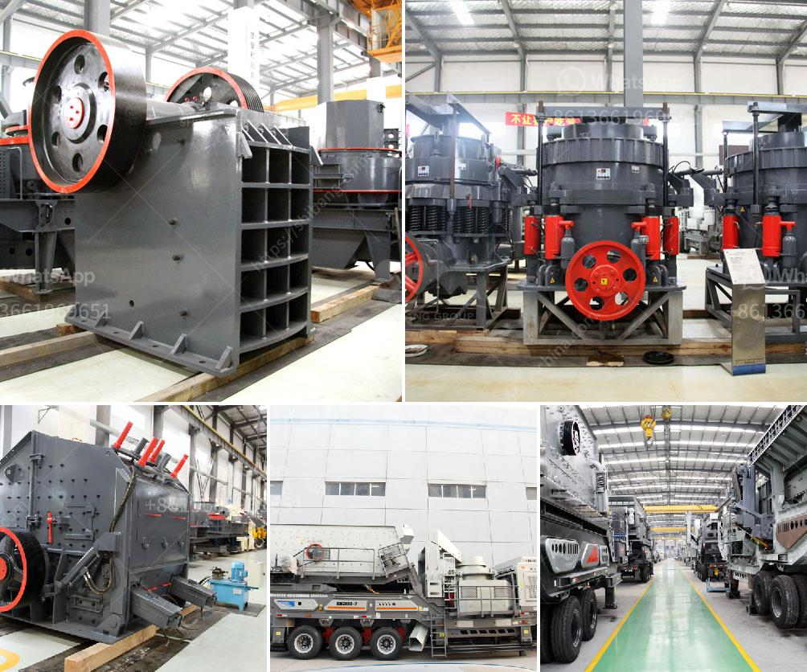

<h3>jaw crusher types</h3>
Jaw crushers are powerful machines that break down hard materials into smaller pieces. They are commonly used in quarries, metallurgical plants, and mining operations. The two main jaw crusher types are the Blake crusher and the Dodge crusher. These two designs have different mechanisms of crushing materials, and differ in their applications and wearing surfaces.

Invented by Eli Whitney Blake in 1858, the Blake Crusher was the first in a new generation of jaw crushers. It is characterized by its sturdy jaw plate, which is made of manganese steel and its ability to break materials, such as rock and ore, into smaller pieces for further processing. The Blake Crusher has a moveable jaw that pivots on a swinging shaft, which causes the jaws to move back and forth, producing an ample amount of crushing force.

One of the key design principles of the Blake Crusher is its simplicity. It is known for being robust and reliable, and requires less maintenance compared to other jaw crusher types. However, the Blake Crusher has a limited feed opening, which restricts its application in large-scale operations. It is more suitable for small to medium-sized projects that require moderate amounts of crushing.

The Dodge Crusher, also known as the Dodge Type 2D, is similar in design to the Blake Crusher, but with one key difference: the swing jaw is fixed at the lower position. The Dodge Crusher relies on the impact force between the stationary jaw and the moving jaw to break down materials. This design allows for a larger feed size and higher crushing capacity compared to the Blake Crusher.

Another advantage of the Dodge Crusher is its ability to produce a uniform product size. As the material is crushed between the stationary and moving jaws, it is forced to pass through a narrow gap, resulting in a more consistent size distribution of the crushed material. This makes the Dodge Crusher suitable for crushing a diverse range of materials, from softer minerals to hard rocks.

Both the Blake Crusher and the Dodge Crusher have different wearing surfaces. In the Blake Crusher, the jaw plates are fixed onto the frame and can withstand wear due to their hardness and durability. On the other hand, the Dodge Crusher has replaceable wear plates, which are located between the fixed and swing jaws. These wear plates can easily be replaced, minimizing downtime and reducing operating costs.

In conclusion, the Blake Crusher and the Dodge Crusher are two jaw crusher types that are commonly used in mining and quarrying operations. These machines are classified based on their mechanism of crushing, their applications, and their wearing surfaces. The Blake Crusher is known for its simplicity and reliability, while the Dodge Crusher has a larger feed opening and can produce a more uniform product size. Both crushers have their advantages and are suitable for different crushing applications.
<h3>Contact us</h3><ul><li><strong>Whatsapp:&nbsp;<a href="https://wa.me/8613661969651">+8613661969651</a></strong></li><li><a href="https://swt.shibang-china.com/?git&amp;zhl&amp;jaw crusher types"><strong>Online Service(chat now)</strong></a></li></ul><h3>Related</h3><ul><li><a href='used stone cursher machinery in uae.md'>used stone cursher machinery in uae</a></li><li><a href='ball mill in peru.md'>ball mill in peru</a></li><li><a href='crushing plant suppliers in pakistan.md'>crushing plant suppliers in pakistan</a></li><li><a href='small slag crushing plant manufacturers in delhi.md'>small slag crushing plant manufacturers in delhi</a></li><li><a href='manganese ore jaw crusher south africa.md'>manganese ore jaw crusher south africa</a></li></ul>