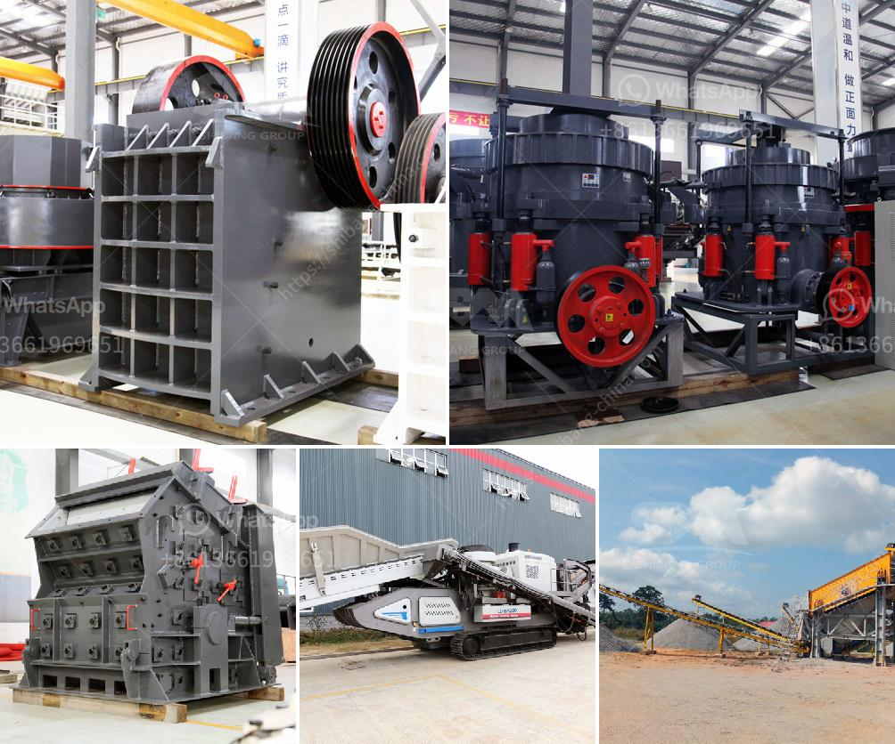

<h3>jaw crusher with different size supplier in india</h3>
India's infrastructure industry has always been one of the key drivers of the country's economic growth. With extensive road networks, bridges, and skyscrapers being constructed, the demand for high-quality construction materials is increasing rapidly. One such crucial material is crushed stones, which are used as raw materials for concrete and asphalt production.

Jaw crushers play a fundamental role in the stone crushing process, enabling efficient size reduction of brittle materials. These devices are primarily utilized when the size of the crushed material is ranging from 300mm to 700mm, varying from medium-hard to hard. The crusher allows primary crushing of the hardest rocks, minimizing operational costs. Jaw crushers are reliable, durable, and highly efficient.

In recent years, India has witnessed a significant surge in infrastructure development. With this growth, the demand for different sizes of crushed stones has also increased. To meet these requirements, India's construction industry is relying on jaw crushers with different sizes.

One of the most popular jaw crusher suppliers in India is Nandhi Crushers. The company offers a variety of models in different sizes. Nandhi Crushers are reliable jaw crusher manufacturers in India, producing high-quality stone crushing equipment. The company uses advanced manufacturing processes to create jaw crushers with superior strength and reliability.

Nandhi Crushers are robust machines, designed to operate in tough conditions. The frame of the crusher is made from high-quality steel and the jaw plates are made of manganese steel to withstand the impact of heavy loads. Nandhi Crushers provide high production capacity, with a wide range of input sizes that vary from 60mm to 500mm, allowing for efficient crushing of different types of materials.

Another reliable supplier for jaw crushers in India is Propel Industries. The company is known for providing top-quality crushers of various sizes for different applications. Propel Industries offers a range of jaw crushers for primary and secondary crushing of various materials. They also provide cone crushers and vertical shaft impactors, ensuring efficient crushing and screening of the desired material.

Propel Industries uses cutting-edge technology to manufacture its crushers. The jaw crushers are equipped with auto-correcting and self-cleaning technologies, ensuring minimal downtime and low maintenance costs. Additionally, the advanced hydraulic systems assist in the smooth functioning of the crushers, reducing the risk of breakdowns.

Metso Outotec, a renowned global supplier, also offers jaw crushers with different sizes in India. The company's Lokotrack® range of jaw crushers provides reliable and efficient material processing in construction and mining applications. These crushers are designed for high productivity and low operating costs.

Metso Outotec jaw crushers are equipped with advanced features such as hydraulic setting adjustment, hydraulic release, and overload protection systems. These features maximize production efficiency while ensuring safe and trouble-free operation.

In conclusion, jaw crushers with different sizes are in high demand in India's construction industry. Nandhi Crushers, Propel Industries, and Metso Outotec are some of the key suppliers offering top-quality jaw crushers. Investing in these crushers guarantees high productivity, efficiency, and reliable performance. As India continues to witness rapid infrastructure growth, such jaw crushers will remain crucial to the construction industry, contributing to the nation's economic development.
<h3>Contact us</h3><ul><li><strong>Whatsapp:&nbsp;<a href="https://wa.me/8613661969651">+8613661969651</a></strong></li><li><a href="https://swt.shibang-china.com/?git&amp;zhl&amp;jaw crusher with different size supplier in india"><strong>Online Service(chat now)</strong></a></li></ul><h3>Related</h3><ul><li><a href='allis chalmers gyratory crushers.md'>allis chalmers gyratory crushers</a></li><li><a href='crusher for rent in malaysia.md'>crusher for rent in malaysia</a></li><li><a href='sand washer turkey.md'>sand washer turkey</a></li><li><a href='buy 450 kw stone crusher.md'>buy 450 kw stone crusher</a></li><li><a href='tata stone crusher machines nairobi.md'>tata stone crusher machines nairobi</a></li></ul>