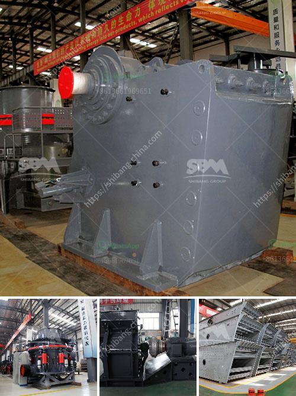

<h3>jaw crushers manufacturers europe</h3>
Jaw crushers are used in various industries such as mining, building materials, and construction. Jaw crushers are commonly used in the mining industry for breaking down big rocks into smaller, manageable pieces to be used for further processing. Europe is one of the major regions to manufacture jaw crushers because of its geographical location and the expertise of its manufacturers. Europea manufacturers make jaw crushers to cater to the growing demand for this equipment in the region and ensure seamless supply to the customers.

One of the leading jaw crusher manufacturers in Europe is ADM. ADM is a global leader in agricultural processing, and its range of jaw crushers are used by customers from various industries. The company has a strong presence in Europe and offers a wide range of jaw crushers to cater to the diverse needs of its customers.

ADM's jaw crushers are known for their robust design, high crushing capacity, and long service life. The company uses advanced manufacturing techniques and high-quality materials to ensure the durability and reliability of its jaw crushers. ADM also focuses on innovation and continuously invests in research and development to introduce new features and improve the performance of its products.

Another prominent jaw crusher manufacturer in Europe is Metso. Metso is a global supplier of equipment, parts, and services for the mining, aggregates, recycling, and process industries. The company's jaw crushers are used in various applications, including mining, quarrying, and recycling. Metso's jaw crushers are known for their high-quality construction and efficiency. The company offers a wide range of jaw crushers, including primary, secondary, and tertiary crushers. Metso's jaw crushers are designed to be reliable, efficient, and easy to maintain.

Sandvik is another well-known jaw crusher manufacturer in Europe. The company offers a range of jaw crushers, including mobile jaw crushers, stationary jaw crushers, and portable jaw crushers. Sandvik's jaw crushers are designed to be versatile, efficient, and reliable. The company has a strong presence in Europe and offers excellent customer support and after-sales service.

In addition to these major manufacturers, there are several other jaw crusher manufacturers in Europe, such as Kleemann, Terex Finlay, and McCloskey. These manufacturers offer a wide range of jaw crushers to cater to the specific needs of their customers. Each manufacturer has its own unique features and advantages, and customers can choose the crusher that best suits their requirements.

In conclusion, Europe is a major hub for jaw crusher manufacturing, with several prominent manufacturers offering high-quality and efficient crushers. These manufacturers focus on providing durable and reliable crushers that can withstand the toughest operating conditions. Whether it is for mining, quarrying, or recycling, Europea manufacturers have a wide range of jaw crushers to cater to the diverse needs of their customers. Customers can choose from several manufacturers and find the crusher that best suits their requirements.
<h3>Contact us</h3><ul><li><strong>Whatsapp:&nbsp;<a href="https://wa.me/8613661969651">+8613661969651</a></strong></li><li><a href="https://swt.shibang-china.com/?git&amp;zhl&amp;jaw crushers manufacturers europe"><strong>Online Service(chat now)</strong></a></li></ul><h3>Related</h3><ul><li><a href='mini rock crusher manufacturer in china.md'>mini rock crusher manufacturer in china</a></li><li><a href='fairly used quarry crusher in nigeria price.md'>fairly used quarry crusher in nigeria price</a></li><li><a href='250 mesh hammer mill.md'>250 mesh hammer mill</a></li><li><a href='limestone crushing and making sand machine.md'>limestone crushing and making sand machine</a></li><li><a href='grinding mill machine roller mill size.md'>grinding mill machine roller mill size</a></li></ul>