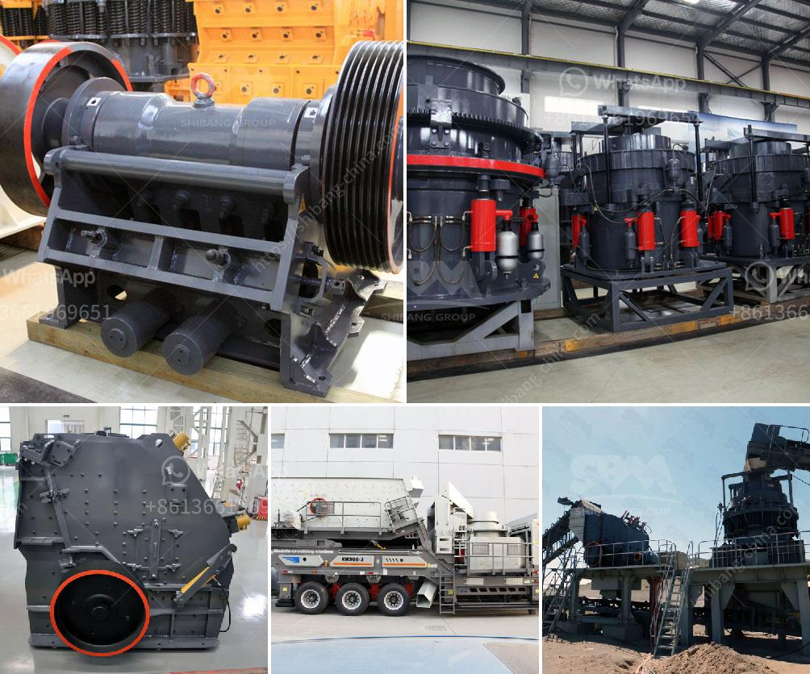

<h3>jaw industry limestone process</h3>
The limestone industry plays a significant role in various sectors, including construction materials, agriculture, and even healthcare. From building materials to agricultural lime that enriches soil, limestone is a versatile mineral that is extracted through a rigorous and systematic process.

One of the primary methods of extracting limestone is through quarrying. Limestone quarries are often large open-pit mines where enormous amounts of rock are extracted from the ground. The process involves drilling holes into the earth's surface and using explosives to break the limestone into smaller pieces. Excavators and loaders are then used to remove the broken rocks from the quarry.

Once the limestone is extracted, it goes through a series of crushing and screening processes. The primary crusher reduces the size of the blasted rocks, transforming them into manageable pieces. These smaller pieces are then conveyed to secondary and tertiary crushers, where further reduction takes place. The resulting material, often called "jaw aggregate," is sorted into different sizes through vibratory screens.

After the crushing and screening process, the limestone undergoes further processing depending on its intended applications. For example, in the construction industry, the limestone may be ground into a fine powder and used as a component in cement production. This process, known as pulverization, involves grinding the limestone into a powder consistency using a variety of milling equipment.

In addition to cement production, limestone is also utilized in agriculture. Agricultural lime, also known as aglime, is produced by crushing limestone rock into a powder or granular form. It is commonly spread on fields to neutralize soil acidity, provide essential nutrients, and improve overall soil structure. Farmers often conduct soil tests to determine the appropriate amount of aglime needed for their specific crops and soil conditions.

Moreover, limestone is a crucial ingredient in various industrial and consumer products. It is used in the manufacturing of glass, as a flux in metallurgical processes, and as a filler or coating agent in paper, plastics, and paint. In the healthcare industry, limestone is used to produce calcium supplements, antacids, and even toothpaste.

Throughout the limestone processing journey, sustainability and environmental responsibility are of utmost importance. Mining and quarrying companies go to great lengths to minimize their environmental impact. This includes implementing best practices for land restoration, re-cultivating areas affected by mining, and monitoring the water and air quality in surrounding regions.

In conclusion, the jaw industry limestone process involves the extraction of limestone through quarrying, followed by crushing, screening, and further processing, depending on its intended applications. This versatile mineral finds its way into various industries, from construction materials to agriculture and healthcare products. Mining companies prioritize sustainable practices to minimize environmental impact and ensure the long-term viability of this essential industry.
<h3>Contact us</h3><ul><li><strong>Whatsapp:&nbsp;<a href="https://wa.me/8613661969651">+8613661969651</a></strong></li><li><a href="https://swt.shibang-china.com/?git&amp;zhl&amp;jaw industry limestone process"><strong>Online Service(chat now)</strong></a></li></ul><h3>Related</h3><ul><li><a href='gold mill three stamp suppliers in south africa.md'>gold mill three stamp suppliers in south africa</a></li><li><a href='mica minerals powder grinding unit in kenya.md'>mica minerals powder grinding unit in kenya</a></li><li><a href='talc crusher processing plant.md'>talc crusher processing plant</a></li><li><a href='quartz grit making machine.md'>quartz grit making machine</a></li><li><a href='safety of conveyor belt ppt.md'>safety of conveyor belt ppt</a></li></ul>