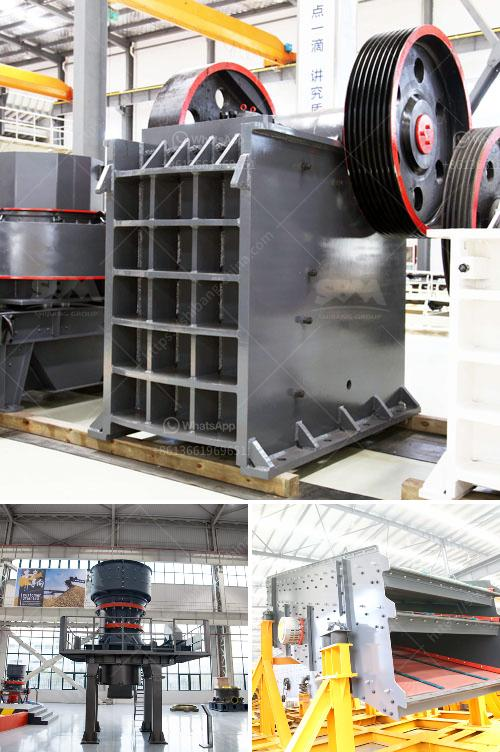

<h3>jual beli stone crusher bekas</h3>
For those who are passionate about stones, the idea of ​​having a stone crusher seems like a dream come true. Unfortunately, not everyone has the ability or resources to acquire this much-desired machine. However, thanks to the option of buying and selling used stone crushers, enthusiasts can now make their dreams a reality.

Jual beli stone crushers bekas, or in English, the purchasing and selling of used stone crushers, is not an easy task. There are several factors to consider when looking for a used stone crusher and to ensure its effectiveness. For instance, consider the condition of the machine, the number of hours it has been used, its maintenance history, and the overall cost of ownership, including transportation fees.

One might wonder why they should opt for a used stone crusher instead of a brand new one. Well, there are quite a few reasons. Firstly, a used stone crusher is typically more affordable compared to a new one. This is especially beneficial for those who have a tight budget but still want to possess a stone crusher for their business or personal use.

Moreover, buying a used stone crusher allows individuals to save both time and effort in the production process. Rather than waiting for a new stone crusher to arrive at the location, a used one can be directly put to work. This means immediate results without any delay or waiting time.

Additionally, buying a used stone crusher is an environmentally friendly way to utilize unused resources. Instead of letting the machine sit idle or disposing of it, individuals can sell it to someone who needs it. In this way, they are preventing unnecessary waste and contributing to the circular economy.

When buying a used stone crusher, it is crucial to ensure that it is in good working condition. This can be done by inspecting the machine thoroughly or seeking the help of a professional. The buyer should check the engine, hydraulic system, transmission, and any other important components. The seller should be forthcoming about the machine's history, including any repairs or maintenance that have been done.

Finally, the buyer and seller must agree on a fair price for the used stone crusher. It is essential to consider the age, condition, and market demand of similar machines to determine a reasonable price. Negotiations can be made based on these factors and both parties should be satisfied with the final agreement.

In conclusion, jual beli stone crusher bekas offers a unique opportunity for stone enthusiasts to acquire a desired machine without breaking the bank. It is an effective way to optimize unused resources while also contributing to the circular economy. However, it is crucial to conduct thorough inspections and negotiations to ensure a successful transaction. With careful consideration and attention to detail, buying and selling used stone crushers can be a rewarding experience for all parties involved.
<h3>Contact us</h3><ul><li><strong>Whatsapp:&nbsp;<a href="https://wa.me/8613661969651">+8613661969651</a></strong></li><li><a href="https://swt.shibang-china.com/?git&amp;zhl&amp;jual beli stone crusher bekas"><strong>Online Service(chat now)</strong></a></li></ul><h3>Related</h3><ul><li><a href='calculation of torque of hammer mill.md'>calculation of torque of hammer mill</a></li><li><a href='sand making machine saudi.md'>sand making machine saudi</a></li><li><a href='mini concrete crushers.md'>mini concrete crushers</a></li><li><a href='advance stone agregate crusher equipments.md'>advance stone agregate crusher equipments</a></li><li><a href='how to dismantle a cone crusher.md'>how to dismantle a cone crusher</a></li></ul>