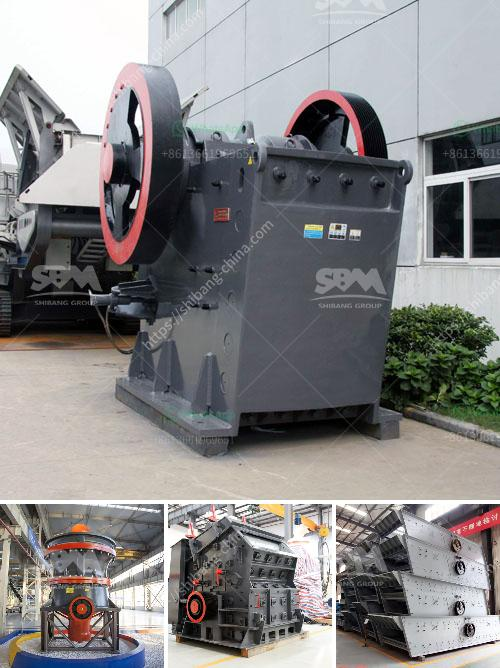

<h3>jual grinding roll mill</h3>
Grinding is an essential process in many industries, especially in manufacturing. It involves the removal of material by abrasion to achieve the desired surface finish or shape. There are various types of grinding machines available, each with its unique features and purposes.

One such machine is the jual grinding roll mill, specifically designed for fine grinding applications. This versatile equipment offers excellent performance and efficiency, making it a go-to choice for many industries.

The jual grinding roll mill consists of two horizontally mounted steel rolls that rotate in opposite directions. The material to be ground is fed between the rolls, where it is compressed and sheared by the rotational motion. This action results in the reduction of particle size and the creation of a smooth and uniform product.

One of the key advantages of the jual grinding roll mill is its ability to produce finer particles compared to other grinding machines. This is achieved through a combination of compression and shear forces, as well as the adjustable gap between the rolls. The smaller the gap, the finer the final product.

Another great feature of the jual grinding roll mill is its versatility. It can grind a wide range of materials, from soft to hard, including minerals, chemicals, pharmaceuticals, and more. Additionally, it can handle both wet and dry grinding, making it suitable for various processing requirements.

In terms of efficiency, the jual grinding roll mill excels. Its compact design and high rotational speeds allow for rapid and consistent grinding. The uniform product size produced ensures efficient downstream processes while minimizing waste.

Maintenance and operation of the jual grinding roll mill are relatively straightforward. The rolls can be easily replaced when worn, and the adjustable gap can be adjusted without much effort. Regular cleaning and lubrication ensure the machine's smooth operation and prolong its lifespan.

When considering purchasing a jual grinding roll mill, there are a few factors to consider. The desired particle size, material properties, and desired production capacity should all be taken into account. Consulting with an expert or supplier can help determine the most suitable model for specific requirements.

In conclusion, the jual grinding roll mill is a valuable tool in the grinding process. Its ability to produce fine particles, versatility in material handling, and efficiency make it an ideal choice for various industries. With proper maintenance and operation, this machine can deliver consistent and high-quality grinding results. Whether in mineral processing, pharmaceuticals, or any other industry that requires fine grinding, the jual grinding roll mill is a reliable and effective solution.
<h3>Contact us</h3><ul><li><strong>Whatsapp:&nbsp;<a href="https://wa.me/8613661969651">+8613661969651</a></strong></li><li><a href="https://swt.shibang-china.com/?git&amp;zhl&amp;jual grinding roll mill"><strong>Online Service(chat now)</strong></a></li></ul><h3>Related</h3><ul><li><a href='quarry dust in concrete sand making stone quarry.md'>quarry dust in concrete sand making stone quarry</a></li><li><a href='lime stone processing machine.md'>lime stone processing machine</a></li><li><a href='marble quarry mining crusher in sudan.md'>marble quarry mining crusher in sudan</a></li><li><a href='millia deasel grinding mill and prices.md'>millia deasel grinding mill and prices</a></li><li><a href='rock crusher machine manufacturer.md'>rock crusher machine manufacturer</a></li></ul>