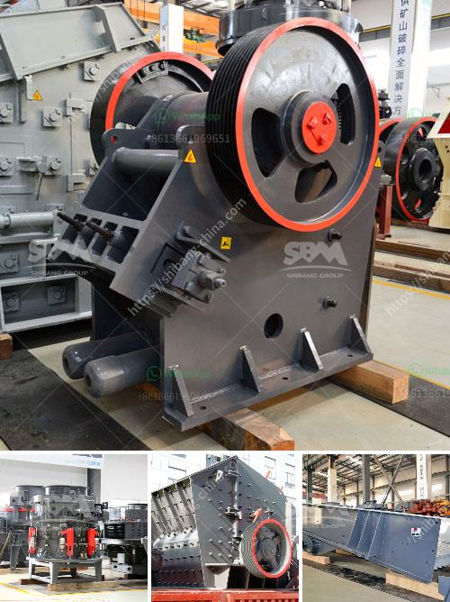

<h3>jual mesin limestone crusher</h3>
When it comes to crushing rocks, there is one machine that has proven to be of great importance. This is the limestone crusher. This is a machine that is used to break down big rocks into smaller pieces. It is commonly used in quarries to produce gravel and aggregate. With the increasing demand for limestone products, it is crucial to have a reliable limestone crusher that can handle this versatile material without causing any issues.

One popular machine that is used for this process is the mesin limestone crusher. This machine is specifically designed to break down limestone, making it easier to handle and transport. The mesin limestone crusher is composed of a rotor that revolves at high speed and throws the limestone particles against the plate of the impact chamber. The machine can further be adjusted to produce coarse or fine limestone products.

The jual mesin limestone crusher is a reliable machine that performs its function tirelessly. It comes equipped with a powerful motor that ensures efficient operation. The machine also has features that make it easy to maintain and operate. This ensures that users can get the maximum benefit from this machine without having to spend a lot of time and effort on its maintenance.

One of the key advantages of using the jual mesin limestone crusher is its ability to produce high-quality limestone products. The machine can produce different sizes of crushed limestone, depending on the required specifications. This versatility makes it suitable for various applications, such as road construction, asphalt production, and concrete production. With the right settings, the machine can produce limestone products that meet the specific needs of different industries.

In addition to its versatility, the jual mesin limestone crusher is also known for its durability. The machine is built to withstand tough working conditions and has a long service life. With regular maintenance, this machine can provide years of reliable service, making it a great investment for businesses in need of a limestone crusher.

In conclusion, the jual mesin limestone crusher is a reliable and efficient machine that can handle the demanding task of crushing limestone. Whether it is used in quarries or industries that require limestone products, this machine is capable of producing high-quality results. Its durability and ease of operation make it a valuable asset for any business that deals with limestone. With proper maintenance, this machine can provide years of reliable service, making it a worthwhile investment. So, if you are in need of a limestone crusher, consider the jual mesin limestone crusher for its exceptional performance and quality.
<h3>Contact us</h3><ul><li><strong>Whatsapp:&nbsp;<a href="https://wa.me/8613661969651">+8613661969651</a></strong></li><li><a href="https://swt.shibang-china.com/?git&amp;zhl&amp;jual mesin limestone crusher"><strong>Online Service(chat now)</strong></a></li></ul><h3>Related</h3><ul><li><a href='jaw crusher pe 250 x 400.md'>jaw crusher pe 250 x 400</a></li><li><a href='quarrying business plant in nigeria.md'>quarrying business plant in nigeria</a></li><li><a href='cara kerja mesin pemecah batu stone crusher.md'>cara kerja mesin pemecah batu stone crusher</a></li><li><a href='machine to crush stones for gold from germany.md'>machine to crush stones for gold from germany</a></li><li><a href='earth moving equipment duty free in zimbabwe.md'>earth moving equipment duty free in zimbabwe</a></li></ul>