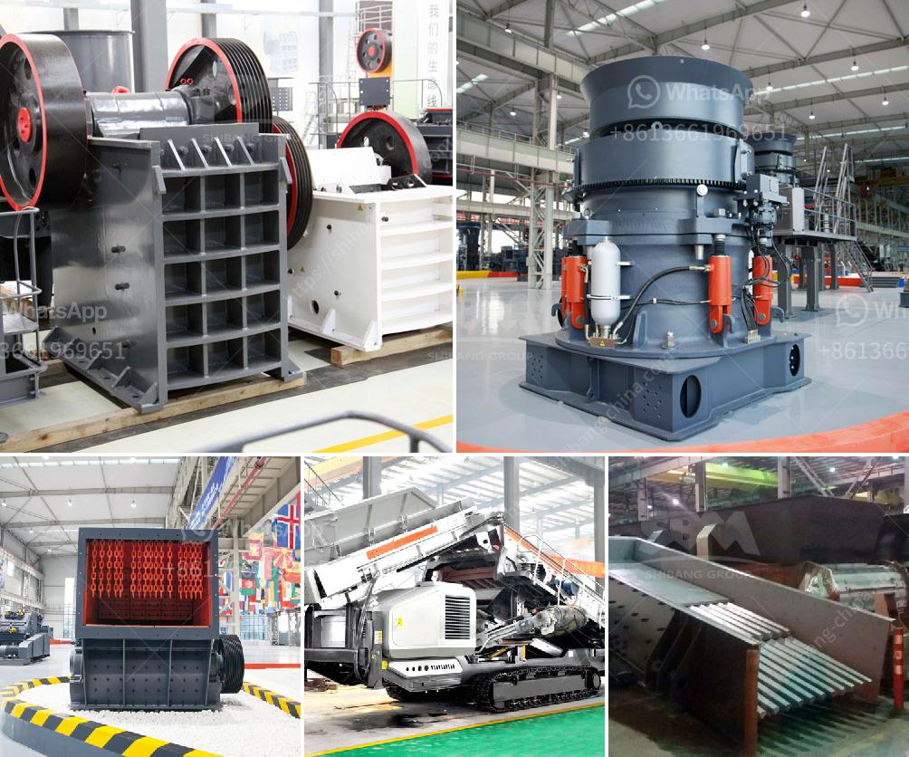

<h3>kaolin stone crusher</h3>
Kaolin, also known as china clay, is a white clay material used in a variety of industrial applications. It is an essential ingredient in the production of paper, rubber, paint, and many other products. Kaolin is also used in ceramics, such as porcelain, and is a popular additive in skincare products due to its ability to absorb excess oils and improve skin texture. To effectively process kaolin, it is first crushed to increase its surface area and prepare it for further processing. A kaolin stone crusher is an indispensable equipment in the kaolin crushing production line.

Kaolin stone crusher has a wide range of application, including industrial, chemical engineering, papermaking, filling, and paint. It is used for crushing limestone, coal, gypsum, and other materials with compressive strength less than 200 MPa. Kaolin stone crusher has several types. Jaw crusher, cone crusher, impact crusher, and mobile crusher are the main ones. Jaw crusher is typically used as the primary crusher, and impact crusher and cone crusher are often used as secondary crusher. Among them, impact crusher has better energy saving and environmental protection performance.

The kaolin stone crusher with impact crusher is a new type of intermediate and fine crushing equipment which is developed according to purified parameter based on the crushing technology at home and abroad. It optimizes the structure and cavity type, improves the crushing efficiency and reduces the wear and cost. Crusher uses the principle of "stone-to-stone" crushing, which breaks the material along its natural cleavage planes, reducing the need for blasting and other harmful methods.

The kaolin stone crusher plant must supervise while in operation. A crusher is a machine designed to reduce large rocks into smaller rocks, gravel, or rock dust. The earliest crushers were hand-held stones, where the weight of the stone provided a boost to muscle power, used against a stone anvil. In industry, crushers are machines which use a metal surface to break or compress materials. A typical processing line at a mine might consist of a crusher followed by a SAG mill followed by a ball mill. In this context, the SAG mill and ball mill are considered grinders rather than crushers.

When it comes to crushing equipment for kaolin stone, Cone Crusher stands out due to its high productivity and easy operation. It has an advanced hydraulic system which provides excellent protection from overload. It is easy to maintain, reduces downtime, and operation costs. Moreover, Cone Crusher has an excellent particle size control system, which provides consistent size reduction results.

In conclusion, the kaolin stone crusher machine is an indispensable equipment in the mining machinery industry. It is mainly used for the coarse and medium crushing of various materials such as limestone, quartz stone, and kaolin. It has many advantages like energy-saving, environmental protection, and easy operation. It is an essential equipment in the kaolin stone crushing production line.
<h3>Contact us</h3><ul><li><strong>Whatsapp:&nbsp;<a href="https://wa.me/8613661969651">+8613661969651</a></strong></li><li><a href="https://swt.shibang-china.com/?git&amp;zhl&amp;kaolin stone crusher"><strong>Online Service(chat now)</strong></a></li></ul><h3>Related</h3><ul><li><a href='barite grinding plant machine sale.md'>barite grinding plant machine sale</a></li><li><a href='stone quarrying machines in dubai.md'>stone quarrying machines in dubai</a></li><li><a href='rock crusher pulverizer.md'>rock crusher pulverizer</a></li><li><a href='supplier of jaw crusher in south africa.md'>supplier of jaw crusher in south africa</a></li><li><a href='jaw crusher small size product.md'>jaw crusher small size product</a></li></ul>