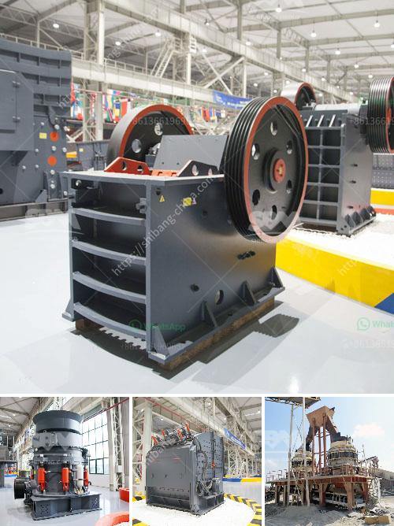

<h3>kenya granite stone crushing plant</h3>
Kenya is a country in East Africa renowned for its scenic landscapes and vast wildlife preserves. With a rich cultural heritage, Kenya has been actively involved in the development of various industries, including mining, agriculture, and tourism. One of the key sectors contributing to the country's economic growth is the mining industry, particularly granite stone crushing.

Granite is an igneous rock with a medium to coarse grain structure. It is usually pink, grey, or white in color and contains high levels of silica, making it extremely hard and durable. Due to its strength and aesthetic appeal, granite has become a popular choice for construction projects, such as buildings, bridges, and monuments.

In Kenya, granite stone is a commonly used raw material for construction projects. The demand for processed granite has been steadily increasing, leading to the establishment of several granite stone crushing plants. These plants include a range of machines such as vibrating screens, crushers, and conveyors capable of reducing the size of the raw materials to meet the desired specifications for construction purposes.

The process of granite stone crushing involves several stages. Initially, the raw material is excavated from the granite quarry and then transported to the crushing plant. The machines used in the crushing plant crush the raw materials into smaller particles with the desired size for further processing. The crushed granite particles are then separated by vibrating screens into different sizes, depending on the specific requirements of the construction project.

The crushed granite is then conveyed to storage bins or directly loaded onto trucks for transportation to the construction site. At the construction site, the granite is used in various applications, including as a base material for roads, foundations for buildings, and as decorative stone in landscaping projects.

The establishment of granite stone crushing plants in Kenya is beneficial to the local economy by providing jobs for local workers and stimulating economic growth. It also helps meet the increasing demand for processed granite stone, which would otherwise need to be imported. By utilizing its own natural resources, Kenya can reduce its reliance on imports and promote self-sufficiency in the construction sector.

Furthermore, the use of granite stone in construction projects in Kenya contributes to the preservation of the environment. By investing in stone crushing plants, the need for quarries in the vicinity of cities and towns can be reduced, minimizing the environmental impact associated with quarrying activities.

In conclusion, Kenya's granite stone crushing plants play a crucial role in the country's economic development. They provide a source of employment, reduce the reliance on imports, and contribute to the sustainable use of natural resources. The construction industry benefits from the availability of high-quality crushed granite, which is used in various applications. As the demand for processed granite continues to grow, the establishment of more stone crushing plants in Kenya is expected, further boosting the country's economy and creating more opportunities for its population.
<h3>Contact us</h3><ul><li><strong>Whatsapp:&nbsp;<a href="https://wa.me/8613661969651">+8613661969651</a></strong></li><li><a href="https://swt.shibang-china.com/?git&amp;zhl&amp;kenya granite stone crushing plant"><strong>Online Service(chat now)</strong></a></li></ul><h3>Related</h3><ul><li><a href='dry mix mortar plant from turkey.md'>dry mix mortar plant from turkey</a></li><li><a href='copper ore separation machine.md'>copper ore separation machine</a></li><li><a href='how much does coal mining machines costs.md'>how much does coal mining machines costs</a></li><li><a href='industrial vibrating feeder.md'>industrial vibrating feeder</a></li><li><a href='spec for 200 tph crushing plant.md'>spec for 200 tph crushing plant</a></li></ul>