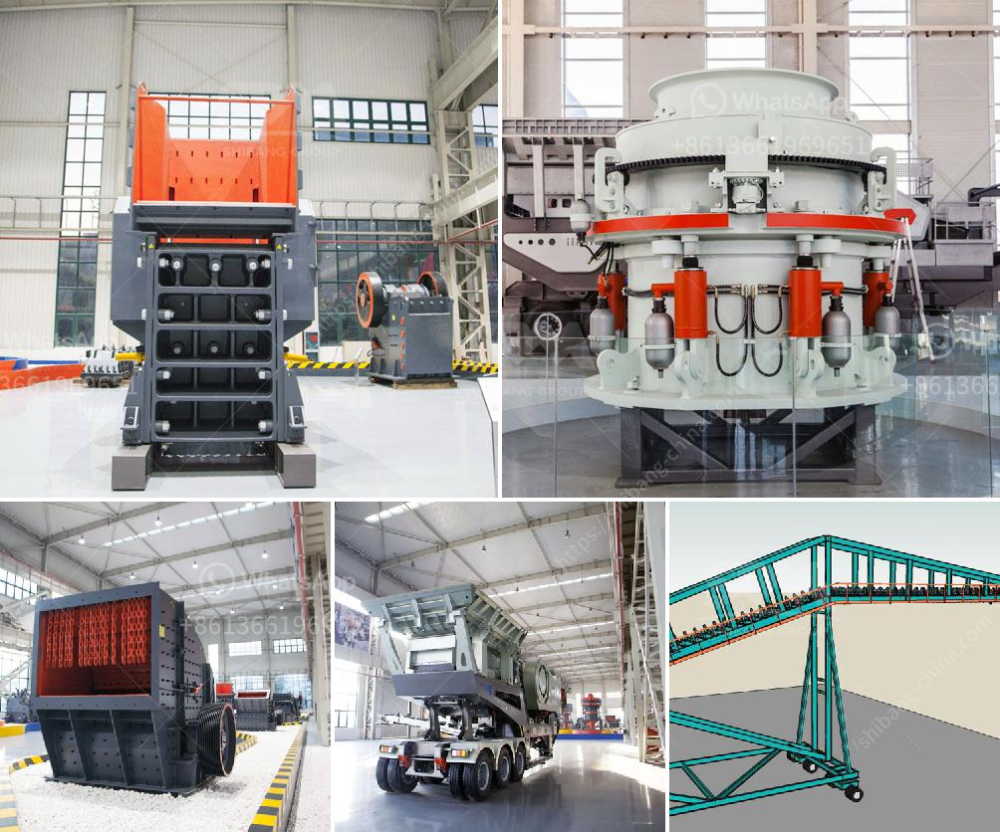

<h3>kenya sand making machine</h3>
In recent years, Kenya has witnessed a remarkable technological revolution, transforming various industries and significantly contributing to the country's economic growth. One such industry that has experienced a revolutionary change is the construction industry with the introduction of advanced machines like the sand making machine.

The sand making machine, often referred to as the VSI crusher, is a revolutionary technology that has made sand production more efficient. It is known for its ability to produce high-quality sand for various construction purposes, such as building roads, making concrete, and creating mortar for plastering walls.

Before the sand making machine's advent, sand production was a labor-intensive and time-consuming process. Traditional methods involved manual extraction of sand from riverbeds, followed by extensive washing and grading. This was not only time-consuming but also led to environmental degradation and the depletion of riverbeds.

The sand making machine, like its name suggests, simplifies and automates the sand production process. It uses advanced crushing and shaping technology to crush rocks and stones into sand particles of different sizes. The machine employs a high-speed rotor with a wear-resistant lining to impart energy on the rock particles, resulting in their fracturing and shaping into sand.

One of the primary advantages of the sand making machine is its ability to produce consistent and high-quality sand. The machine ensures that the produced sand has a consistent particle size distribution, which is critical for achieving the desired strength and workability of concrete. Additionally, the machine can adjust the gradation of sand based on specific project requirements, offering flexibility to construction companies.

Another significant advantage of the sand making machine is its cost-effectiveness. The machine reduces the reliance on river sand, which has become scarce and expensive due to excessive mining. By using locally available rocks and stones, the sand making machine allows construction companies to produce sand on-site, reducing transportation costs and environmental impact.

Furthermore, the sand making machine streamlines the construction process by eliminating the need for extensive washing and grading. The machine produces clean and well-graded sand, ready for immediate use in construction applications. This not only saves time but also increases the speed and efficiency of construction projects.

Kenya's construction industry has embraced the sand making machine with open arms, revolutionizing the way sand is produced in the country. The machine has not only improved the quality of sand but also reduced the dependence on imported sand, which was costly and often of inferior quality.

The sand making machine's impact extends beyond the construction industry. It has created new job opportunities, particularly for skilled operators who operate and maintain these machines. Moreover, the machine has positively contributed to Kenya's economic growth by reducing imports and promoting local manufacturing and innovation.

In conclusion, Kenya's sand making machine has been a game-changer for the construction industry. Its ability to produce high-quality and consistent sand at a lower cost has revolutionized the way sand is produced and used in the country. This innovative technology has not only improved construction practices but also contributed to the country's economic growth. With continued investment in such advanced machines, Kenya is poised to lead the way in sustainable and efficient construction practices.
<h3>Contact us</h3><ul><li><strong>Whatsapp:&nbsp;<a href="https://wa.me/8613661969651">+8613661969651</a></strong></li><li><a href="https://swt.shibang-china.com/?git&amp;zhl&amp;kenya sand making machine"><strong>Online Service(chat now)</strong></a></li></ul><h3>Related</h3><ul><li><a href='total cost of machinery of stone crusher.md'>total cost of machinery of stone crusher</a></li><li><a href='aggregate crushing processes.md'>aggregate crushing processes</a></li><li><a href='coltan processing plant cost.md'>coltan processing plant cost</a></li><li><a href='buy used crushing coal screen plant.md'>buy used crushing coal screen plant</a></li><li><a href='coltan milling equipment in south africa.md'>coltan milling equipment in south africa</a></li></ul>