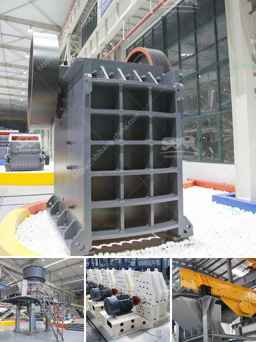

<h3>land requirement for mini cement plant</h3>
A mini cement plant is a small-scale production unit in the cement industry, capable of producing cement from 100 to 300 tons per day. It is a modern-day solution for cement producers who seek to expand their market share and meet customers' demands in various regions or rural areas.

When planning to establish a mini cement plant, one crucial aspect to consider is the land requirement. The land needed for such a project depends on several factors, including the production capacity, the type of cement to be produced, the availability of raw materials, environmental regulations, and future expansion plans.

Generally, a mini cement plant requires a minimum land area of about 3 acres. However, the exact land requirement may vary depending on the local zoning regulations and specific operational needs. Additionally, the plant layout should be designed to ensure proper flow of materials, efficient processing, and comply with safety standards.

It is vital to assess the availability and accessibility of raw materials nearby, as they are the primary inputs in cement production. The main raw materials include limestone, clay, and gypsum. The mini cement plant should be located close to these materials to minimize transportation costs and ensure a steady supply.

Furthermore, environmental regulations play a significant role in determining the land requirement for a mini cement plant. Adequate space must be allocated for pollution control measures, such as dust collectors, air filtration systems, and wastewater treatment facilities. The plant's location should also consider the surrounding population and the impact of its operations on the local community.

Lastly, when considering land requirement for a mini cement plant, it is essential to account for future expansion plans. Even though the initial production capacity may be within the range of 100 to 300 tons per day, there might be a need to increase the capacity in the future to meet growing demand. Therefore, it is advisable to secure additional land adjacent to the plant to accommodate such expansion.

In conclusion, the land requirement for a mini cement plant varies based on production capacity, raw material availability, environmental regulations, and future expansion plans. Investing in a mini cement plant can be a profitable venture, provided proper considerations are made regarding the land requirement and other operational aspects.
<h3>Contact us</h3><ul><li><strong>Whatsapp:&nbsp;<a href="https://wa.me/8613661969651">+8613661969651</a></strong></li><li><a href="https://swt.shibang-china.com/?git&amp;zhl&amp;land requirement for mini cement plant"><strong>Online Service(chat now)</strong></a></li></ul><h3>Related</h3><ul><li><a href='stone crusher process.md'>stone crusher process</a></li><li><a href='mobile crusher indonesia hire mines crusher for sale.md'>mobile crusher indonesia hire mines crusher for sale</a></li><li><a href='gypsum furnace for boiling.md'>gypsum furnace for boiling</a></li><li><a href='crushing pe jaw crusher.md'>crushing pe jaw crusher</a></li><li><a href='small scall stone crushing machine.md'>small scall stone crushing machine</a></li></ul>