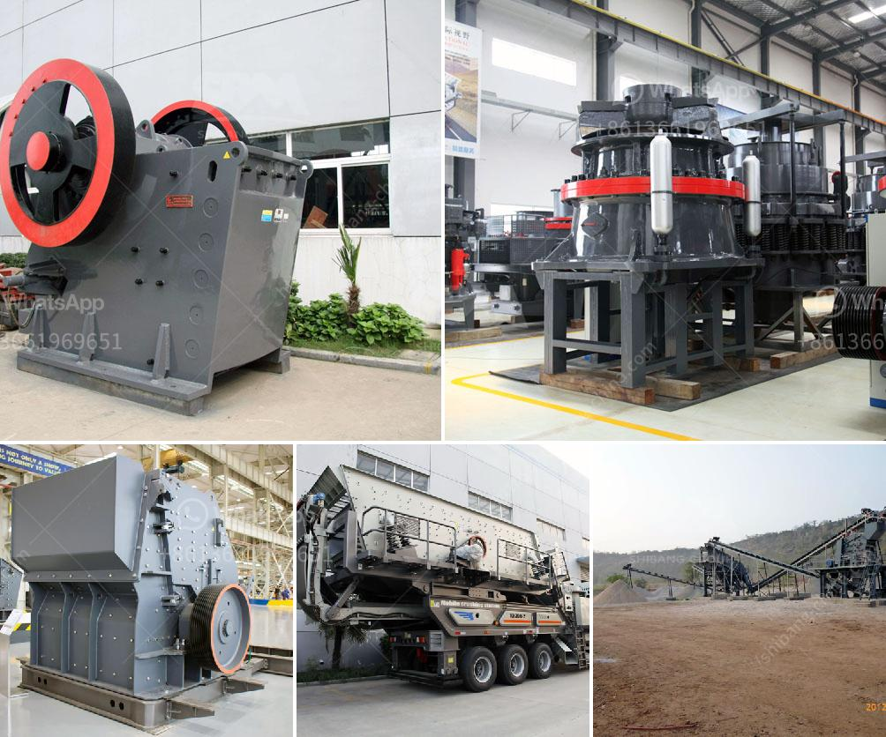

<h3>large capacity ton per hour limestone crushers</h3>
Large capacity limestone crushers play an important role in the limestone crushing industry. With the increasing demand for limestone products, large capacity limestone crushers are needed more and more by manufacturers. To meet the growing needs, manufacturers have made much progress in large capacity limestone crushers. In this article, we will discuss the advantages of large capacity limestone crushers and their working principles.

First of all, large capacity limestone crushers are designed to handle big rocks and ores. A typical limestone crusher can crush materials measuring up to 1.8 meters in diameter. By contrast, the largest material that can be processed by a standard cone crusher is about 4.5 centimeters. This ability to handle large rocks and ores makes large capacity limestone crushers ideal for use in the mining industry, where large amounts of material need to be crushed.

Another advantage of large capacity limestone crushers is their high production capacity. With a powerful crushing cavity and a high crushing ratio, these crushers can process a large amount of material in one hour. For example, a standard limestone crusher can crush 75 to 100 tons of limestone per hour, while a small capacity limestone crusher can only process 15 to 60 tons per hour. With the investment in large capacity limestone crushers, the production capacity of the crushing line can be significantly improved, which can provide high-quality limestone products to meet market demand.

Large capacity limestone crushers are designed with advanced technology and high-quality materials. The materials used in the crushers are carefully selected to ensure their durability and reliability. The crushers are equipped with strong and efficient motors, which can provide the necessary power to crush the material effectively. In addition, the crushers are equipped with advanced hydraulic systems, which can adjust the discharge port size and control the particle size of the crushed material. This allows manufacturers to produce limestone products with different specifications to meet customers' requirements.

The working principle of these crushers is relatively simple. The material enters the crushing cavity from the feeding port and is crushed by the rotating hammers or impact plates. The crushed material is discharged through the lower part of the crusher, and the fineness of the crushed material can be adjusted by changing the gap between the impact plates or the hammers. The crushed material can then be further processed by other equipment, such as vibrating screens or conveyor belts.

In conclusion, large capacity limestone crushers are essential equipment in the limestone crushing industry. They can handle large rocks and ores, have high production capacity, and are designed with advanced technology and high-quality materials. By investing in large capacity limestone crushers, manufacturers can greatly improve their production capacity and provide high-quality limestone products to meet market demand.
<h3>Contact us</h3><ul><li><strong>Whatsapp:&nbsp;<a href="https://wa.me/8613661969651">+8613661969651</a></strong></li><li><a href="https://swt.shibang-china.com/?git&amp;zhl&amp;large capacity ton per hour limestone crushers"><strong>Online Service(chat now)</strong></a></li></ul><h3>Related</h3><ul><li><a href='dolomite mining crusher process.md'>dolomite mining crusher process</a></li><li><a href='roller mill for sale nz.md'>roller mill for sale nz</a></li><li><a href='conveyor belts in merida.md'>conveyor belts in merida</a></li><li><a href='concrete cube crushing machine price.md'>concrete cube crushing machine price</a></li><li><a href='price a stone crusher in peru.md'>price a stone crusher in peru</a></li></ul>