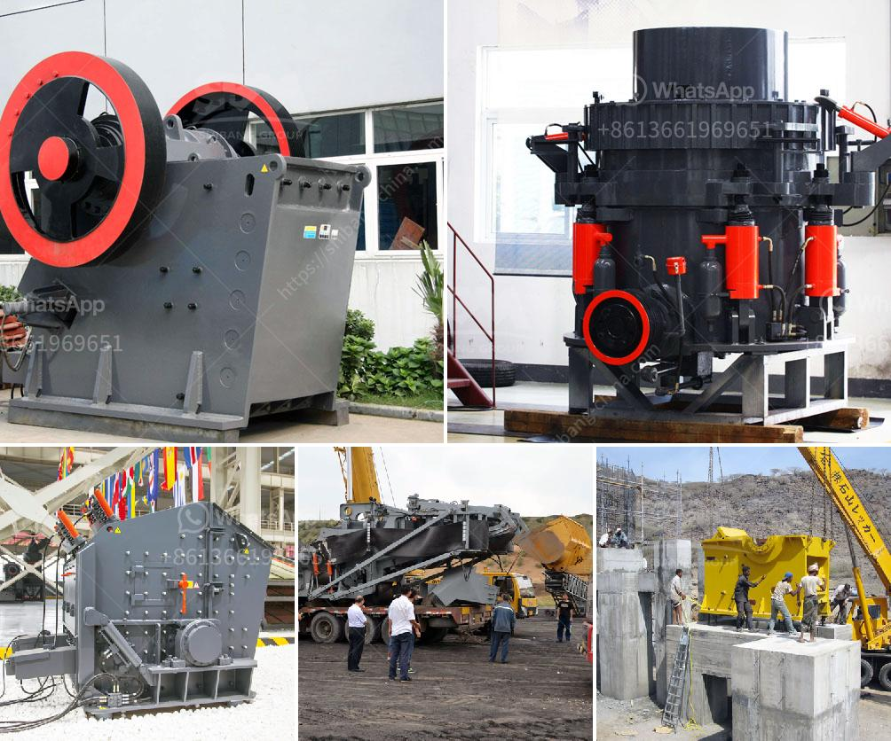

<h3>lime grinding machine manufacturer in kolhapur</h3>
Lime Grinding Machine Manufacturer in Kolhapur: Providing Superior Quality Machines for Efficient Lime Grinding

Lime, or calcium oxide, is a crucial ingredient in many industrial and chemical processes. However, in order to utilize lime effectively, it needs to be crushed, ground, and processed into fine particles. This is where lime grinding machines come into play. A prominent lime grinding machine manufacturer in Kolhapur, Maharashtra, has been catering to the needs of diverse industries for several years, offering top-quality grinding machines for lime processing.

When it comes to grinding machines for lime, it is crucial to choose a reliable manufacturer that specializes in the production of these machines. Lime grinding requires precision and efficiency to ensure the consistent production of high-quality lime particles, which are utilized in construction, agriculture, and many other sectors. The lime grinding machine manufacturer in Kolhapur has successfully mastered the art of creating machines that consistently deliver the desired output.

One of the primary advantages of choosing a reputable lime grinding machine manufacturer is the assurance of superior quality machines. These manufacturers understand the specific needs of the lime grinding process, and their machines are designed to meet those requirements precisely. They incorporate advanced technology and superior components to ensure long-lasting durability, high efficiency, and minimal maintenance needs.

Additionally, lime grinding machine manufacturers in Kolhapur often offer a wide range of machine options to cater to different industry needs. These machines are available in various sizes, capacities, and configurations, allowing businesses to choose the most suitable option based on their specific requirements. Whether a company requires a small-scale lime grinding machine for laboratory purposes or a large-scale machine for commercial production, they can find the right solution from reputable manufacturers in Kolhapur.

Moreover, these manufacturers prioritize customer satisfaction and provide comprehensive after-sales services to ensure optimal machine functioning. They offer installation assistance, technical support, and regular maintenance services to address any operational issues promptly. By choosing a lime grinding machine manufacturer in Kolhapur, businesses can receive reliable support and guidance throughout the entire operation.

Choosing the right lime grinding machine manufacturer is essential for maximizing productivity and minimizing operational costs. By investing in high-quality machines, businesses can experience efficient and cost-effective lime grinding processes, leading to enhanced productivity and profitability. Reputable manufacturers in Kolhapur ensure that their machines are energy-efficient and deliver consistent performance, helping industries achieve their production targets without excessive energy consumption.

In conclusion, lime grinding machine manufacturers in Kolhapur play a vital role in providing superior quality machines for efficient lime grinding. These manufacturers understand the specific needs of lime grinding processes and design machines that deliver consistent, high-quality output. By choosing a reputable manufacturer, businesses can benefit from advanced technology, various machine options, and comprehensive after-sales services. Investing in top-quality lime grinding machines not only improves productivity and profitability but also contributes to sustainable development through energy efficiency.
<h3>Contact us</h3><ul><li><strong>Whatsapp:&nbsp;<a href="https://wa.me/8613661969651">+8613661969651</a></strong></li><li><a href="https://swt.shibang-china.com/?git&amp;zhl&amp;lime grinding machine manufacturer in kolhapur"><strong>Online Service(chat now)</strong></a></li></ul><h3>Related</h3><ul><li><a href='barite crusher price.md'>barite crusher price</a></li><li><a href='gold ore milling machine.md'>gold ore milling machine</a></li><li><a href='quarry equipment for sale in china.md'>quarry equipment for sale in china</a></li><li><a href='carbonate grinding plant feasibility study.md'>carbonate grinding plant feasibility study</a></li><li><a href='mets ball mill specification.md'>mets ball mill specification</a></li></ul>