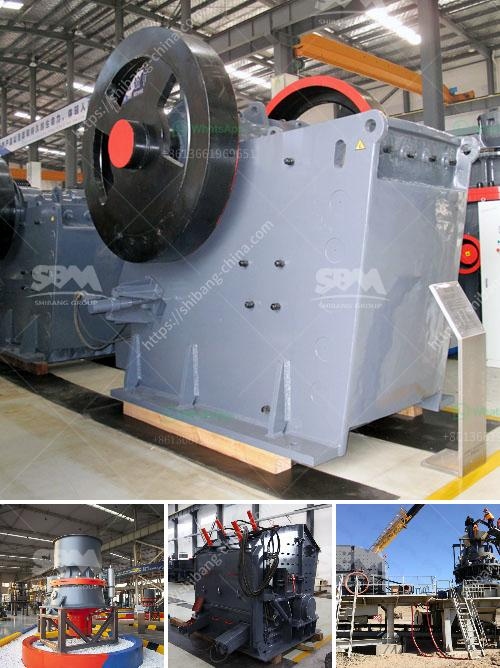

<h3>lime stone crusher rotor</h3>
The rotor is considered as the heart of the lime stone crusher, capable of performing heavy-duty tasks. The rotor consists of a main shaft, a disc, a pin shaft, and hammers that actively interlock and fling the limestone against the breaker plate. It's an essential component at the crushing chamber, where the raw limestone is crushed into smaller fragments before being sent for further processing.

One of the key factors in improving the efficiency of the lime stone crusher rotor is the selection of the appropriate hammers. They come in different shapes and sizes, each designed to deliver optimal impact force. When the rotor rotates, the hammers strike the limestone with tremendous force, breaking it into smaller particles. The specific hammer configuration is crucial to achieve the desired outcome.

Another important aspect of the rotor is its balance. Imbalanced rotors can cause excessive vibration, leading to accelerated wear and tear of the crusher components. To ensure balanced operation, the rotor is carefully designed and manufactured to have equal weight distribution. This helps minimize vibrations and provides a stable working environment for the crusher.

The material used for constructing the rotor also plays a vital role in its performance. For lime stone crushers, the rotor is often made up of high-strength steel to withstand heavy impact forces. The steel used should have high tensile strength, toughness, and resistance to wear and abrasion.

In addition to the material selection, the manufacturing process of the rotor is crucial in ensuring its reliability and durability. The rotor is usually cast or forged to form a solid structure, capable of withstanding the stresses generated during operation. Precision machining is then performed to achieve the required dimensions and tolerances.

Regular maintenance and inspection of the rotor are essential to ensure its optimal performance. It's important to check for any signs of wear, cracks, or damage that may affect its functionality. If any issues are detected, they should be addressed immediately to prevent further damage or failure.

In conclusion, the lime stone crusher rotor is a critical component in achieving efficient and sustainable crushing of limestone. It requires careful attention to design, material selection, manufacturing process, and regular maintenance to ensure its reliable operation. With a properly functioning rotor, the lime stone crusher can provide consistent and high-quality crushed limestone, paving the way for various construction and industrial applications.
<h3>Contact us</h3><ul><li><strong>Whatsapp:&nbsp;<a href="https://wa.me/8613661969651">+8613661969651</a></strong></li><li><a href="https://swt.shibang-china.com/?git&amp;zhl&amp;lime stone crusher rotor"><strong>Online Service(chat now)</strong></a></li></ul><h3>Related</h3><ul><li><a href='xzm ultrafine grinding mill.md'>xzm ultrafine grinding mill</a></li><li><a href='specification for stone crushing for roads.md'>specification for stone crushing for roads</a></li><li><a href='crusher price china.md'>crusher price china</a></li><li><a href='two roll mill machine.md'>two roll mill machine</a></li><li><a href='screening and crushing solutions.md'>screening and crushing solutions</a></li></ul>