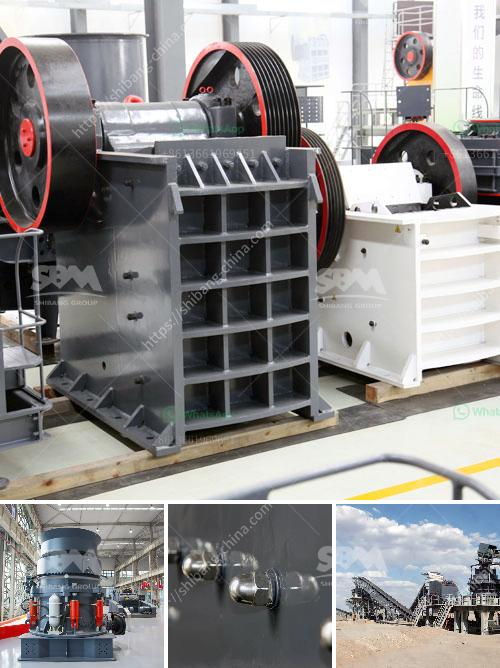

<h3>lime stone processing machine</h3>
Limestone is a sedimentary rock composed primarily of calcium carbonate. It forms from the accumulation of the remains of marine organisms such as coral and shells. Over millions of years, these remains are compressed and lithified into solid rock. Limestone is a versatile stone used in various industries, including construction, agriculture, and manufacturing. In order to utilize limestone efficiently, it needs to be processed using specialized machines.

One of the most important machines in limestone processing is the limestone crushing machine. This machine breaks the limestone into smaller pieces, making it easier to transport and use as raw material. In the limestone crushing machine, jaw crusher is used as the primary crusher. It is one of the most commonly used limestone processing machines. As the primary crushing equipment, jaw crusher has strong crushing capability and large crushing ratio.

After being crushed, the limestone can be further processed by the limestone grinding machine. The limestone grinding machine is a key piece of equipment for grinding crushed materials, and it is widely used in production lines for powders such as cement, silicates, refractory material, fertilizer, glass ceramics, etc. as well as for ore dressing of both ferrous and non-ferrous metals.

In addition to the crushing and grinding machines, there are various other machines used in the limestone processing plant. For example, the limestone calcining machine is used to calcine limestone to produce quicklime, a precursor for cement production. The limestone conveyor belt system is used to transport limestone from one process to another, ensuring efficient and continuous limestone processing. The limestone screening machine is used to separate the granules or powders from the crushed limestone, ensuring high-quality limestone products.

With the development of technology, more advanced machines have been introduced to the limestone processing industry. For example, the limestone raymond mill is a new type of limestone grinding machine developed by CLIRIK Machinery Co., Ltd. It is widely used in the grinding of limestone, limestone, bauxite, dolomite, talc, and other mineral materials. The fineness of finished products can be adjusted between 0.18mm-0.038mm by changing the screen pore size.

In conclusion, limestone processing machines play a vital role in the production of limestone products. These machines break, crush, grind, calcine, and separate limestone to produce high-quality materials for various industries. With the advancement of technology, more efficient and advanced machines have been introduced, improving the efficiency and quality of limestone processing. As the demand for limestone products continues to grow, the development and improvement of limestone processing machines are expected to continue, ensuring the industry's sustainability and growth.
<h3>Contact us</h3><ul><li><strong>Whatsapp:&nbsp;<a href="https://wa.me/8613661969651">+8613661969651</a></strong></li><li><a href="https://swt.shibang-china.com/?git&amp;zhl&amp;lime stone processing machine"><strong>Online Service(chat now)</strong></a></li></ul><h3>Related</h3><ul><li><a href='used aggregate crusher for sale in india.md'>used aggregate crusher for sale in india</a></li><li><a href='vertical mill rock.md'>vertical mill rock</a></li><li><a href='prices of stone crushers in johannesburg.md'>prices of stone crushers in johannesburg</a></li><li><a href='marble powder plant price pakistan.md'>marble powder plant price pakistan</a></li><li><a href='small profile format for crusher company.md'>small profile format for crusher company</a></li></ul>