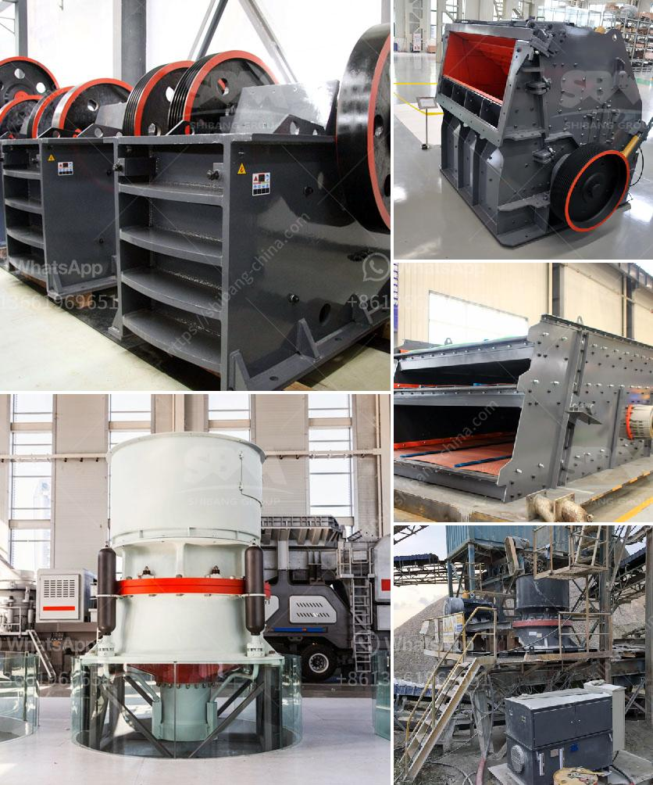

<h3>limestone crisher machine for sale in cebu</h3>
Limestone is a sedimentary rock composed mainly of calcium carbonate (CaCO3), usually in the form of calcite or aragonite. It is a common rock type found in many parts of the world, including the Philippines. In Cebu, specifically, limestone is abundant, making it an ideal material for various construction projects.

To extract the rock from the quarry, a limestone crusher machine is used. This machine utilizes a heavy-duty rotor that crushes the limestone into manageable sizes. The machine's hammer mill-type crushers, whose design allows them to crush large-sized stone materials in just one blow, presents opportunities for potential buyers.

One option for acquiring a limestone crusher machine is to search online for suppliers or manufacturers that offer top-quality machines at reasonable prices. Online channels can provide potential buyers with an extensive range of options, allowing them to compare prices and specifications. Moreover, suppliers often provide detailed descriptions of their products, making it easier for buyers to determine which machine best suits their needs.

Another option is to visit local dealers or stores in Cebu that specialize in construction equipment. Physical stores allow buyers to personally inspect the machines, providing them with a hands-on experience and a chance to discuss directly with the sellers any specific requirements or concerns they may have.

When purchasing a limestone crusher machine, it is essential to consider several factors. Firstly, the machine's capacity should match the project's requirements. A machine with a smaller capacity may not be able to handle the desired workload efficiently, and a machine with excessive capacity may lead to unnecessary expenses.

Secondly, the machine's durability and quality should be assessed, especially when buying used machines. By inspecting the machine's wear parts, such as the hammerhead and lining plate, potential buyers can determine the machine's condition and estimate its remaining service life. Additionally, it is advisable to ask for maintenance records to ensure the machine has been well-maintained and is in good working condition.

Cost is another crucial consideration when purchasing a limestone crusher machine. While buyers should aim to find the best value for their money, they should also be cautious of overly cheap machines, as their quality may be compromised. It is always wise to balance price with quality and go for a machine that offers good performance, durability, and value in the long run.

In conclusion, a limestone crusher machine is a valuable investment for construction projects in Cebu, as limestone is widely available and essential in many construction applications. Whether purchasing online or through local dealers, buyers should carefully evaluate the machine's capacity, durability, quality, and cost to make an informed decision. By choosing the right limestone crusher machine, construction companies and contractors in Cebu can optimize their operations and achieve efficient and cost-effective results.
<h3>Contact us</h3><ul><li><strong>Whatsapp:&nbsp;<a href="https://wa.me/8613661969651">+8613661969651</a></strong></li><li><a href="https://swt.shibang-china.com/?git&amp;zhl&amp;limestone crisher machine for sale in cebu"><strong>Online Service(chat now)</strong></a></li></ul><h3>Related</h3><ul><li><a href='buy the stone crusher function of 1100.md'>buy the stone crusher function of 1100</a></li><li><a href='talc powder conveying systems.md'>talc powder conveying systems</a></li><li><a href='crushing machines in bolivia.md'>crushing machines in bolivia</a></li><li><a href='china limestone jaw crusher machine.md'>china limestone jaw crusher machine</a></li><li><a href='equipment stone crushing.md'>equipment stone crushing</a></li></ul>