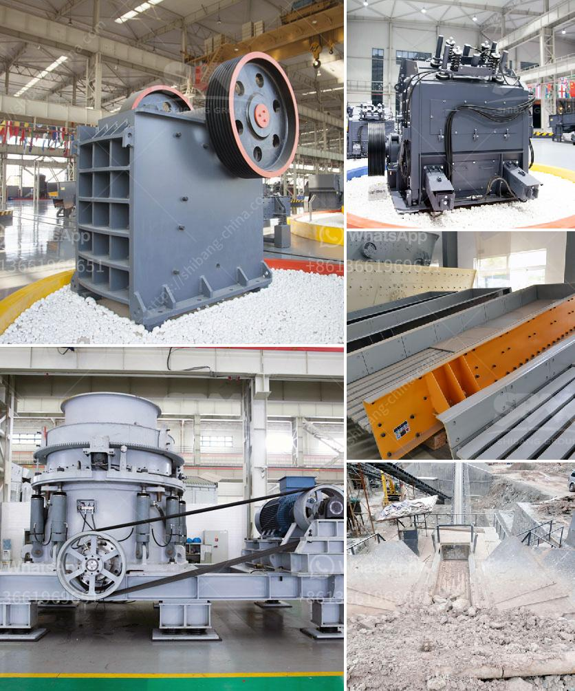

<h3>limestone crusher made in italy</h3>
Limestone is a sedimentary rock that is primarily composed of calcium carbonate. It is commonly used in construction, agriculture, and industry. Lime is made by combining limestone with various heat sources to create quicklime or hydrated lime.

In Italy, limestone crusher machines are available in different sizes and types to meet the various needs of customers. For example, jaw crusher machines are suitable for processing limestone materials with a maximum size of 800mm, while cone crusher machines are often used for secondary crushing to produce different particle sizes. Moreover, impact crushers are also commonly used to process limestone into smaller sizes.

One of the notable manufacturers who produce crushers in Italy is FTM Machinery. FTM limestone crusher machines are available in various models with different capacities. Different types of crushers have different crushing principles and particle sizes of the finished products. Therefore, customers can choose the most suitable type of limestone crusher according to their specific needs.

The limestone crusher machines produced by FTM Machinery have high crushing efficiency, low energy consumption, and strong wear resistance to ensure the efficient completion of limestone crushing tasks. They are widely used in various fields such as mining, quarrying, construction, highways, railways, cement, chemicals, etc.

The limestone crusher machines are highly praised by customers for their stable operation, high production efficiency, excellent performance, environmental protection, convenient maintenance, and low costs. They are favored by many customers both at home and abroad.

In conclusion, in Italy, limestone crusher machines are widely used in various industries due to their excellent performance and quality. The limestone crushers made in Italy are currently favored by many customers and have been successfully applied in limestone processing projects all over the world. With the development of the global marketplace, there are more and more manufacturers of limestone crushers on the market, and their production and sales are constantly increasing, which greatly promotes the development of limestone crusher machines.
<h3>Contact us</h3><ul><li><strong>Whatsapp:&nbsp;<a href="https://wa.me/8613661969651">+8613661969651</a></strong></li><li><a href="https://swt.shibang-china.com/?git&amp;zhl&amp;limestone crusher made in italy"><strong>Online Service(chat now)</strong></a></li></ul><h3>Related</h3><ul><li><a href='mobile crusher machine price.md'>mobile crusher machine price</a></li><li><a href='china crushing plant.md'>china crushing plant</a></li><li><a href='companies selling mining equipment in south africa.md'>companies selling mining equipment in south africa</a></li><li><a href='crushing plant company.md'>crushing plant company</a></li><li><a href='continuous or discontinuous ball mills.md'>continuous or discontinuous ball mills</a></li></ul>