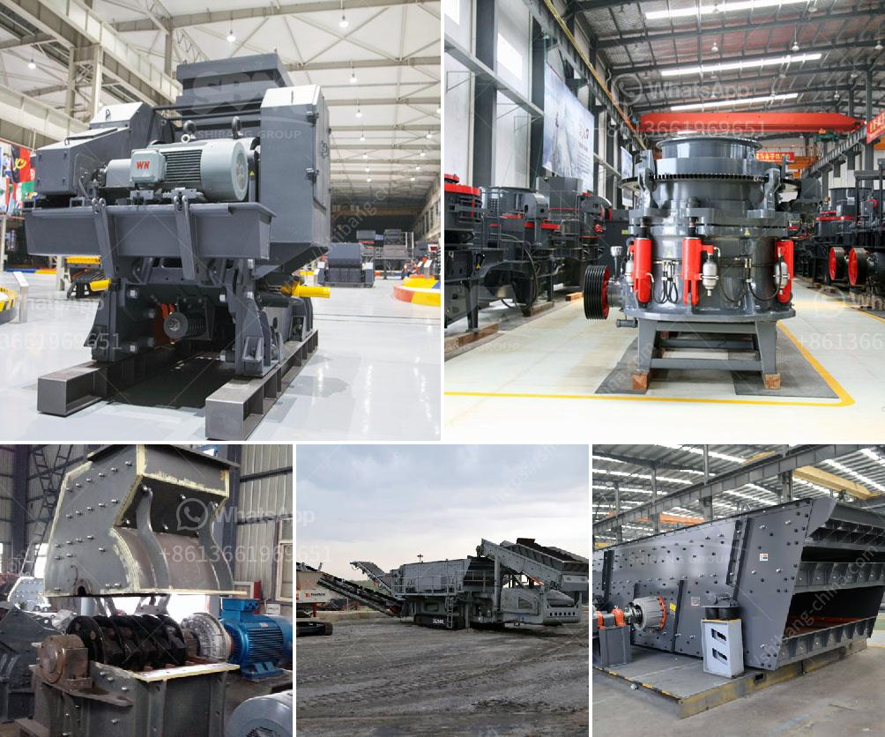

<h3>limestone crushing and making sand machine</h3>
Limestone is a sedimentary rock that is mainly composed of calcium carbonate (CaCO3). It is formed over millions of years by the accumulation and compression of fossilized remains of marine organisms. As a versatile stone, limestone is widely used in the construction industry for road base material, aggregate, and concrete. One important application is the production of crushed limestone, which is used in various building materials and industrial applications. 

The first step in the process of limestone crushing is the coarse crushing of the limestone. These primary crushers break limestone into smaller pieces that can be transported to the secondary crusher for further crushing. Before the actual crushing occurs, a screening process separates the limestone into various sizes to ensure proper sizing for the subsequent stages of the limestone crushing process. 

The second stage: secondary crushing. After the coarse crushing, the limestone is conveyed to a secondary crushing machine by a belt conveyor. The secondary crushing process uses a compression or impact crusher to further reduce the size of the limestone. At this stage, the limestone is already suitable for use as road base material, building aggregates, or other industrial applications. 

The third stage: fine crushing. In the fine crushing stage, the limestone is further crushed into the desired size by a sand making machine, also known as a sand maker or tertiary crusher. This machine produces high quality particles that are widely used for various applications. It is the main component in asphalt and concrete mixtures, providing strength and durability to the final product.

Limestone is also crushed for use in agriculture. The limestone powder obtained by grinding the limestone can be used as a soil amendment to neutralize acidic soils and improve crop yields. Additionally, it is used in animal feed to provide essential calcium and minerals.

Manufacturers have developed various machines for limestone crushing and sand making, each with different crushing principles and particle sizes. Common types include jaw crushers, impact crushers, cone crushers, and hammer crushers. These machines can crush limestone into different sizes according to the requirements of the construction project.

In recent years, the demand for artificial sand has surged, leading to the development of sand making machines that can produce high-quality sand from limestone. These machines are designed to crush limestone into fine particles, creating a better substitute for natural river sand. By using limestone as the primary material, these machines help preserve natural resources and reduce environmental pollution.

In conclusion, limestone crushing and making sand machines are essential for limestone quarrying and aggregate production. Limestone is an important raw material used in construction, industrial, and agricultural projects. Limestone crushing and sand making machines are ideal choices for large-scale and automated production operations, which can meet the diverse and complex needs of the crushing industry.
<h3>Contact us</h3><ul><li><strong>Whatsapp:&nbsp;<a href="https://wa.me/8613661969651">+8613661969651</a></strong></li><li><a href="https://swt.shibang-china.com/?git&amp;zhl&amp;limestone crushing and making sand machine"><strong>Online Service(chat now)</strong></a></li></ul><h3>Related</h3><ul><li><a href='cement mill plant design drawings.md'>cement mill plant design drawings</a></li><li><a href='gypsum powder making.md'>gypsum powder making</a></li><li><a href='grinding plant improvement.md'>grinding plant improvement</a></li><li><a href='silica washing plant.md'>silica washing plant</a></li><li><a href='marble mining equipment manufacturers.md'>marble mining equipment manufacturers</a></li></ul>