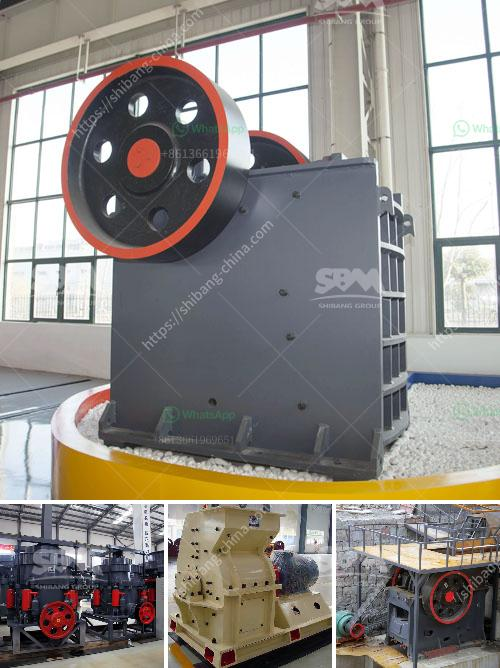

<h3>limestone crushing process</h3>
Limestone is a sedimentary rock composed mainly of calcium carbonate (CaCO3) found in abundance all around the globe. Limestone crushing process involves multiple stages and many different types of crushing plants such as jaw crusher and impact crusher.

Limestone is a sedimentary rock composed mainly of calcium carbonate (CaCO3), usually calcite. In the cement plant, limestone is the major raw material for cement production. Go through crushing, grinding process, and then make in the dust. Limestone is generally of large size and high hardness. Therefore the limestone crushing is very important in the whole material crushing. Usually we choose jaw crusher for limestone crushing since jaw crusher is of easy principle, convenient maintainence and low cost. However, if the whole cement mining scale is of large size, we usually choose cone crusher or impact crusher to assit jaw crusher and to be secondary or tertiary cement crusher machine.

Also cement conveyor is used to transport these materials to next procedure, such as vibrating cement screen to screen out required fineness. In some production sites, we use a whole mobile crusher to complete the whole cement crushing and screening production since the mobile crusher is equipped with jaw crusher, impact crusher or cone crusher, vibrating feeder,vibrating screen,etc.

In the limestone crushing process, you can always choose a jaw crusher as the primary limestone crushing equipment. Cone crusher is essentially the most common fine crusher, and usually utilised as final crushing machine. It has four types: spring cone crusher, CS cone crusher, hydraulic cone crusher, hcs90 cone crusher. Each cone crusher has their diverse applications and they will be used in limestone crushing.

To be able to make complete utilization of limestone, we need limestone crusher, limestone grinding mill, and limestone beneficiation equipment. Limestone mining process is complex. It mainly includes crushing and grinding. It will use a lot of grinding machines and crushing machines in the process. Here I will introduce these devices, hoping to help you choose the right machine.

In the limestone production line, the first step is to crush the limestone. Limestone crusher machine include Jaw crusher, Impact Crusher, Cone Crusher and Mobile Crusher. Crush the limestone is very necessary in limestone processing plant, meanwhile limestone crushing machine is the key products of limestone production line. So the quality of limestone crusher machine is quite important. In addition, PEW jaw crusher, which is a new generation crushing machine, using the most advanced European technology with a reliable performance. It is the ideal for being used as primary crusher in the limestone production line. In the crushing process, jaw crusher and impact crusher are both widely used.

The whole production line consists of vibrating feeder, jaw crusher, impact crusher, vibrating screen, belt conveyor, electric control, etc. We design different production lines ranging 50 t/h to 500 t/h by combining different models of equipment which can match cone crusher, deduster, etc.

If you have any interest in the limestone crushing process, you can contact us online or leave a message to us. We will do our best to help you to solve your problems and improve your business.
<h3>Contact us</h3><ul><li><strong>Whatsapp:&nbsp;<a href="https://wa.me/8613661969651">+8613661969651</a></strong></li><li><a href="https://swt.shibang-china.com/?git&amp;zhl&amp;limestone crushing process"><strong>Online Service(chat now)</strong></a></li></ul><h3>Related</h3><ul><li><a href='rock crusher for crushing balsalt stone.md'>rock crusher for crushing balsalt stone</a></li><li><a href='crusher plant made in uk.md'>crusher plant made in uk</a></li><li><a href='machines de crushine primaires.md'>machines de crushine primaires</a></li><li><a href='quarry crusher in kenya.md'>quarry crusher in kenya</a></li><li><a href='iron ore mobile crusher available in india.md'>iron ore mobile crusher available in india</a></li></ul>