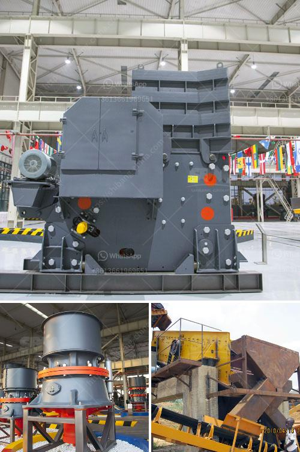

<h3>limestone grinding and crushing</h3>
Limestone is a sedimentary rock that is composed mainly of calcium carbonate (CaCO3). Limestone is a widely used building material, as it offers several benefits in terms of strength, durability, and versatility. It is also a vital ingredient in the production of cement, which is used to construct various buildings and infrastructure projects worldwide. Limestone grinding and crushing processes play a crucial role in the efficient functioning of these industries.

Limestone grinding involves reducing the limestone rocks into smaller particles. This is achieved by using various techniques and machinery to achieve the desired size of particles, which makes it easier to handle and use it in various industries. Limestone grinding is usually carried out using a ball mill, which is an energy-efficient process that consumes less energy in comparison to other methods.

The process begins by feeding the limestone chunks into the ball mill. The rotating drum filled with steel balls or rods grinds and crushes the limestone until it has become a fine powder. This powder is then mixed with water and other additives to produce cement. The grinding process has a significant impact on the performance of cement, as it determines the fineness and quality of the final product.

Limestone crushing is a crucial step in the mining and construction industries, as it not only determines the efficiency of the final product but also leads to various environmental implications. Crushing limestone involves several stages, including primary crushing, secondary crushing, and tertiary crushing. Each stage aims to reduce the size of the limestone rocks further, making it suitable for various applications.

In the primary crushing stage, large limestone rocks are fed into a jaw crusher, which reduces the size of the rocks to produce a coarse aggregate. The crushed limestone is then fed into a secondary impact crusher, which further pulverizes it to produce smaller particles. The fine aggregate is obtained by passing the crushed limestone through a system of screens that filter out the appropriate size.

Limestone grinding and crushing processes are crucial for the construction and cement production industries. The finely ground limestone powder is an essential component in the production of cement, as it acts as a binding agent when mixed with water and aggregates. Without proper grinding and crushing processes, the quality and strength of cement would be compromised.

Furthermore, limestone grinding and crushing processes also generate employment opportunities in the mining and construction sectors. The demand for limestone products provides employment to a significant number of people involved in the extraction, grinding, and crushing processes.

In conclusion, limestone grinding and crushing are vital industrial processes that are necessary for the production of cement and other building materials. These processes not only ensure the quality and strength of cement but also contribute to the overall development of the mining and construction industries. With the growing demand for construction materials worldwide, limestone grinding and crushing continue to play a crucial role in meeting these needs efficiently and sustainably.
<h3>Contact us</h3><ul><li><strong>Whatsapp:&nbsp;<a href="https://wa.me/8613661969651">+8613661969651</a></strong></li><li><a href="https://swt.shibang-china.com/?git&amp;zhl&amp;limestone grinding and crushing"><strong>Online Service(chat now)</strong></a></li></ul><h3>Related</h3><ul><li><a href='grinding mill installation operation.md'>grinding mill installation operation</a></li><li><a href='gypsum board machinery turkey manufacturers.md'>gypsum board machinery turkey manufacturers</a></li><li><a href='processing of quartz crusher.md'>processing of quartz crusher</a></li><li><a href='stone crusher manufacturers in dhansura.md'>stone crusher manufacturers in dhansura</a></li><li><a href='puzzolana lime stone crushing plant.md'>puzzolana lime stone crushing plant</a></li></ul>