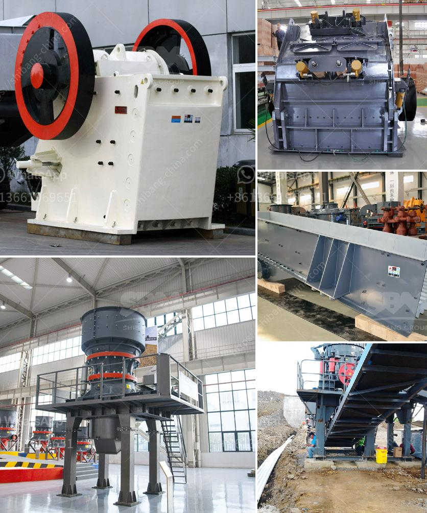

<h3>limestone mining crusher industry in nepal</h3>
Limestone is a sedimentary rock composed mostly of calcium carbonate (CaCO3), which forms from the accumulation of shells and remains of marine organisms such as coral. Limestone mining for the cement industry is a major threat to the Caves of Meghalaya, causing a major collapse of the Krem Mawmluh cave, the seventh longest cave in the state of Meghalaya.

The "cave-in" stimulated public awareness of the potential threat mining places to the rich scientific, tourism and ecological heritage. With over 300 caves, the delicate ecosystem and cultural landscape of Meghalaya have been in jeopardy in recent years due to extensive limestone mining activities.

Nepal, nestled at the southern portion of the Himalayas, is known for its rich cultural heritage, distinctive architecture, and the abundance of natural resources. However, industries such as cement, copper, and limestone mining pose a significant threat to the environment and the local communities.

The detrimental impact of limestone mining on wildlife habitats, cultural heritage, and agro-ecology is evident. As a result, environmentalists and conservationists have raised concerns about the long-term effects of excessive mining in Nepal.

One of the key areas of concern is the Chure region, which spans across 20 districts in Nepal. The Chure region, known for its unique ecosystem and biodiversity, is under immense pressure due to rampant limestone mining. This has led to deforestation, loss of habitat for wildlife, and an increase in soil erosion, which in turn leads to landslides and floods.

Furthermore, excessive mining activity has led to the drying up of rivers and streams, impacting the availability of water for agriculture, drinking, and other domestic purposes. This has detrimental effects on the lives and livelihoods of the local communities who depend on these water sources.

The cumulative impact of limestone mining has had adverse effects on various aspects of the environment, including vegetation cover, soil fertility, and the availability of groundwater. The extraction of limestone is also responsible for the emission of considerable amounts of dust, which pollutes the air and poses severe health hazards to the workers and surrounding communities.

To address these issues, it is imperative for the government of Nepal to develop and implement stringent regulations and guidelines for limestone mining activities. This includes conducting comprehensive environmental impact assessments, monitoring and regulating mining practices, and enforcing appropriate restoration and rehabilitation measures.

Additionally, it is crucial to create awareness among the local communities about the importance of conserving natural resources and the adverse effects of uncontrolled mining. Encouraging sustainable mining practices, promoting alternative livelihood options, and supporting local initiatives for environmental conservation can contribute to mitigating the detrimental impact of limestone mining.

In conclusion, limestone mining in Nepal can have detrimental effects on the environment and the local communities. It is essential for the government and industry players to take necessary measures to ensure responsible mining practices and protect the delicate ecosystem and cultural heritage of the region.
<h3>Contact us</h3><ul><li><strong>Whatsapp:&nbsp;<a href="https://wa.me/8613661969651">+8613661969651</a></strong></li><li><a href="https://swt.shibang-china.com/?git&amp;zhl&amp;limestone mining crusher industry in nepal"><strong>Online Service(chat now)</strong></a></li></ul><h3>Related</h3><ul><li><a href='hammer mill h 300 tph.md'>hammer mill h 300 tph</a></li><li><a href='jual mesin limestone crusher.md'>jual mesin limestone crusher</a></li><li><a href='used cement clinker grinding plant.md'>used cement clinker grinding plant</a></li><li><a href='used mobile screens and crusher in africa.md'>used mobile screens and crusher in africa</a></li><li><a href='barite mining and quarry equipment spain.md'>barite mining and quarry equipment spain</a></li></ul>