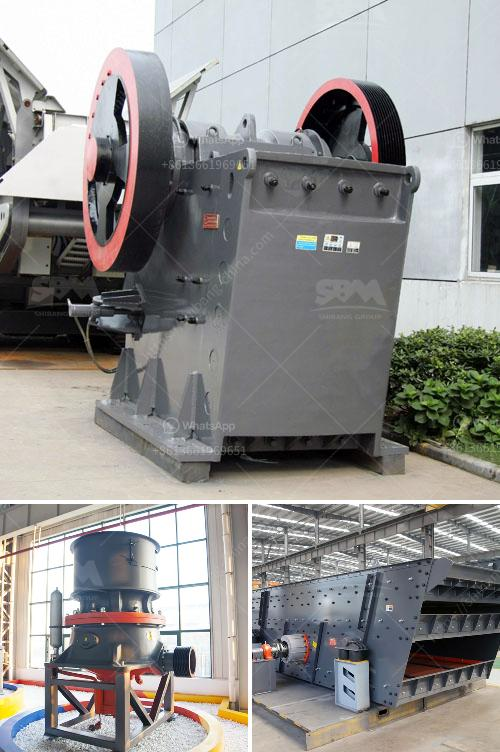

<h3>limestone needed for 1 ton cement production</h3>
Cement plays an integral role in modern construction, aiding in the creation of durable and strong structures. One of the essential ingredients used in the manufacturing of cement is limestone. Limestone, a sedimentary rock composed mainly of calcium carbonate, provides calcium and acts as a catalyst to initiate the formation of cement, resulting in a versatile and high-quality building material.

Limestone is quarried, typically from open-pit mines, and then crushed into smaller fragments. These fragments are further processed and heated until they reach the temperature necessary for cement production. During this process, limestone chemically reacts with other minerals, such as silica and alumina, to form a substance known as clinker. The clinker is then mixed with gypsum and other materials to produce the final cement product.

As limestone contributes significantly to the overall composition of cement, understanding the amount needed for its production is crucial. For every ton of cement produced, approximately 1.6 tons of limestone are required. This means that for a typical cement plant producing one million tons of cement per year, around 1.6 million tons of limestone will be needed.

The quantity of limestone required can vary depending on several factors, including the specific type of cement being produced. Cement manufacturers often use limestone with a high calcium carbonate content, as this type of limestone offers better chemical reactions and improved strength properties. The ideal calcium carbonate content in the limestone is usually around 75-95%, ensuring optimal performance during cement production.

Limestone is an abundant natural resource, with vast reserves worldwide. However, the availability of high-quality limestone suitable for cement production can vary from region to region. Therefore, cement plants often establish their own limestone mines or partner with local quarries to secure a reliable supply. This approach helps to minimize transportation costs and reduces the carbon footprint associated with long-distance shipments.

Additionally, the environmental impact of limestone quarrying and cement production should not be overlooked. Quarrying operations can have adverse effects on ecosystems, including habitat destruction and air and water pollution. However, responsible mining practices, such as reclamation efforts and the use of advanced technologies for dust and noise control, can help mitigate these impacts. Furthermore, cement plants are increasingly adopting sustainable practices to reduce their environmental footprint, such as incorporating alternative fuels and incorporating carbon capture and storage technologies.

In conclusion, limestone is a vital component of cement production. Its chemical properties promote the formation of clinker, which is the key ingredient in cement. For every ton of cement manufactured, approximately 1.6 tons of limestone are required. The availability of high-quality limestone plays a crucial role in ensuring the consistent production of high-quality cement. As the construction industry continues to grow, sustainable mining practices and responsible production methods will be essential to meet the increasing demand for cement while minimizing the environmental impact.
<h3>Contact us</h3><ul><li><strong>Whatsapp:&nbsp;<a href="https://wa.me/8613661969651">+8613661969651</a></strong></li><li><a href="https://swt.shibang-china.com/?git&amp;zhl&amp;limestone needed for 1 ton cement production"><strong>Online Service(chat now)</strong></a></li></ul><h3>Related</h3><ul><li><a href='crusher machine manufacturers in pakistan.md'>crusher machine manufacturers in pakistan</a></li><li><a href='marble quarry mining in sudan.md'>marble quarry mining in sudan</a></li><li><a href='granite quarry plant in sri lanka.md'>granite quarry plant in sri lanka</a></li><li><a href='barite processing plants in texas.md'>barite processing plants in texas</a></li><li><a href='piedra maquinaria agregada equipos de bolivia.md'>piedra maquinaria agregada equipos de bolivia</a></li></ul>