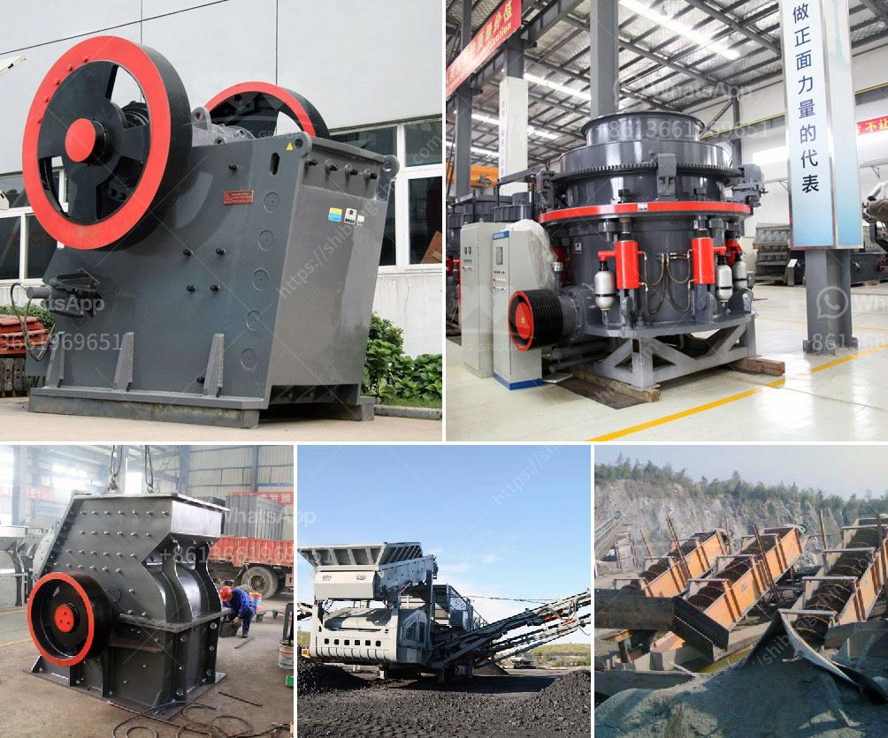

<h3>limestone powder mill</h3>
Limestone is a sedimentary rock composed primarily of calcium carbonate (CaCO3) in the form of the mineral calcite. It is widely used in various industries such as construction, agriculture, and even food and beverage production. In order to efficiently utilize limestone, it is often necessary to process it into a fine powder. This is where limestone powder mills come into play.

A limestone powder mill is a device that grinds materials into a fine powder, which is widely used in various industries such as construction, metallurgy, and chemistry. Different types of limestone powder mills come with different specifications and capacities. For instance, there are vertical mills, ball mills, and Raymond mills that can be used to grind limestone. However, if you are looking for a mill specifically designed for limestone, a limestone powder mill is the ideal choice.

Limestone powder mills are typically equipped with a motor-driven grinding system that consists of a grinding disc and a classifier. The material to be ground is fed into the grinding chamber from the feed hopper, and is then struck by the grinding disc. As the material is being ground, the fine particles are carried away by the airflow generated by the fan and collected by the classifier. The coarse particles, on the other hand, fall back onto the grinding disc for further grinding.

The advantages of using a limestone powder mill are numerous. Firstly, it allows for the efficient utilization of limestone, as it can process limestone into a fine powder, making it easier to transport and store. Secondly, a limestone powder mill ensures a more even and consistent particle size distribution, resulting in better performance in various applications. Lastly, as limestone is a relatively soft material, a limestone powder mill operates with minimal abrasion, leading to less wear and tear on the equipment and lower maintenance costs.

In conclusion, a limestone powder mill is a crucial piece of equipment in the limestone processing industry. With its ability to grind limestone into a fine powder, it enables efficient utilization of limestone and improves the overall performance of various applications. Whether you are in the construction, metallurgy, or chemistry industry, a limestone powder mill is a valuable investment that can greatly enhance your operations.
<h3>Contact us</h3><ul><li><strong>Whatsapp:&nbsp;<a href="https://wa.me/8613661969651">+8613661969651</a></strong></li><li><a href="https://swt.shibang-china.com/?git&amp;zhl&amp;limestone powder mill"><strong>Online Service(chat now)</strong></a></li></ul><h3>Related</h3><ul><li><a href='copper ore concentration processing.md'>copper ore concentration processing</a></li><li><a href='jaw crusher mem fr.md'>jaw crusher mem fr</a></li><li><a href='mini rock crusher.md'>mini rock crusher</a></li><li><a href='mining conveyor prices.md'>mining conveyor prices</a></li><li><a href='used stone cursher machinery in uae.md'>used stone cursher machinery in uae</a></li></ul>