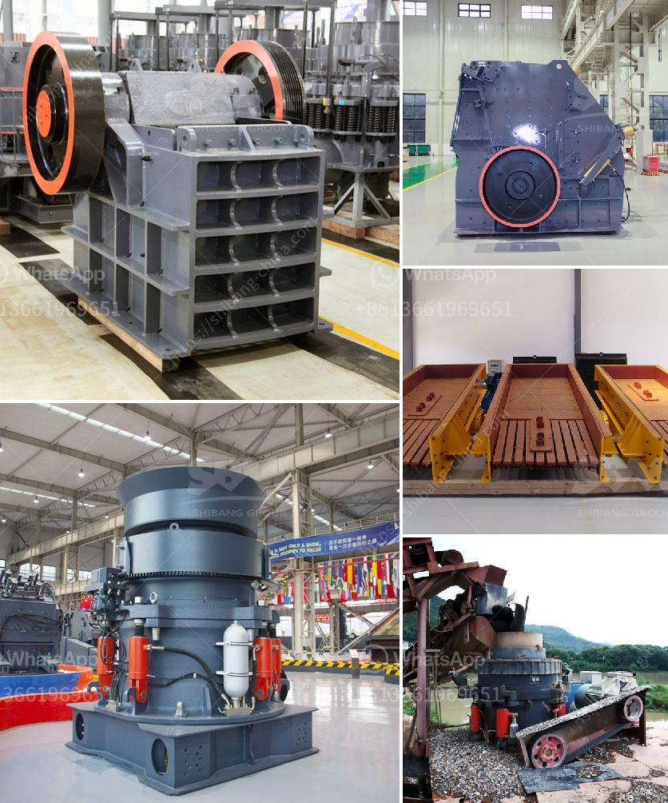

<h3>limestone process plant</h3>
Limestone is a common sedimentary rock found all over the world. It is formed by the sedimentation of shells and skeletal remains of marine organisms such as coral, making it rich in calcium carbonate. Due to its versatile nature and wide range of applications, limestone is highly sought after in various industries. Therefore, a limestone process plant plays a crucial role in extracting and processing this valuable resource.

The limestone process plant is designed to efficiently produce high-quality limestone in various forms, including crushed stone, pulverized limestone, and limestone powder. The plant incorporates several stages of crushing and screening to ensure the desired size and purity of the limestone. Additionally, it may include a limestone grinding mill to further process the crushed limestone.

The process begins with the limestone being blasted from quarries, which results in large chunks of rock. These rocks are then transported to the primary crusher, where they are crushed into smaller pieces. The crushed limestone is then screened to separate the desirable sizes for different applications. The limestone powder is obtained through another stage of grinding, where the crushed limestone is further processed to achieve the desired fineness.

In the limestone process plant, environmental sustainability is of great importance. Therefore, various measures are implemented to minimize the impact on the environment. For instance, dust control systems are installed to capture and control airborne particles generated during the crushing and grinding processes. Water is also recycled within the plant, reducing water consumption and minimizing water wastage.

The limestone process plant serves as a crucial part of various industries. It is used in construction for road base and concrete aggregate, in agriculture as a soil conditioner and fertilizer, and in manufacturing for the production of lime and cement. Furthermore, limestone is a key component in the steel industry, where it aids in the production of iron and serves as a fluxing agent.

In conclusion, a limestone process plant is a vital facility that extracts and processes limestone to meet the demands of various industries. It involves a series of crushing, screening, and grinding stages to produce limestone in different forms. The implementation of environmentally friendly practices ensures the sustainability of the plant while meeting the needs of the market.
<h3>Contact us</h3><ul><li><strong>Whatsapp:&nbsp;<a href="https://wa.me/8613661969651">+8613661969651</a></strong></li><li><a href="https://swt.shibang-china.com/?git&amp;zhl&amp;limestone process plant"><strong>Online Service(chat now)</strong></a></li></ul><h3>Related</h3><ul><li><a href='correct feed of cone crushers.md'>correct feed of cone crushers</a></li><li><a href='price of crushers of gravel.md'>price of crushers of gravel</a></li><li><a href='crusher mobile stone.md'>crusher mobile stone</a></li><li><a href='stone crushing machines for brick making.md'>stone crushing machines for brick making</a></li><li><a href='quartz ball mill.md'>quartz ball mill</a></li></ul>