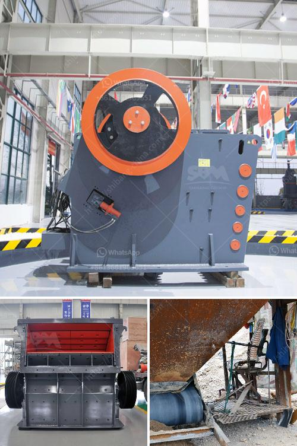

<h3>limestone processing equipment in south africa</h3>
Limestone is a sedimentary rock that is mainly composed of calcium carbonate (CaCO3) mineral. It can be found in many places around the world, including South Africa. This versatile rock is used in various industries for a wide range of applications, including building materials, road construction, and agriculture.

Limestone processing equipment in South Africa is primarily utilized in crushing limestone into various product sizes. Many industries require limestone in powder form, which is ideal for the production of a variety of materials. These include fertilizer, construction aggregate, cement, and even food and pharmaceutical products.

Limestone is a crucial component in the manufacture of cement, as it combines with other materials, such as clay, sand, and iron ore, to create the desired chemical composition that is then heated at high temperatures to form clinker. Once cooled, this clinker is ground into a fine powder known as cement. Cement is extensively used in the construction industry to create sturdy and durable structures, such as buildings, bridges, and roads.

Another important application of limestone in South Africa is in the production of agricultural lime. Agricultural lime, also known as aglime, is used to neutralize acidic soils and improve crop yields. Limestone is crushed and applied to fields to combat soil acidity, which can reduce the availability of essential nutrients required for plant growth. By neutralizing the soil pH, limestone enhances nutrient absorption by plants, leading to improved agricultural productivity.

To meet the demands of various industries, limestone processing equipment in South Africa has a wide range of applications. For example, our limestone grinding mill machine can process limestone into powders with different sizes to meet various industries' requirements. Additionally, limestone can be directly crushed and processed into different sizes for road construction and other applications.

In South Africa, limestone is abundantly available, with deposits located in the Limpopo, Mpumalanga, Gauteng, and Western Cape provinces. South Africa's limestone quarries produce 120 million tons of limestone annually, contributing to the nation's economic growth. Limestone is a fundamental resource that is widely utilized to stimulate economic development.

Proper limestone processing is essential for the efficient utilization of the rock. To ensure the processing equipment works effectively, we must continuously monitor operational conditions, especially feed rates and temperatures. When limestone is processed without the proper conditions, it can result in reduced product quality, increased energy consumption, and potential equipment damage.

In conclusion, limestone processing equipment in South Africa is in plenty. With the growing requirements of various industries, the demand for limestone processing equipment will continue to increase. As a prominent manufacturer of mining machinery in South Africa, XSM is here to offer you the best equipment in the industry. We are committed to providing high-quality equipment that meets industry standards and exceeds customer expectations. Contact us today for all your limestone processing equipment needs.
<h3>Contact us</h3><ul><li><strong>Whatsapp:&nbsp;<a href="https://wa.me/8613661969651">+8613661969651</a></strong></li><li><a href="https://swt.shibang-china.com/?git&amp;zhl&amp;limestone processing equipment in south africa"><strong>Online Service(chat now)</strong></a></li></ul><h3>Related</h3><ul><li><a href='designs of hammer mills.md'>designs of hammer mills</a></li><li><a href='mica processing technology and flow chart.md'>mica processing technology and flow chart</a></li><li><a href='rubber conveyor belt pdf.md'>rubber conveyor belt pdf</a></li><li><a href='ball mill iron ore only company.md'>ball mill iron ore only company</a></li><li><a href='brand new stone crusher for sale in the philippines.md'>brand new stone crusher for sale in the philippines</a></li></ul>