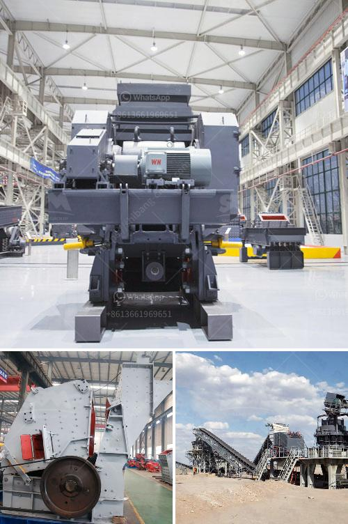

<h3>list of crusher industry in nepal</h3>
The crusher industry in Nepal has been growing rapidly due to the increasing demand for aggregates. There are several types of crushers like jaw crusher, gyratory crusher, cone crusher, impact crusher, etc. They are used for different purposes like crushing the stones into different sizes, breaking the large rocks into smaller pieces, reducing the size of the ore particles, etc.

Nepal's construction industry has been flourishing in recent years due to the growth in infrastructure development projects. It has created a huge demand for crushed stones, sand, gravel, and aggregates. The crusher industry plays a crucial role in meeting this demand and providing the necessary raw materials.

1. Ason Crusher Plant: Located in Teku, Kathmandu, this crusher industry is one of the key players in the market. It produces high-quality aggregates for various construction purposes. The plant has a capacity of producing 200 tons of crushed stones per day.

2. Baba Shree Krishna Stone Crusher: This crusher industry is situated in Thapagaun, Bhaktapur. It specializes in producing different sizes of crushed stones, sand, and aggregates for commercial and residential construction projects.

3. Himalaya Stone Crusher: This crusher industry is located in Nayabazar, Kavre. It is renowned for producing different sizes of crushed stones, sand, and aggregates. The company also supplies construction materials like steel rods, cement, and bricks.

4. Jagdamba Stone Crusher: Located in Chandragiri Municipality, Kathmandu, this crusher industry has been providing quality aggregates for construction projects since its inception. The company also specializes in stone dust and manufactured sand production.

5. Kalika Stone Crusher: Located in Bandipur, Tanahun, this crusher industry is one of the major players in the region. It produces aggregates of different sizes that are widely used in the construction industry. The company also manufactures bricks and supplies them to various construction projects.

6. Krishna Stone Crusher: Situated in Amlekhgunj, Bara, this crusher industry produces aggregates of various sizes for different construction purposes. The company is committed to environmentally sustainable practices and employs advanced crushing technology to minimize dust and noise pollution.

7. Shree Ram Crusher: This crusher industry is situated in Birgunj, Parsa. It specializes in the production of crushed stones and sand for both commercial and residential construction projects. The company has a well-equipped laboratory for quality control testing of its products.

These are just a few examples of the crusher industries in Nepal. There are many other small and medium-scale crushers spread across the country that cater to the growing demand for aggregates. The crusher industry not only contributes to the economy by providing employment opportunities but also plays a crucial role in the development of infrastructure projects.
<h3>Contact us</h3><ul><li><strong>Whatsapp:&nbsp;<a href="https://wa.me/8613661969651">+8613661969651</a></strong></li><li><a href="https://swt.shibang-china.com/?git&amp;zhl&amp;list of crusher industry in nepal"><strong>Online Service(chat now)</strong></a></li></ul><h3>Related</h3><ul><li><a href='ultra fine calcium carbonate powder production equipment.md'>ultra fine calcium carbonate powder production equipment</a></li><li><a href='sand washer machine.md'>sand washer machine</a></li><li><a href='gold ore milling machine.md'>gold ore milling machine</a></li><li><a href='cement mill plant design drawings.md'>cement mill plant design drawings</a></li><li><a href='price of ballast per ton in kenya.md'>price of ballast per ton in kenya</a></li></ul>